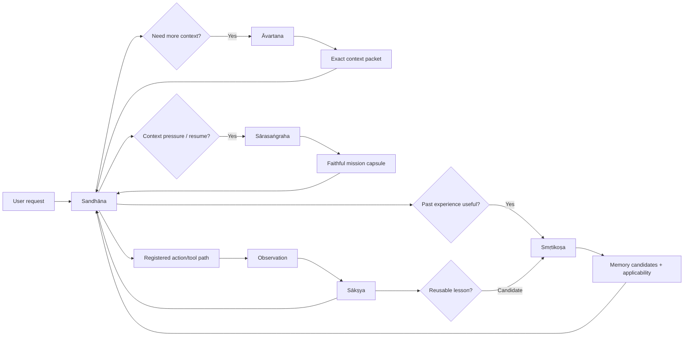
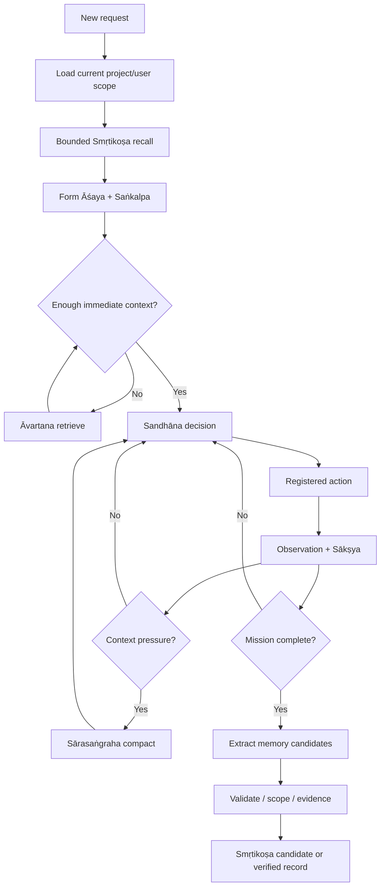

# Padma Combined Context + Persistent Memory Phase

## Āvartana + Sārasaṅgraha + Smṛtikoṣa

You are implementing a major combined Padma capability in the **actual Padma repository**. This implementation deliberately combines the work previously assigned to **Phase 4 — Āvartana + Sārasaṅgraha** and **Phase 14 — Smṛtikoṣa** into one larger engineering phase, but it is divided into **three strict sub-phases** so that the implementation agent is never forced to build the entire system at once.

The three sub-phases are:

1. **Sub-Phase A — Āvartana (आवर्तन / `avartana`)**: bounded retrieval, externalized context access, exact source slicing, large-output access, recursive analysis, source identity, coverage, freshness, and context packets.
2. **Sub-Phase B — Sārasaṅgraha (सारसङ्ग्रह / `sarasangraha`)**: faithful compaction, durable mission position, protected-state preservation, context reconstruction, restart recovery, stale-context invalidation, and continuity across long missions.
3. **Sub-Phase C — Smṛtikoṣa (स्मृतिकोश / `smritikosha`)**: verified persistent memory across missions, user preference and intent continuity, reusable procedures, project conventions, failure signatures, memory lifecycle, retrieval, contradiction handling, and automatic memory use by Sandhāna.

Treat these as **three implementation checkpoints inside one merged phase**. Finish and verify A before B. Finish and verify B before C. Do not attempt to implement all three in one giant diff. Do not return a proposal, an architecture essay, or a fake completion report. Inspect the repository, find the real integration seams, implement working code, test it through the actual Padma agent, repair failures, and only then report what exists.

The purpose of this merged phase is to give Padma something close to practical **continuous memory**: the ability to work with information too large to fit in one prompt, preserve the exact mission through compaction and restart, remember verified reusable knowledge across sessions, recognize recurring user needs, and retrieve the right past information at the moment it becomes useful.

This is **not** permission to claim literal infinite memory, perfect recall, omniscience, or zero-loss compression. The engineering target is durable, bounded, inspectable, evidence-backed continuity. If the implementation cannot retrieve something, has incomplete coverage, is stale, or has only an inference rather than a verified fact, it must say so through typed state rather than pretending.

---

# 0. The most important requirement: the AI must actually be able to use this system

A major failure mode in agent harnesses is implementing an impressive subsystem that the model cannot actually invoke. A repository may contain a memory database, search engine, summarizer, graph, or context manager, yet the live AI agent never sees a tool for it, does not know when to call it, receives no usable result schema, or has no route from the result back into reasoning. That is **not implementation** for Padma.

For this phase, adopt the following hard rule.

## Capability Reachability Contract

A capability is not complete until all of the following are true:

1. **The implementation exists.** Real production code performs the operation.
2. **The capability is registered.** It appears in Padma's real Yantra/tool registry or equivalent real tool surface used by the selected Pi-based runtime.
3. **The model can discover it.** Its name, description, arguments, limitations, and result schema are supplied to the model through the actual tool protocol or command surface.
4. **The model can invoke it.** A normal Sandhāna mission can call it without requiring a developer to manually execute an internal function.
5. **The result returns to the model.** Results enter the same mission loop as other registered tools, with typed success, limitation, stale, denied, cancelled, and failure outcomes.
6. **The model knows when it should use it.** The runtime/system instruction and tool descriptions provide clear selection rules. Do not rely on the model magically guessing that a hidden subsystem exists.
7. **The controller can invoke it automatically where appropriate.** High-value memory/context retrieval should be integrated into context assembly and planning so the agent does not need to remember an obscure manual command every time.
8. **The capability respects Sandhāna authority.** It cannot bypass ScopePolicy, authorization, budget, revision checks, cancellation, evidence, or terminal-state semantics.
9. **The capability is observable.** Sākṣya or the existing evidence/event system records that the tool was selected, what source or memory IDs were considered, what was returned, and what limitations existed.
10. **An end-to-end test proves reachability.** The test must start from the real agent/tool registry boundary, not directly call the internal library. It must demonstrate that a mission causes the capability to be invoked and that its output changes or informs the subsequent decision.

If any one of these ten conditions is missing, label the capability **UNREACHABLE**, **PARTIALLY WIRED**, or another truthful incomplete state. Do not mark it complete.

The same rule applies to every tool built in this phase. A beautiful memory engine that is invisible to the model is worse than a small memory engine that the model reliably uses.

---

# 1. Preserve Padma's authority model

The foundation remains the selected pinned Pi checkout used by Padma. Inspect the current repository before assuming exact filenames or modules.

**Sandhāna remains the sole authoritative mission controller.** Āvartana, Sārasaṅgraha, and Smṛtikoṣa are capabilities used by Sandhāna. They do not become autonomous agents, second planners, hidden mission loops, or alternative sources of authorization.

There are exactly two top-level product modes:

- `padma_code`
- `padma_cyber`

Internal routes such as `SAKSHAT`, `MADHYAMA`, and `GAMBHIRA` remain routes inside Sandhāna. Do not invent a memory mode, context mode, RLM mode, recall mode, or research mode.

A context or memory operation must never independently:

- change the active route;
- grant permission;
- widen scope;
- create a second budget;
- declare mission success;
- declare mission failure;
- mark an effect verified;
- start an external side effect outside the registered action path;
- convert historical success into present authorization;
- convert a summary into authoritative evidence;
- treat an inferred user preference as a direct user instruction;
- treat remembered repository state as current repository state.

Everything feeds the one Sandhāna controller.

---

# 2. Inspect the real repository before coding

Before editing code, read the applicable repository instructions and trace the live runtime.

At minimum, identify the concrete implementation for:

- the Pi model/provider adapter;
- tool/Yantra registration;
- model tool-call serialization;
- mission/session state;
- Sandhāna's current controller loop;
- Āśaya and Saṅkalpa mission intent/contract state;
- Koṣa budget accounting;
- Sākṣya evidence/events;
- current ScopePolicy and authorization checks;
- target/workspace binding;
- operation IDs and cancellation propagation;
- artifact storage;
- command output capture;
- file reading/searching;
- model context construction;
- context-window/token counting if available;
- session persistence and restart loading;
- current database/storage technology;
- any pre-existing placeholders for RLM, context retrieval, compaction, memory, archive search, or tool discovery.

Trace at least one real mission from user request to model call to tool call to observation to final response. Do not rely on an earlier design document to prove a module exists.

Prefer the repository's existing language, database, dependency injection, schema tooling, test framework, and event system. Do not introduce a heavy service merely because it is theoretically elegant.

If Padma already uses SQLite or another durable embedded store, extend it rather than adding a separate database unless there is a concrete limitation. If SQLite is available, ordinary structured tables plus FTS-style indexing are a strong default. A vector store may be added only if it materially improves retrieval and can be disabled or replaced without breaking exact retrieval. Semantic embeddings must not become the only way to find exact facts.

---

# 3. Four information layers must remain distinct

The implementation must distinguish at least four semantic layers.

## Layer 1 — Authoritative mission state

Examples:

- original user request;
- active mission contract;
- active requirement IDs;
- prohibitions;
- current route;
- current workspace/target binding;
- authorization records;
- current Koṣa budget;
- operation lifecycle;
- pending verification;
- current terminal-state eligibility.

This is authoritative because Sandhāna owns it.

## Layer 2 — Original observations and artifacts

Examples:

- exact file bytes;
- command output;
- test results;
- Git objects;
- tool responses;
- screenshots/artifacts;
- external API results;
- source documents;
- raw session events.

These are observations tied to exact identity, time, version, and source.

## Layer 3 — Derived context

Examples:

- excerpts;
- search results;
- summaries;
- context packets;
- extracted claims;
- model-generated interpretations;
- compact mission capsules;
- recursive-analysis outputs.

Derived context can cite original observations but cannot replace them.

## Layer 4 — Reusable experience / persistent memory

Examples:

- verified project conventions;
- user preferences;
- recurring workflow constraints;
- verified procedures;
- failure signatures;
- compatibility knowledge;
- session binding hints;
- stable long-term user goals;
- repeated but explicitly marked behavioral patterns.

Persistent memory is reusable across missions but is still not current authorization or current environment truth.

Use separate types or tagged unions for these layers. Do not store every reference as a generic string and hope callers remember what it means.

Suggested conceptual reference families:

```ts
type AuthorityRef = BrandedId<'authority'>;
type EvidenceRef = BrandedId<'evidence'>;
type ArtifactRef = BrandedId<'artifact'>;
type DerivedRef = BrandedId<'derived'>;
type ExperienceRef = BrandedId<'experience'>;
```

Adapt naming to the repository's conventions if branded IDs are not used, but preserve the semantic separation.

---

# 4. Unified architecture

The intended flow is:



The memory/context system increases the information available to Sandhāna. It does not create a second authority path.

---

# 5. Shared storage and identity rules

All three sub-phases should share stable identity concepts so that retrieval, compaction, and memory can refer to the same source without copying entire payloads.

Define or adapt stable records for:

- source identity;
- source version/generation;
- range identity;
- content hash where useful;
- mission ID;
- mission revision;
- workspace/repository identity;
- branch/commit/build identity where available;
- user/profile identity scoped according to Padma's product design;
- tool schema version;
- memory record version;
- provenance/evidence links;
- timestamps;
- invalidation cause;
- lifecycle state.

Avoid using filesystem path alone as permanent identity when a repository or workspace may change beneath it.

A useful source identity may conceptually resemble:

```ts
type SourceIdentity = {
  sourceId: string;
  adapterId: string;
  kind: 'file' | 'command_output' | 'session' | 'artifact' | 'git' | 'document' | 'memory' | 'other';
  workspaceId?: string;
  repositoryId?: string;
  versionId?: string;
  generation?: number;
  contentHash?: string;
  createdAt?: string;
};
```

Do not blindly copy this if the repository already has a better record. The requirement is stable source identity and version-aware references.

---

# 6. Shared typed outcomes

Context and memory tools should not return only strings. Return typed metadata allowing Sandhāna to distinguish useful evidence from partial, stale, unavailable, or denied information.

At minimum support states conceptually equivalent to:

```ts
type KnowledgeStatus =
  | 'CURRENT'
  | 'HISTORICAL'
  | 'PARTIAL'
  | 'STALE'
  | 'UNAVAILABLE'
  | 'DENIED'
  | 'CANCELLED'
  | 'FAILED';
```

Result metadata should be able to express:

- source identity;
- version/generation;
- currentness;
- coverage;
- known omissions;
- unknown/unexamined scope;
- provenance/evidence links;
- whether content is original or derived;
- truncation;
- cost/budget consumed;
- whether more expansion is available;
- whether present revalidation is required.

Never collapse `no result found`, `source not searched`, `search incomplete`, and `result does not exist` into one state.

---

# 7. Shared tool exposure requirements

The following names are recommended because they are clear and map directly to Padma concepts. If the existing registry imposes another naming convention, adapt them while preserving the functions.

Agent-callable tools should be namespaced by capability.

Suggested Āvartana tools:

- `avartana.search`
- `avartana.read`
- `avartana.expand`
- `avartana.analyze`
- `avartana.sources`
- `avartana.context_status`

Suggested Sārasaṅgraha tools:

- `sarasangraha.compact`
- `sarasangraha.restore`
- `sarasangraha.pin`
- `sarasangraha.unpin`
- `sarasangraha.status`
- `sarasangraha.explain`

Suggested Smṛtikoṣa tools:

- `smritikosha.recall`
- `smritikosha.inspect`
- `smritikosha.consider`
- `smritikosha.store`
- `smritikosha.correct`
- `smritikosha.demote`
- `smritikosha.forget`
- `smritikosha.status`

Not every tool must be exposed directly to end users. Some are agent-facing tools; some may be internal registered operations. However, every significant capability must have a **real reachable path** from the live agent.

Where a user-facing command system exists, also expose useful inspection/control commands such as:

```text
/context status
/context sources
/context compact
/context restore
/context explain
/memory search <query>
/memory show <id>
/memory why <id>
/memory forget <id>
/memory correct <id>
/memory status
```

Do not create user commands solely for decoration. Wire them to the same underlying services and policies used by the agent tools.

---

# SUB-PHASE A — ĀVARTANA

# 8. Sub-Phase A objective

Implement **Āvartana**, Padma's bounded context-access and recursive-analysis capability.

Its job is to let Sandhāna access information that should not all live inside the model's immediate prompt. It should make long documents, repository sources, command outputs, prior session artifacts, and other context addressable by exact range and identity.

Āvartana is not a memory database and is not an autonomous subagent. It is a controlled way for the current mission to ask:

> What information exists outside my immediate context, which parts are relevant to this decision, how complete was the search, and what exact source supports the returned material?

Do not proceed to Sub-Phase B until Sub-Phase A's completion gate passes.

---

# 9. Build a source adapter interface

Create a small typed source abstraction around the real sources Padma can already access.

Potential adapters include:

- bound repository/file workspace;
- immutable command-output artifacts;
- current mission/session history;
- historical session archive where permitted;
- Git revisions/objects if already supported;
- structured tool result artifacts;
- long user-supplied documents;
- future Jālacitra graph source;
- future plugin-provided sources.

Each adapter should advertise its capabilities. Do not force every source into identical operations if it cannot honestly support them.

A conceptual capability description may include:

```ts
type SourceCapabilities = {
  exactRead: boolean;
  rangeRead: boolean;
  lexicalSearch: boolean;
  structuredQuery: boolean;
  semanticSearch?: boolean;
  versioned: boolean;
  immutable: boolean;
  supportsCoverage: boolean;
};
```

Adapters must return identity and currentness metadata with content.

---

# 10. Exact retrieval before fuzzy retrieval

When Sandhāna already knows the exact source and range, use a direct exact read. Do not invoke semantic search, recursive analysis, or a model merely to re-open known lines.

Priority should generally be:

1. exact source/range read;
2. deterministic structured lookup;
3. lexical/scoped search;
4. repository/project intelligence if available;
5. semantic retrieval if useful;
6. bounded model-assisted decomposition only when simpler retrieval is insufficient.

This ordering should be a default, not an unchangeable law. The goal is to prevent expensive recursive reasoning from replacing trivial source reads.

---

# 11. Long outputs become durable sources

Any tool output too large to safely return in full to the model must become a durable addressable source rather than being discarded or arbitrarily chopped.

For a long command output, for example:

- store or reference the complete output as an artifact;
- return a bounded preview;
- provide total size/line count where known;
- provide truncation status;
- provide a source identity;
- allow `avartana.read` or `avartana.search` over the complete output;
- preserve stdout/stderr distinction if the current action system supports it;
- preserve exit state separately from textual content.

Do not make "tool output exceeded context window" mean "Padma permanently lost the omitted portion."

---

# 12. Context request contract

Āvartana should accept explicit context requests from Sandhāna. A request needs enough information to constrain the search.

Conceptually:

```ts
type ContextRequest = {
  missionId: string;
  missionRevision: number;
  purpose: string;
  query?: string;
  sourceScopes?: SourceScope[];
  exactRefs?: SourceRangeRef[];
  desiredKinds?: string[];
  maxItems: number;
  maxBytes?: number;
  maxTokens?: number;
  freshnessRequirement?: 'CURRENT' | 'HISTORICAL_ALLOWED';
  cancellationId?: string;
};
```

The `purpose` matters. "Find evidence for why test X fails" is safer and more useful than a context engine that blindly dumps whatever seems semantically nearby.

---

# 13. Context packet contract

Return a bounded packet that separates exact material from derived explanation.

Conceptually:

```ts
type ContextPacket = {
  packetId: string;
  missionId: string;
  missionRevision: number;
  purpose: string;
  items: ContextItem[];
  coverage: CoverageReport;
  limitations: Limitation[];
  createdAt: string;
  dependencies: KnowledgeDependency[];
};
```

Each `ContextItem` should indicate whether it is:

- exact source excerpt;
- structured value;
- search hit;
- derived summary;
- recursive-analysis result;
- historical observation;
- memory candidate returned by another source adapter.

Do not flatten these into one undifferentiated prose blob.

---

# 14. Source range identity and citation

Every exact excerpt must retain enough metadata to re-open the original source.

For files, retain relevant identity such as:

- repository/workspace;
- path;
- version/generation;
- byte or line range;
- content hash or range hash if practical.

For command outputs, retain:

- operation ID;
- output artifact ID;
- stream;
- line/byte range.

For sessions, retain:

- session/mission ID;
- event/message IDs;
- visibility scope;
- time.

A summary must link to the source references it summarizes.

---

# 15. Coverage is first-class

Retrieval quality cannot be represented by a single confidence number.

A coverage report should distinguish:

- sources requested;
- sources actually searched;
- sources skipped and why;
- exact result count;
- known truncated results;
- unknown/unexamined scope;
- unsupported query types;
- stale sources;
- budget/cancellation limits;
- adapters that failed.

If a search covered three files out of one thousand, "no match" must not be interpreted as "the repository contains no match."

---

# 16. Freshness and invalidation

Derived context must know what it depends on.

If a file changes, any derived summary, search result, or analysis frame that depended on the previous version becomes stale. It may remain useful as historical context, but it must not silently present itself as current.

Use dependency references and invalidation rather than deleting all old context. Historical evidence is still valuable for explaining why Sandhāna previously chose a path.

At action preparation time, current-sensitive facts should be checked for currentness.

---

# 17. Bounded recursive analysis

Āvartana should support RLM-style recursive analysis, but **recursion is optional compute, not the default personality of the agent**.

Use recursive analysis when:

- the relevant source is too large for a single context packet;
- a query spans many candidate regions;
- local summaries need hierarchical aggregation;
- the model must compare multiple distant sections;
- a large source needs decomposition before a useful answer can be produced.

Do not recursively analyze when:

- the exact range is already known;
- a deterministic search answers the question;
- one small source fits comfortably in context;
- the next action can be verified directly;
- recursion has stopped producing new information.

Recursive analysis frames are read-only computations inside the parent mission. They do not receive independent authorization, budgets, or ability to dispatch side effects.

---

# 18. Recursive analysis frame

A frame should have explicit bounds.

Conceptually:

```ts
type AnalysisFrame = {
  frameId: string;
  parentMissionId: string;
  parentRevision: number;
  question: string;
  sourceRefs: SourceRef[];
  depth: number;
  maxDepth: number;
  maxChildren: number;
  tokenBudget: number;
  modelCallBudget: number;
  producedClaims: DerivedClaim[];
  status: 'RUNNING' | 'COMPLETE' | 'LIMITED' | 'CANCELLED' | 'FAILED';
};
```

Enforce bounds at runtime. Do not trust generated analysis text to obey the limits.

---

# 19. Progress and stopping criteria

Recursive analysis must have progress signals.

Useful stopping conditions include:

- question answered with sufficient exact support;
- no new source regions selected;
- repeated source set;
- duplicate claim set;
- depth limit;
- model-call limit;
- token limit;
- parent cancellation;
- source becomes stale;
- expected value falls below configured threshold.

Integrate with Padma's existing stagnation/hypothesis concepts where appropriate rather than inventing a second unrelated stagnation engine.

---

# 20. Tool schemas for Āvartana

The live AI must have useful tool descriptions. Keep them concise enough for normal context but explicit enough for correct selection.

Example intent, not mandatory syntax:

### `avartana.search`

Searches one or more registered sources for information relevant to a specific mission purpose. Returns exact hits plus coverage and limitations. Use when the exact source range is not already known.

Arguments should include at least:

- query;
- source scope or auto scope;
- current vs historical requirement;
- bounded result count.

### `avartana.read`

Reads an exact source or exact range. Use instead of search when a source/range is already known.

### `avartana.expand`

Expands a prior bounded hit or excerpt while preserving its source identity.

### `avartana.analyze`

Performs bounded read-only analysis over specified source references. Use only for large or distributed context that simpler retrieval cannot answer.

### `avartana.sources`

Reports registered sources and capability/currentness metadata.

### `avartana.context_status`

Reports current context packet dependencies, staleness, truncation, and limits.

These tools must be registered through the real model tool surface.

---

# 21. Automatic use rules for Āvartana

Do not require the model to manually call context tools for every trivial operation. Add lightweight policy to the context assembly/controller seam.

Examples:

- If the user names an exact open file and a small read is needed, direct read is fine.
- If a relevant tool result was truncated, expose its source reference and instruct the agent to use Āvartana rather than assume the omitted content.
- If the current decision depends on material removed from immediate prompt by compaction, automatically retrieve the relevant exact references.
- If a mission asks about prior parts of the same long source, make the source discoverable without re-ingestion.
- If the model says it lacks context that is known to exist in registered sources, permit one bounded automatic retrieval attempt before concluding unavailable.

Automatic retrieval must still respect budget and scope.

---

# 22. Security and authorization for context reads

Read-only is not automatically unrestricted.

A context adapter must respect:

- workspace binding;
- path restrictions;
- user visibility rules;
- secret/redaction policy;
- plugin permissions;
- Cyber scope rules;
- source-specific access controls.

A memory/context system must not become a back door around Padma's action policy.

---

# 23. Evidence integration

Emit structured events for at least:

- context request created;
- adapter selected;
- exact read performed;
- search completed;
- coverage reported;
- analysis frame started/completed/limited;
- source stale event;
- context packet published;
- context tool failure;
- cancellation.

Do not log sensitive full payloads when references are enough.

---

# 24. Sub-Phase A tests

Implement unit and integration tests, then at least the following end-to-end behaviors:

1. A real model-facing mission can discover `avartana.search` and invoke it.
2. An exact source read returns exact source identity and range.
3. A large command output is stored completely while only a preview enters immediate model context.
4. The model can search the omitted part of that output through the registered tool.
5. Search coverage distinguishes partial search from exhaustive search.
6. A changed file marks dependent derived context stale.
7. A bounded analysis frame stops at configured depth/call budget.
8. Cancelling the parent mission cancels active recursive analysis.
9. The context capability cannot grant authorization or dispatch a side effect.
10. An unreachable internal function does not satisfy the test; the test must go through the same registered tool path the live model uses.

---

# 25. Sub-Phase A completion gate

Do not start Sārasaṅgraha until all of these are true:

- real source adapters exist;
- exact range reads work;
- long outputs remain recoverable;
- search returns coverage;
- freshness/invalidation works for at least core file/artifact sources;
- bounded recursive analysis works and stops correctly;
- live tool registration is proven;
- a real mission invokes at least one Āvartana tool;
- evidence records the operation;
- tests pass;
- no second controller or budget was introduced.

Create a short checkpoint note in the repository describing exactly what is finished and any limitations before proceeding.

---

# SUB-PHASE B — SĀRASAṄGRAHA

# 26. Sub-Phase B objective

Implement **Sārasaṅgraha**, the faithful compaction and mission reconstruction capability.

The goal is not merely to summarize chat. The goal is to preserve the meaning of the active mission even when raw context must be removed from the model prompt, the process is interrupted, the application restarts, or the mission continues for a very long time.

Sārasaṅgraha answers:

> What must Padma retain so that after compaction or restart, Sandhāna continues the same mission rather than a subtly mutated version of it?

---

# 27. MissionPosition is authoritative reconstruction input

Build a deterministic, compact `MissionPosition` projection from the existing durable mission state.

It should include or reference, as applicable:

- immutable original request;
- active Āśaya revision;
- active Saṅkalpa revision;
- requirements and preservation conditions;
- explicit prohibitions;
- unresolved ambiguities;
- current workspace/target binding;
- current route;
- current ScopePolicy version;
- authorization references and expirations;
- current Koṣa snapshot/reference;
- pending operations;
- uncertain external outcomes;
- pending verification;
- best recoverable state/checkpoint;
- active hypotheses;
- rejected hypotheses that must not be accidentally retried;
- current plan/next intended action if represented durably;
- context dependencies needed for the next step;
- user corrections made during the mission;
- cancellation state.

Do not reconstruct these critical fields from an LLM summary if they already exist as structured state.

---

# 28. Protected state

Define a protected-state set that compaction is never allowed to overwrite with a generated summary.

Protected state includes at minimum:

- active user requirements;
- explicit prohibitions;
- authorization/scope;
- operation identities;
- uncertain outcomes;
- terminal state;
- current budget;
- verification status;
- best-state/checkpoint identity;
- exact target binding;
- user corrections;
- unresolved safety/policy conditions.

If a generated capsule conflicts with protected structured state, structured state wins and the conflict should be visible as a compaction inconsistency.

---

# 29. Context capsule structure

Generate a compact projection for model consumption, but keep it linked to source references.

A capsule may conceptually contain:

```ts
type ContextCapsule = {
  capsuleId: string;
  missionId: string;
  missionRevision: number;
  missionPositionRef: string;
  currentGoal: string;
  conciseProgress: string;
  activeRequirements: RequirementRef[];
  keyDecisions: DecisionSummary[];
  exactEvidenceRefs: EvidenceRef[];
  contextRefs: SourceRangeRef[];
  unresolvedQuestions: string[];
  activeHypotheses: string[];
  knownFailures: string[];
  nextStepCandidates: string[];
  omittedMaterialIndex: OmittedContextRef[];
  dependencyVersions: KnowledgeDependency[];
  generatedAt: string;
};
```

The capsule is a **projection**, not the mission database.

---

# 30. Compaction must be loss-aware

Before compacting, classify current prompt contents into categories:

- authoritative structured state already stored elsewhere;
- exact source content recoverable by reference;
- derived reasoning worth preserving;
- disposable conversational redundancy;
- unresolved user intent;
- evidence needed for later verification;
- low-value repeated tool chatter;
- model output that should not be trusted as fact.

Prefer replacing recoverable source text with exact references rather than generated paraphrases.

For example, if 400 lines of a file are currently in context but the source remains accessible by versioned reference, retain the few important exact lines plus a range reference instead of summarizing all 400 lines into unverifiable prose.

---

# 31. Never silently rewrite the mission

Compaction must not change:

- "must" to "should";
- "do not" to "avoid if possible";
- exact numerical limits;
- file/target identity;
- chosen option labels;
- user corrections;
- requested output format;
- safety boundary;
- authorization boundary;
- acceptance criteria.

When a user instruction cannot be represented safely in a generated summary, preserve the exact original instruction or an exact reference to it.

---

# 32. Triggering compaction

Compaction may be triggered by:

- context-window pressure;
- long-running mission checkpoints;
- transition between major task stages;
- application/session suspension;
- explicit user or agent command;
- large source ingestion followed by source externalization.

Do not compact continuously after every message. Avoid needless churn and repeated summarization error.

Use deterministic thresholds tied to actual context/token usage where available.

---

# 33. Reconstruction procedure

On restore/resume:

1. load the authoritative mission record;
2. validate mission revision and target/workspace identity;
3. restore protected state;
4. restore pending/uncertain operation state;
5. load the latest compatible ContextCapsule;
6. verify its dependency versions;
7. mark stale derived material;
8. use Āvartana to rehydrate only the source ranges necessary for the next decision;
9. retrieve relevant Smṛtikoṣa memories only after Sub-Phase C exists;
10. assemble bounded model context;
11. continue through the same Sandhāna controller.

Do not simply prepend the last generated summary to a new chat and call that recovery.

---

# 34. Interruption and crash recovery

Test abrupt process termination at difficult moments:

- after action preparation but before dispatch;
- during a long read;
- during recursive analysis;
- after external effect but before observation recording;
- during compaction;
- after capsule write but before mission-position update;
- during cancellation;
- while a source version changes.

Use atomic writes/transactions where appropriate. Recovery must not create duplicate external effects.

Sārasaṅgraha should work with Phase 3's operation/uncertain-outcome semantics rather than bypass them.

---

# 35. Context dependency invalidation

A capsule records the versions of important dependencies.

If a dependency changes after compaction:

- keep the old capsule as historical;
- mark affected claims/context refs stale;
- preserve the mission decision history;
- re-read current source before current-sensitive actions;
- do not silently mutate the old capsule to make history appear cleaner.

---

# 36. Pinning important context

Allow Sandhāna to pin a small number of critical exact references or derived notes against ordinary compaction.

Examples:

- user-provided acceptance criterion;
- exact API contract;
- a failing stack-trace range;
- a decision rationale needed for later comparison.

Pins must be bounded. A model must not pin an entire repository or every message and thereby defeat compaction.

Track why an item was pinned and permit unpinning when the reason no longer applies.

---

# 37. Tool schemas for Sārasaṅgraha

### `sarasangraha.compact`

Creates a new bounded context capsule from current durable mission state and context dependencies. Must not mutate authorization or mission contract.

### `sarasangraha.restore`

Reconstructs usable context for an existing mission from durable state, capsule, and exact sources.

### `sarasangraha.pin`

Pins a bounded exact reference or mission-local derived note with a reason.

### `sarasangraha.unpin`

Removes a pin when no longer required.

### `sarasangraha.status`

Reports context pressure, latest capsule, stale dependencies, protected state health, and recoverability.

### `sarasangraha.explain`

Explains what was kept, externalized, summarized, or discarded during the latest compaction, with source references where available.

The agent does not necessarily need to call `compact` manually every time. The runtime may invoke compaction automatically. However, the tool must remain observable and testable.

---

# 38. Automatic use rules for Sārasaṅgraha

Integrate Sārasaṅgraha with the actual context builder.

Required behaviors:

- before context overflow, compact safely rather than allowing arbitrary oldest-message truncation;
- when a mission resumes, reconstruct from durable state before the first substantive model call;
- if compacted context references a source no longer current, mark it stale and retrieve fresh context when needed;
- preserve exact user constraints even if ordinary conversational history is removed;
- maintain a bounded immediate prompt rather than dumping every historical capsule into context.

---

# 39. Compaction fidelity checks

Build deterministic checks comparing pre- and post-compaction protected state.

At minimum verify equality or compatible reference identity for:

- active requirements;
- prohibitions;
- target identity;
- authorization;
- pending operations;
- current revision;
- terminal state;
- verification obligations.

If the check fails, reject the capsule and fall back to a safer strategy. Never continue with known-corrupted mission context.

---

# 40. Sārasaṅgraha tests

Required tests include:

1. A long mission crosses the context pressure threshold and compacts without losing an explicit prohibition.
2. Exact source content removed from immediate prompt is later recovered through Āvartana.
3. A process restart reconstructs the same active mission requirements.
4. A stale file dependency is detected after restart.
5. A pending uncertain external operation remains uncertain after restart rather than being marked success/failure from memory.
6. Generated capsule text cannot override structured authorization.
7. User correction after the original request survives compaction.
8. Pinned context survives ordinary compaction but respects configured bounds.
9. A failed/corrupt capsule does not destroy the durable mission record.
10. Tool/command reachability is demonstrated through the real runtime.

---

# 41. Sub-Phase B completion gate

Do not start Smṛtikoṣa until:

- MissionPosition exists and is deterministic;
- protected-state checks exist;
- compaction produces bounded capsules;
- exact recoverable sources are referenced rather than needlessly duplicated;
- restart recovery works;
- stale dependencies are visible;
- context pressure triggers safe compaction;
- a real mission survives compact → restart → restore → continue;
- the live agent can inspect/use the context system;
- tests pass.

Create a checkpoint note before moving on.

---

# SUB-PHASE C — SMṚTIKOṢA

# 42. Sub-Phase C objective

Implement **Smṛtikoṣa**, Padma's persistent reusable memory system.

Smṛtikoṣa gives Padma durable knowledge across missions without turning every past utterance into unquestioned truth.

It should help Padma answer questions such as:

- What does this user normally want when they ask for this kind of work?
- What stable formatting/style preference has the user explicitly established?
- Which project constraints repeatedly matter?
- Which build/test command was verified in this repository?
- Which fix procedure succeeded before under the same conditions?
- Which hypothesis previously failed for this failure signature?
- Which decision did the user make earlier and has not revoked?
- Which past session or artifact should Āvartana reopen for exact details?

The design target is the feeling that Padma **remembers the relationship, project, and working context**, while remaining honest about what is explicit, inferred, historical, stale, or environment-specific.

---

# 43. Archive is not the same as memory

To approximate broad long-term recall without polluting trusted memory, separate **durable history/archive** from **promoted reusable memory**.

The archive may retain or reference a large amount of historical mission/session information according to product retention policy. Āvartana can search that history when relevant.

Smṛtikoṣa should contain a smaller structured set of reusable records that are suitable to influence future decisions.

This distinction is essential:

- archive = "this was said/observed/happened at time T";
- memory = "this is a reusable fact/preference/procedure with explicit provenance and applicability."

Do not force every conversation into the memory table merely to claim eternal memory.

---

# 44. Memory classes

Implement at least the following classes.

## 44.1 Project convention

Examples:

- verified build command;
- repository layout rule;
- test location convention;
- formatting policy;
- deployment convention;
- stable module ownership;
- explicit project design constraint.

Bind these to repository/workspace identity and relevant version/applicability.

## 44.2 Failure signature

Record:

- normalized symptom;
- relevant environment fingerprint;
- evidence;
- hypotheses tried;
- hypotheses disproved;
- root cause if verified;
- repair outcome.

## 44.3 Procedure

A reusable versioned sequence of registered actions with:

- eligibility conditions;
- required permissions;
- required tools/schema versions;
- preconditions;
- steps/action schema IDs;
- expected observations;
- verification recipe;
- rollback guidance;
- successful historical evidence;
- failure/counterexample evidence.

## 44.4 User preference

Examples:

- preferred output format;
- preferred level of detail;
- naming style;
- stable workflow preference;
- explicit tool preference;
- recurring constraints.

Preferences must not override an explicit current request.

## 44.5 User goal / intent continuity

Store long-lived user goals or project objectives that are explicitly stated or strongly supported by repeated history.

Examples:

- continuing a named project;
- target architectural direction;
- chosen foundation;
- important product invariant;
- long-term milestone.

Distinguish explicit goals from inferred goals.

## 44.6 Interaction pattern / inferred need

Padma may learn recurring patterns that help it anticipate user needs, but these must be clearly weaker than explicit preferences.

For example:

- user often asks for implementation prompts rather than conceptual essays;
- user generally wants existing project terminology preserved;
- a recurring task type normally needs a specific artifact format.

Such records must carry `INFERRED` origin, confidence/support count, and an expiry/revalidation policy. One accidental behavior must not become a permanent personality assumption.

## 44.7 Session binding history

Store references that help locate earlier sessions, workspaces, artifacts, or project state. These are hints for retrieval, not proof that the same target is currently active.

---

# 45. Memory record model

Adapt to the repository, but preserve fields conceptually equivalent to:

```ts
type MemoryRecord = {
  memoryId: string;
  version: number;
  kind:
    | 'PROJECT_CONVENTION'
    | 'FAILURE_SIGNATURE'
    | 'PROCEDURE'
    | 'USER_PREFERENCE'
    | 'USER_GOAL'
    | 'INFERRED_PATTERN'
    | 'SESSION_BINDING';

  subject: string;
  normalizedKey?: string;
  content: StructuredMemoryContent;

  origin: 'EXPLICIT_USER' | 'OBSERVED' | 'DERIVED' | 'INFERRED';
  lifecycle: 'CANDIDATE' | 'VERIFIED' | 'STALE' | 'REVOKED';

  userScope?: string;
  projectScope?: string;
  repositoryScope?: string;
  environmentFingerprint?: string;

  applicabilityPredicates: string[];
  requiredPermissions?: string[];
  actionSchemaIds?: string[];

  supportingEvidence: EvidenceRef[];
  counterexampleEvidence: EvidenceRef[];
  sourceMissionIds: string[];

  confidence?: number;
  supportCount?: number;
  lastValidatedAt?: string;
  expiresAt?: string;
  invalidationTriggers?: string[];

  createdAt: string;
  updatedAt: string;
};
```

Do not let one float `confidence` replace evidence and lifecycle. Confidence is optional metadata, not truth.

---

# 46. Memory admission pipeline

Memory creation should be a controlled pipeline.

Recommended lifecycle:

1. **Observe candidate.** Something potentially reusable occurs.
2. **Normalize.** Determine memory class, subject, scope, and structured key.
3. **Attach evidence.** Link exact observations or explicit user statements.
4. **Check duplication/conflict.** Compare with existing relevant memories.
5. **Classify origin.** Explicit, observed, derived, or inferred.
6. **Assign applicability.** User/project/repository/environment/version scope.
7. **Validate.** Apply class-specific criteria.
8. **Admit as CANDIDATE or VERIFIED.** Never skip lifecycle silently.
9. **Retrieve only when relevant.** Avoid prompt stuffing.
10. **Revalidate on use when current environment matters.**
11. **Demote, stale, revoke, or correct** when counterevidence appears.

---

# 47. Explicit user memory vs inferred memory

This distinction is critical for identifying user needs without becoming overconfident.

An explicit statement such as:

> "Use Sanskrit names for Padma's technical capabilities."

may be stored as `EXPLICIT_USER` if the product's memory policy allows it.

An inferred pattern such as:

> "The user probably prefers every response to be extremely long."

must not be treated equally unless explicitly confirmed or strongly repeated.

Rules:

- explicit current request always wins;
- explicit stored preference beats an inferred pattern;
- project-specific preference does not automatically become global;
- inferred patterns require repeated support;
- inferred patterns should decay or expire if not reinforced;
- contradictions should reduce confidence or stale the record;
- user correction should update/revoke the old record;
- the agent should be able to explain why it believed a memory was relevant.

---

# 48. Remember decisions, not every sentence

Persistent memory should favor information with future decision value.

High-value examples:

- "Use Pi as the Padma foundation."
- "There are exactly two product modes."
- "Goal is a plugin-like workflow, not a top-level mode."
- "This repository builds with command X."
- "This test runner needs flag Y."
- "The user rejected design Z."
- "For this project, preserve single authority and single ledger."

Low-value examples:

- greetings;
- transient wording;
- one-off assistant filler;
- unverified speculation;
- obsolete temporary state already represented in mission history.

The archive can preserve history; Smṛtikoṣa should preserve reusable meaning.

---

# 49. Memory promotion rules by class

## Project conventions

Require direct source/document evidence, explicit user instruction, or repeated verified execution. Bind to project/repository identity.

## Procedures

Require at least one real observed outcome. Prefer multiple successful outcomes before strong promotion. Store failures too.

## User preferences

Explicit user statements may become verified quickly. Inferred preferences require repeated support and must remain distinguishable from explicit memory.

## User goals

Explicitly stated stable goals may be verified. Derived goals remain candidates until support is strong.

## Failure signatures

Require concrete historical evidence and environment fingerprinting.

## Session bindings

Can be stored as references but never imply current trust.

---

# 50. Memory retrieval should be hybrid and bounded

Use a retrieval pipeline that combines exact structure with optional semantic relevance.

Potential signals:

- exact user/project/repository scope;
- memory kind;
- normalized intent signature;
- lexical match;
- semantic similarity;
- recency;
- last validation time;
- applicability predicates;
- environment compatibility;
- lifecycle;
- supporting evidence strength;
- counterexamples;
- current mission purpose.

Do not retrieve hundreds of memories into prompt context.

Typical result count should be small and configurable, for example 3–8 high-value candidates depending on task complexity.

Return a reason for each selected memory.

---

# 51. Retrieval result contract

A memory hit should include:

- memory ID;
- kind;
- concise content;
- origin;
- lifecycle;
- applicability status;
- why it matched;
- last validation/currentness;
- evidence refs;
- conflicting memory refs if any;
- revalidation requirement;
- scope.

Example conceptual status:

```ts
type MemoryApplicability =
  | 'APPLICABLE'
  | 'POSSIBLY_APPLICABLE'
  | 'REQUIRES_REVALIDATION'
  | 'INCOMPATIBLE'
  | 'STALE';
```

---

# 52. Contradiction handling

Never silently overwrite meaningful contradictory history.

When a new explicit user instruction conflicts with an old preference:

- current explicit instruction wins immediately;
- update or revoke the old reusable memory as appropriate;
- retain provenance/history according to policy;
- do not keep surfacing both as equally valid.

When two project procedures conflict:

- check repository/version/environment scope;
- prefer the one validated in the current compatible environment;
- otherwise return ambiguity and revalidate.

When counterevidence appears, attach it and demote/stale the memory rather than hiding it.

---

# 53. Forgetting and correction are first-class

Persistent memory must support user and system correction.

Implement:

- forget/revoke by ID;
- correction/replacement with lineage;
- scope-specific deletion where supported;
- automatic stale/demotion triggers;
- removal from active retrieval immediately after revocation;
- evidence that a forget/correct operation occurred without re-injecting the forgotten content into normal prompts.

Do not make memory append-only in a way that causes old incorrect preferences to influence every future mission forever.

---

# 54. Temporal reasoning

Every memory with time sensitivity should carry timestamps and/or validity conditions.

Padma must distinguish:

- "the user preferred X last year";
- "the user currently prefers X";
- "the project used dependency version X at commit Y";
- "the current checkout still uses X."

Historical memory may suggest where to look, but current-sensitive execution requires current evidence.

---

# 55. Procedure memory cannot bypass tools

A stored procedure is not executable magic.

If Smṛtikoṣa recalls a procedure saying:

1. edit file A;
2. run command B;
3. inspect output C;

Sandhāna must still dispatch each real effect through the current registered Yantra/action path with current authorization, target binding, budget, and verification.

Never allow memory to replay raw shell strings directly outside the registered action boundary.

---

# 56. Memory should improve intent recognition

Implement a bounded **intent continuity packet** assembled from relevant memories before or during mission framing.

The packet may include a small number of:

- stable explicit user preferences;
- current project goals;
- active project invariants;
- recent relevant decisions;
- relevant inferred patterns clearly marked as inferred;
- references to prior missions worth reopening.

Sandhāna can use this packet while forming Āśaya/Saṅkalpa, but current user text has higher authority.

Do not inject the user's entire long-term profile into every prompt. Retrieve only what is relevant to the present request.

---

# 57. Automatic memory recall policy

The system should not depend entirely on the model remembering to call `smritikosha.recall`.

Add a lightweight automatic recall stage at appropriate points.

### Before mission framing

For a non-trivial user request, query a small memory set using:

- user identity/scope;
- active project/workspace if known;
- current request/intent signature;
- requested artifact/task type.

Inject only highly relevant results into the mission-framing context.

### Before high-impact project decisions

Recall relevant project conventions and prior explicit decisions.

### When a familiar failure appears

Recall matching failure signatures and procedures.

### When the model says "I don't remember" or asks the user to repeat context

If permitted history/memory exists, perform a bounded recall/search before asking the user to restate information.

### After mission completion

Run a bounded memory-candidate extraction pass over verified outcomes and explicit new user preferences. Do not automatically verify every candidate.

---

# 58. Automatic memory write policy

Do not persist everything the model says.

Candidate creation may be triggered by:

- explicit user preference or correction;
- explicit stable project decision;
- verified successful procedure;
- verified failure/root cause;
- repeated recurring pattern;
- stable user goal;
- important session binding.

The candidate extractor must reference exact source/evidence. A hallucinated assistant sentence cannot become a verified memory merely because it appeared in conversation.

---

# 59. Tool schemas for Smṛtikoṣa

### `smritikosha.recall`

Retrieve a bounded set of relevant memories for the current purpose. Returns applicability, origin, lifecycle, evidence, and reasons.

### `smritikosha.inspect`

Inspect an exact memory record and provenance.

### `smritikosha.consider`

Submit a potential memory candidate from current mission evidence. This should not automatically mark it verified.

### `smritikosha.store`

Admit or update a memory record after required validation. Depending on architecture, this may be controller/internal-only rather than freely model-callable.

### `smritikosha.correct`

Correct or replace a memory with explicit lineage and evidence.

### `smritikosha.demote`

Mark a previously stronger memory stale/candidate when compatibility or support fails.

### `smritikosha.forget`

Revoke/remove memory from future retrieval according to product storage policy.

### `smritikosha.status`

Report memory subsystem health, counts by lifecycle/class, indexing health, pending candidates, and storage/version state without dumping private content.

---

# 60. Tool descriptions must teach the model to use them

Tool descriptions are part of the implementation.

Bad description:

> "Search memory."

Better description:

> "Retrieve a small set of persistent Padma memories relevant to the current mission. Use for prior user preferences, project decisions, verified procedures, and recurring failure knowledge. Returned memories may be historical or require revalidation; they never grant authorization or prove current repository state. Prefer this before asking the user to repeat information that may already be remembered."

Do this for every major tool.

The model must be able to choose correctly from the descriptions alone.

---

# 61. Runtime/system instruction integration

Update Padma's actual model instruction/context assembly so the live agent understands the new capability.

The runtime guidance should include compact rules such as:

- use exact current evidence over memory when they conflict;
- use Āvartana when needed information exists outside immediate context;
- use Smṛtikoṣa before asking the user to repeat likely remembered project/preferences;
- treat inferred memories as suggestions, not hard requirements;
- retrieve narrowly;
- never use memory as authorization;
- revalidate environment-sensitive procedures;
- after compaction, trust protected mission state and source refs rather than invented recollection.

Keep runtime instructions concise. The giant implementation prompt belongs in the repository/developer workflow, not in every model call.

---

# 62. Capability reachability audit

Create a test/helper that enumerates expected phase capabilities and checks whether each is reachable from the live agent tool registry.

Conceptually:

```ts
type CapabilityAudit = {
  capability: string;
  implementationFound: boolean;
  registered: boolean;
  modelVisible: boolean;
  callable: boolean;
  resultRoundTrip: boolean;
  evidenceEmitted: boolean;
  endToEndTest: boolean;
};
```

The build should fail or the phase should remain incomplete when a required capability is implemented but not reachable.

This directly prevents the "feature exists but the AI cannot use it" problem.

---

# 63. Agent-use end-to-end tests

Do not only unit-test services. Add scenario tests that exercise the real tool protocol.

At minimum:

## Scenario 1 — Remembered preference

Mission 1: user explicitly states a stable formatting preference and completes a task.

Mission 2: new session asks for a related task without restating the preference.

Expected:

- automatic recall finds the preference;
- memory is marked explicit and applicable;
- Sandhāna applies it unless current instructions conflict;
- evidence shows recall occurred.

## Scenario 2 — Current request overrides memory

Memory says preference A. Current request explicitly asks for B.

Expected: B wins. The model must not stubbornly follow memory.

## Scenario 3 — Reuse verified project convention

A build command is verified in mission 1.

In mission 2, Padma recalls it as a candidate, checks repository/environment applicability, and uses it through the normal command tool.

Expected: memory does not directly execute the command.

## Scenario 4 — Stale procedure

A dependency/tool schema changes.

Expected: old procedure becomes `REQUIRES_REVALIDATION` or `STALE`, not blindly replayed.

## Scenario 5 — Inferred need

Several missions show the same user workflow preference.

Expected: system may form an `INFERRED_PATTERN`, but the live agent sees it as lower authority than explicit memory.

## Scenario 6 — Forget

User/system revokes a memory.

Expected: subsequent recall no longer injects it.

## Scenario 7 — Huge historical context

A needed fact exists only in an old archived session, not in immediate context or promoted memory.

Expected: Smṛtikoṣa/session binding or archive index points Āvartana to the relevant session, and exact history is reopened with provenance.

## Scenario 8 — Compaction + cross-session recall

A long mission compacts several times, completes, admits a reusable memory, application restarts, and a new mission retrieves it.

Expected: no loss of original evidence lineage.

---

# 64. Retrieval quality tests

Build a small deterministic evaluation corpus in tests.

Measure at least:

- exact-key retrieval;
- scope filtering;
- conflict ranking;
- stale filtering;
- explicit vs inferred priority;
- relevant-project vs unrelated-project isolation;
- current request override;
- small top-K behavior;
- false-positive resistance.

Do not hard-code benchmark vanity numbers into product docs. The purpose is regression detection.

---

# 65. Privacy and scope boundaries

Memory systems are powerful because they persist. That makes scope important.

Implement appropriate separation between:

- global user preferences;
- project-specific preferences;
- repository-specific conventions;
- mission-local notes;
- Cyber-sensitive observations;
- secrets/credentials that should not become ordinary reusable memory.

Never promote credentials, raw tokens, private keys, or transient authentication material into ordinary Smṛtikoṣa records.

Respect the product's deletion/retention policy.

---

# 66. Cyber-mode memory rules

In `padma_cyber`, remembered scope or authorization is never sufficient for a new mission.

Memory may remember:

- preferred reporting format;
- prior lab topology;
- historical target labels;
- known defensive procedures;
- prior findings.

But a new mission must obtain current scope/authorization through the current mission contract. A historical statement that a target was authorized does not authorize it today.

---

# 67. Avoid prompt stuffing

The point of this architecture is not to make prompts gigantic.

For each model call, build a small relevant set from:

1. protected current mission state;
2. current exact observations;
3. minimal relevant Āvartana context;
4. current Sārasaṅgraha capsule;
5. a very small set of relevant Smṛtikoṣa memories;
6. tool definitions required for the current route.

Keep the rest addressable outside the prompt.

---

# 68. Memory and context ranking should be inspectable

When a memory or source is selected, retain enough reason metadata to answer:

- Why did Padma retrieve this?
- Which query matched it?
- Which scope made it eligible?
- Was it explicit or inferred?
- Was it current or historical?
- Which evidence supports it?
- Which competing items were filtered out and why, at least at a bounded diagnostic level?

Do not expose raw internal chain-of-thought. Provide structured retrieval rationale.

---

# 69. Failure behavior

If memory storage is unavailable:

- continue the current mission without pretending persistence occurred;
- emit a typed limitation;
- do not block unrelated actions unless memory is essential to the requested operation.

If context retrieval fails:

- report the failed source/adapter;
- try an appropriate bounded fallback if available;
- do not fabricate the missing content.

If compaction fails:

- preserve durable mission state;
- use a safer bounded context strategy;
- do not overwrite the last known-good capsule.

If indexing is corrupt:

- exact record access should remain possible where storage is intact;
- rebuild indexes without inventing records.

---

# 70. Performance constraints

Padma should remain usable on modest machines.

Design principles:

- lazy indexing;
- incremental updates;
- bounded top-K retrieval;
- avoid loading full history into RAM;
- stream or page long sources;
- compact indexes;
- reuse existing storage engine;
- batch background-safe maintenance only where the runtime supports it;
- never require an always-on heavyweight embedding service for basic memory correctness;
- deterministic exact/lexical retrieval must remain functional without semantic embeddings.

If embeddings are used, make them an accelerator, not the truth store.

---

# 71. Concurrency and transactional safety

Multiple reads may occur concurrently, but memory mutation must preserve record versioning.

Use optimistic revision checks or transactions to prevent:

- two simultaneous corrections overwriting each other;
- a stale candidate promoting over a newer revocation;
- compaction publishing against an obsolete mission revision;
- index state claiming records exist when the transaction failed.

Late worker/plugin results from later phases must not write memories directly without parent reconciliation.

---

# 72. Integration with future and existing Padma capabilities

Keep interfaces compatible with the wider architecture.

## Jālacitra

Can supply structured repository findings as an Āvartana source. Smṛtikoṣa may tag memory applicability to repository identity. Graph associations alone do not automatically become memories.

## Sūkṣmaśastra / editing capabilities

Can use recalled project conventions and exact current source context, but memory cannot authorize edits.

## Setu / causal investigation

May use failure signatures as hypotheses. Current runtime evidence remains primary.

## Maṇḍala contributors

Workers may return evidence or candidate lessons to the parent. Only the parent mission path should admit persistent memory.

## Plugins

Plugins may expose new source adapters or memory-aware workflows but cannot create private memory authority or bypass lifecycle rules.

## Kriyādarpaṇa

Should later be able to show memory/context events from Sākṣya without becoming a separate truth source.

---

# 73. Unified automatic reasoning flow

For a non-trivial mission, the intended high-level behavior is:



This flow is not a second controller. Sandhāna still decides actions and completion.

---

# 74. No hidden downgrade after implementation

After implementing the system, specifically inspect whether the model actually uses it in real missions.

Common hidden downgrade patterns to eliminate:

- tool registered in code but omitted from model tool list;
- tool appears in UI but not model runtime;
- model tool name differs from handler registration;
- result schema is too large or malformed and gets dropped;
- automatic context builder never calls memory recall;
- memory search exists but system prompt tells the model nothing about it;
- context source IDs are generated but not returned to the model;
- compaction happens but exact source refs are discarded;
- user command works, but agent tool does not;
- agent tool works in tests using direct function calls but not through provider serialization;
- tool is disabled in one of the two product modes accidentally;
- plugin/tool allowlist hides the capability;
- route-specific tool filtering removes memory when it is needed;
- a permission flag defaults to false and no normal mission enables it;
- a capability is technically callable but its description is so vague that the model almost never selects it;
- context injection is so large that the new memory system actually reduces model performance.

Create explicit regression tests for the failure modes that are plausible in the actual repository.

---

# 75. Tool selection telemetry without spying on reasoning

Track structured operational signals, not hidden chain-of-thought.

Useful signals:

- whether automatic recall ran;
- number of candidates searched;
- number returned;
- classes returned;
- whether selected memories were used as context;
- whether current evidence later contradicted them;
- whether a context search was exact/lexical/semantic/recursive;
- coverage;
- tool latency/cost;
- compaction count;
- capsule size;
- stale dependency count;
- memory candidate promotions/demotions.

These allow engineering evaluation without logging private internal reasoning.

---

# 76. User-visible explainability

When appropriate, Padma should be able to explain memory usage in ordinary terms such as:

- "I reused your previously stated project preference."
- "I found this in a previous project session, but I rechecked the current file before acting."
- "I remembered this build procedure, but the dependency version changed, so I revalidated it."
- "This is only an inferred preference, so I did not let it override your current request."

Do not surface internal implementation noise on every reply. Make it available when useful or requested.

---

# 77. Suggested storage layout

Use the existing store where possible. A conceptual relational layout may include:

- `knowledge_sources`
- `source_versions`
- `source_ranges`
- `context_packets`
- `context_packet_items`
- `context_dependencies`
- `mission_positions`
- `context_capsules`
- `context_pins`
- `memory_records`
- `memory_versions`
- `memory_evidence`
- `memory_counterexamples`
- `memory_scopes`
- `memory_index_terms`

Do not create all of these as separate tables if the existing storage model supports a cleaner normalized implementation. The names are illustrative.

Add migrations with rollback/compatibility considerations appropriate to the project.

---

# 78. Indexing strategy

Implement correctness without requiring embeddings.

Base retrieval can use:

- structured filters;
- normalized keys;
- FTS/lexical index;
- exact project/user scope;
- recency/applicability;
- deterministic ranking.

Optional semantic indexing may improve recall for paraphrases. If used:

- store model/version metadata;
- rebuild when embedding format changes;
- keep source record as truth;
- tolerate missing vectors;
- never prevent exact lookup;
- do not embed secrets unless policy allows it.

---

# 79. Memory deduplication

Deduplicate using structured identity first.

Examples:

- same normalized preference key + same scope;
- same procedure intent + compatible action-schema set;
- same failure signature + same environment family;
- same project convention key + repository scope.

Use model-assisted comparison only for ambiguous semantic duplicates, and make that comparison bounded. Do not call a model for every insert.

Preserve meaningful version history rather than destructively collapsing conflicting records.

---

# 80. Memory decay and staleness

Not all memories should remain equally active forever.

Possible stale triggers:

- repository identity changes;
- dependency major version changes;
- tool schema version changes;
- user explicitly changes preference;
- project is replaced/archived;
- procedure repeatedly fails;
- environment fingerprint no longer matches;
- defined expiration reached.

Explicit stable user preferences may not need automatic time decay, but must still be correctable.

Inferred patterns should have stronger decay than explicit preferences.

---

# 81. User need identification without mind-reading

Padma should become better at anticipating what the user needs, but do so through observable history rather than pretending certainty.

Build a small `IntentContinuity` projection that can combine:

- explicit stable preferences;
- active project goals;
- recent project decisions;
- current task type;
- repeated workflow patterns;
- prior corrections relevant to this task type.

For each element, carry origin and authority.

The model should receive something like:

```text
Relevant continuity:
- [EXPLICIT, project] Technical Padma capability names use Sanskrit terminology.
- [EXPLICIT, project] Sandhāna remains the single mission authority.
- [INFERRED, medium support] For implementation work, the user often prefers a runnable prompt/file over a conceptual overview.
```

Do not present the inferred item as if the user explicitly said it.

---

# 82. Mission-local learning vs persistent learning

During a mission, Sandhāna may learn many temporary facts. Keep them mission-local unless they pass persistent admission rules.

Examples that should often remain local:

- temporary branch state;
- current test failure before root cause is known;
- transient debugging guess;
- one-off path generated by a build;
- a temporary server port;
- an unverified user assumption.

This prevents Smṛtikoṣa from becoming a junk drawer.

---

# 83. Memory candidate extraction

At mission completion, use structured events first.

Candidate extraction should inspect:

- explicit user instructions/corrections;
- final verified outcome;
- successful action sequences;
- failed hypotheses;
- repository/applicability data;
- current project decisions;
- evidence refs.

A model may help summarize a candidate, but the original structured evidence determines whether it is eligible.

No candidate should be promoted solely because a model says "this seems important."

---

# 84. Revalidation recipes

Memory types that depend on external state should store a cheap revalidation recipe.

Examples:

- project build command: check manifest/script still exists before use;
- file path convention: verify path or repository graph;
- procedure: verify tool schema IDs and preconditions;
- dependency behavior: check installed/current version;
- session binding: confirm target identity before treating it as live.

Prefer deterministic checks over model judgement when possible.

---

# 85. Memory conflict policy

Apply deterministic conflict priority before asking a model.

Suggested authority ordering for task behavior:

1. current explicit user instruction;
2. current mission contract;
3. current authorization/scope;
4. current verified source evidence;
5. explicit stored user/project memory that is applicable;
6. verified historical procedure/convention after compatibility check;
7. inferred pattern;
8. generic heuristic.

This ordering should be encoded in integration logic where possible rather than relying only on prompt text.

---

# 86. Integration with Sandhāna mission framing

Add a context port rather than hard-coding memory database queries throughout the controller.

A conceptual API:

```ts
interface KnowledgePort {
  retrieveContext(req: ContextRequest): Promise<ContextPacket>;
  buildContinuity(req: ContinuityRequest): Promise<IntentContinuityPacket>;
  compact(req: CompactionRequest): Promise<ContextCapsule>;
  restore(req: RestoreRequest): Promise<RestoredContext>;
  considerMemory(req: MemoryCandidateRequest): Promise<MemoryCandidateResult>;
}
```

Keep underlying services separate enough to test, but do not create a second controller.

---

# 87. Graceful model behavior when memory is absent

Padma must remain functional for a brand-new user or empty memory database.

Do not make mission framing fail merely because no memories exist.

No-memory result should be an ordinary typed empty set, not an exception.

The agent should not mention memory absence unless relevant.

---

# 88. Migration from any existing memory/context prototype

If the repository already contains a prototype:

- inspect actual persisted schema;
- preserve useful data when feasible;
- write a migration/import path;
- mark old unverifiable records as historical/candidate rather than pretending they meet new verification rules;
- keep compatibility aliases only where necessary;
- remove dead duplicate paths after tests prove the new one works.

Do not leave two active memory systems competing to inject context.

---

# 89. One authority, one context assembly path

There should be one canonical model-context assembly pipeline.

Avoid:

- one context builder for TUI;
- another for GUI;
- a hidden memory prompt for plugins;
- a separate subagent memory prompt;
- a Cyber-only history injector;
- direct database reads sprinkled across tools.

All clients should consume the same backend mission semantics.

---

# 90. Detailed completion tests for Sub-Phase C

Before declaring the merged phase complete, prove all of the following:

1. **Explicit preference recall** — stored and applied in a later session.
2. **Current instruction override** — current request beats old memory.
3. **Inferred preference weakness** — inferred pattern never overrides explicit request.
4. **Project isolation** — memory from repository A does not leak as a convention into unrelated repository B.
5. **Procedure revalidation** — remembered procedure checks compatibility before action.
6. **Failure memory** — a prior disproven hypothesis is retrieved and prevents needless repetition when applicability matches.
7. **Counterexample demotion** — a once-successful procedure becomes stale/demoted after conflicting evidence.
8. **Forget/correction** — revoked preference disappears from recall.
9. **Archive fallback** — historical source can be found through Āvartana even when not promoted as memory.
10. **Compaction lineage** — a memory admitted after a compacted long mission still links to exact original evidence.
11. **Tool reachability** — live model can see and call `smritikosha.recall`.
12. **Automatic recall** — a real non-trivial mission receives relevant memory without the user issuing `/memory search`.
13. **No authorization laundering** — remembered Cyber scope does not authorize a new Cyber mission.
14. **No present-state laundering** — remembered build success does not count as current passing tests.
15. **Storage restart** — records survive restart and indexes recover.
16. **Empty-memory behavior** — normal mission works with no memories.
17. **Bounded prompt** — recall injects only a small relevant set.
18. **Explainability** — retrieved memory includes structured reason/provenance.
19. **Concurrency** — stale write cannot resurrect a revoked memory.
20. **Reachability audit** — every required capability passes the Capability Reachability Contract.

---

# 91. Final merged-phase acceptance scenario

Run one realistic long-form scenario through the actual Padma runtime.

The scenario should include:

1. User begins a non-trivial Padma Code mission and states at least one stable preference/project rule.
2. Mission reads enough source/tool output that some information is externalized through Āvartana.
3. A long output is truncated in immediate context but remains exactly searchable.
4. The agent uses `avartana.search` or `avartana.read` through the real model tool path.
5. The mission crosses the compaction threshold.
6. Sārasaṅgraha produces a capsule and preserves all protected state.
7. Simulate restart.
8. Restore the mission and continue correctly.
9. Complete and verify the mission.
10. Extract at least one legitimate Smṛtikoṣa candidate from evidence.
11. Admit it under the correct lifecycle/scope.
12. Start a new mission/session.
13. Automatic memory recall retrieves the relevant preference/project knowledge.
14. The agent uses it appropriately.
15. Change one current condition so a historical procedure requires revalidation.
16. Confirm Padma revalidates instead of blindly trusting memory.
17. Ask the agent why it used the remembered information and confirm structured provenance is available.
18. Revoke/correct the preference and verify the next mission reflects the correction.

The merged phase is not complete unless this scenario works through the real runtime, not through manually calling internal service methods.

---

# 92. Required repository deliverables

Produce working code plus focused documentation.

At minimum deliver:

- Āvartana source/retrieval implementation;
- long-output source handling;
- recursive-analysis bounds;
- context packet types;
- coverage/currentness types;
- Sārasaṅgraha MissionPosition projection;
- context capsule generation;
- protected-state fidelity checks;
- restart reconstruction;
- Smṛtikoṣa persistent schema/store;
- memory lifecycle and validation;
- bounded hybrid retrieval;
- contradiction/correction/forget behavior;
- intent continuity projection;
- automatic recall integration;
- automatic candidate extraction integration;
- real agent tool registrations;
- optional user command wrappers where the product has a command surface;
- Sākṣya events/telemetry;
- migrations;
- unit tests;
- integration tests;
- live tool-path end-to-end tests;
- capability reachability audit;
- concise docs describing how future phases integrate.

---

# 93. Do not implement fake placeholders

Avoid empty architecture theater such as:

- interfaces with every method returning `notImplemented`;
- commands that print "memory coming soon";
- a database table with no retrieval path;
- a tool schema with no handler;
- a handler never registered with the model;
- a recall function only invoked by tests;
- a context manager that simply concatenates the last N messages;
- a summarizer called "eternal memory";
- comments claiming RLM while no externalized context or bounded recursion exists.

If time or repository constraints prevent part of the implementation, implement the strongest coherent subset, keep interfaces honest, and report the missing reachability explicitly.

---

# 94. Do not overbuild

This phase is large. Keep it practical.

Do not add:

- a distributed vector database;
- a separate microservice fleet;
- autonomous memory agents;
- a second planner;
- an independent memory budget;
- recursive worker spawning;
- a knowledge graph merely to store simple preferences;
- a complex learned ranking model before deterministic retrieval works;
- always-on background daemons when ordinary lazy/indexed storage is enough.

Prefer a clear embedded implementation that can later be optimized.

---

# 95. Three-sub-phase execution discipline

The implementation agent must follow this sequence.

## Checkpoint A — Āvartana only

Implement Sections 8–25. Do not build persistent cross-mission memory yet. Finish exact retrieval, large-source handling, recursive analysis, coverage, currentness, and live tool exposure.

Run tests and repair them.

Write a short checkpoint result.

## Checkpoint B — Sārasaṅgraha only

Build Sections 26–41 on top of the working Āvartana layer. Finish mission compaction and recovery.

Run compact/restart/restore tests and repair them.

Write a short checkpoint result.

## Checkpoint C — Smṛtikoṣa only

Build Sections 42–90 on the stable A+B foundation. Finish durable memory, intent continuity, lifecycle, retrieval, automatic use, correction, and agent reachability.

Then run the final merged scenario.

Do not jump ahead because later sections are interesting. The separation exists specifically to prevent an implementation agent from becoming overwhelmed and leaving every component half-finished.

---

# 96. Definition of done

This merged phase is complete only when Padma can truthfully demonstrate all of the following:

- It can keep large relevant information outside immediate model context and retrieve exact pieces when needed.
- It can inspect huge tool outputs without losing omitted content.
- It can perform bounded recursive analysis when appropriate without turning recursion into uncontrolled agent spawning.
- It knows which sources were searched and which were not.
- It knows whether retrieved information is current, historical, partial, or stale.
- It can compact a long mission without changing the user's requirements or permissions.
- It can recover the mission after restart.
- It can preserve exact references so compacted context can be rehydrated.
- It can remember verified reusable information across missions.
- It can remember explicit user preferences and stable project decisions with provenance.
- It can form weaker inferred patterns to anticipate user needs without pretending they were explicit instructions.
- It can retrieve only the few memories relevant to the current task.
- It can correct, stale, demote, or forget memories.
- It never lets memory bypass current authorization or verification.
- It can automatically use relevant memory/context without depending on the user to manually invoke a hidden command.
- Every significant capability is exposed through the live agent's real registered tool/command path.
- A capability-reachability audit proves that implementation, registration, visibility, invocation, result round-trip, evidence, and end-to-end use are all present.
- Real scenario tests show that the model actually calls and benefits from the system.

The standard is **usable intelligence**, not dormant infrastructure.

---

# 97. Final implementation report format

When finished, return a concise engineering report with these sections:

## A. Sub-Phase A — Āvartana

State exactly what was implemented, real tool names, source adapters, recursive-analysis bounds, tests run, and known limitations.

## B. Sub-Phase B — Sārasaṅgraha

State MissionPosition/capsule integration, protected-state checks, restart test result, and limitations.

## C. Sub-Phase C — Smṛtikoṣa

State memory classes, lifecycle, retrieval, automatic recall, correction/forgetting, tool exposure, and limitations.

## D. Capability Reachability Audit

For every required capability, show:

- implemented;
- registered;
- model-visible;
- callable;
- result round-trip;
- evidence emitted;
- end-to-end tested.

Do not mark a row green merely because an internal function exists.

## E. Tests

List exact commands run and results.

## F. Remaining limitations

Be explicit about anything incomplete, partially wired, untested, or dependent on later Padma phases.

Do not include vanity benchmark claims. Do not claim perfect or infinite memory. Let the functioning system prove its value.

---

# 98. Final instruction

Implement this as a **real part of Padma**, not a decorative layer.

At the end of the work, the desired experience is simple:

Padma should be able to enter a new mission, recognize the relevant user/project history, remember important established preferences and decisions, locate exact old evidence when needed, work across sources too large for one prompt, survive context compaction and restart, and continue with the same mission intent—while still knowing the difference between a current fact, a historical observation, an explicit memory, an inference, and a guess.

Most importantly, **the AI agent must be able to use what you build**.

If Āvartana exists but Sandhāna cannot call it, it is incomplete.

If Sārasaṅgraha exists but the real context builder ignores it, it is incomplete.

If Smṛtikoṣa stores memories but the live model never receives or recalls them, it is incomplete.

If a tool works only through direct unit tests but is not reachable through the live agent registry, it is incomplete.

If a memory can be retrieved but its origin, scope, applicability, or staleness is hidden, it is incomplete.

If historical memory can silently override present evidence or authorization, it is wrong.

Build the full chain:

**store → index → expose → discover → invoke → return → reason with → verify → observe → improve**.

That chain is the feature.
