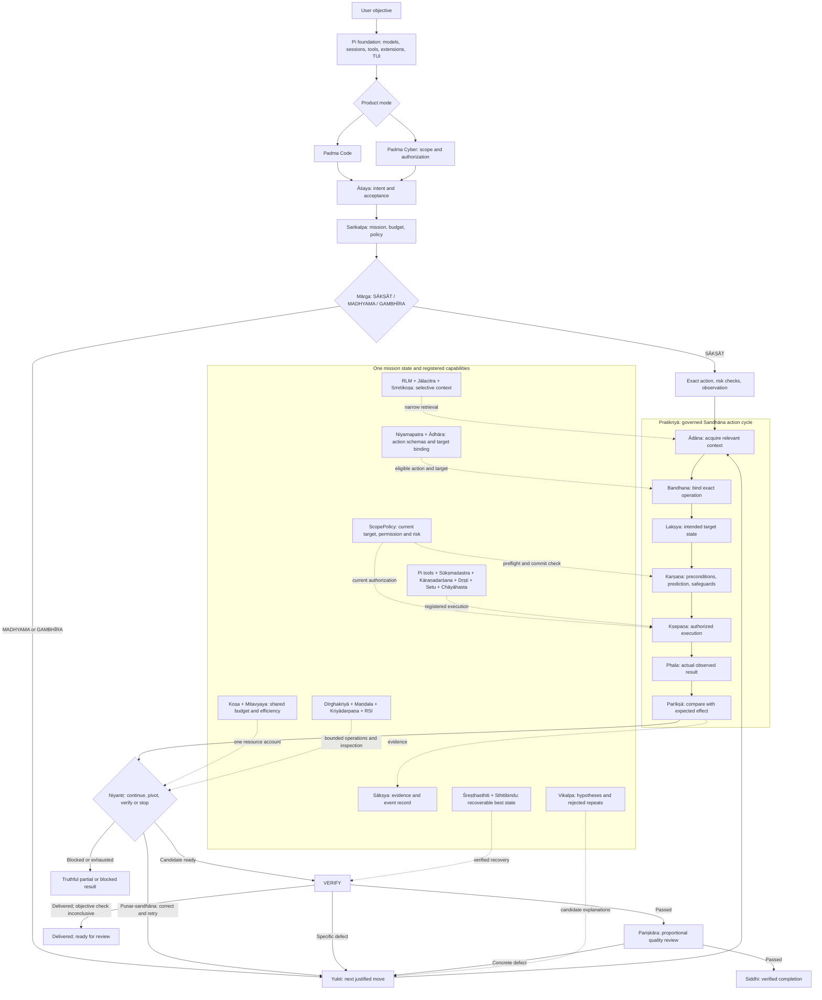
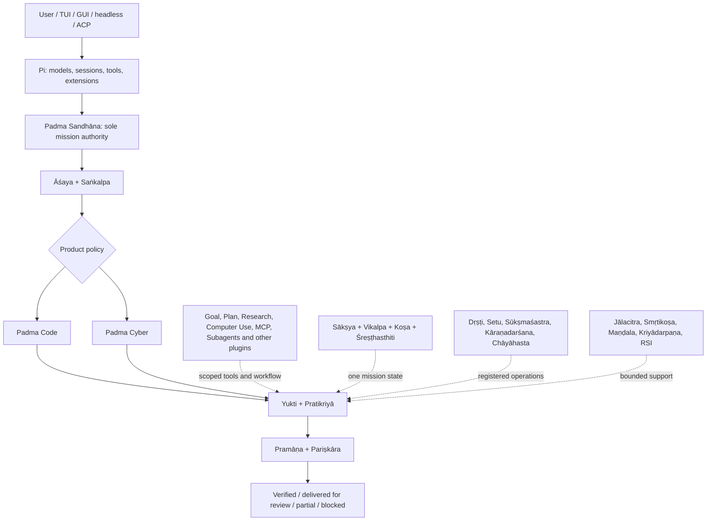

# Padma (Lotus) Harness

> **Naming decision — 29 September 2026.** The project is **Padma (Lotus) Harness**, shortened to **Padma**. Pi remains the pinned foundation. **Sandhāna** is the authoritative execution kernel. The two product modes are **Padma Code** and **Padma Cyber**. SĀKṢĀT, MADHYAMA and GAMBHĪRA are internal execution routes; other named flows remain plugins or capabilities.
>
> The prose is in English. Sanskrit is used for Padma's architectural names and stage labels, with Devanagari, meanings and old-name mappings near the front. Standard programming, protocol and file-format terms remain in their recognized forms. All named capabilities below describe intended contracts; the document does not claim they are already implemented.
>
> **Reference donors:** Prime Agent for selective context and controlled improvement; Unreal Agent for durable async execution; MiniMax Code for product ergonomics; Codex CLI for sandbox/process execution. They do not supply another control loop.

## Core design decisions

This section resolves ambiguities in the later chapters. The plan covers the complete Padma Code and Padma Cyber build. The build order follows technical dependencies; it does not end with a formal review at each stage. One integrated review appears at the end of the plan. Runtime checks inside Padma remain part of the product's behavior.

### Contract precedence and source of truth

1. The immutable user instruction and its explicit amendments define the mission objective and authorization; neither a plugin nor retrieved content may change them.
2. Part VII defines the shared record meanings. Earlier sketches are illustrations. Implement the records as versioned types in code, with one source for serialization and migration.
3. The Sandhāna action boundary and the invariants of one controller, one ledger, current target binding, risk policy and evidence before completion apply to every route and product mode.
4. The route gates decide reasoning and retrieval effort, never permission. The stage implementation table below decides when a model call is justified. A stage label does not imply a separate agent or model request.
5. Capability chapters describe the intended finished system. A capability is invoked only for tasks that need it; its presence in the architecture does not load it for every command.
6. If two explanatory passages disagree, this decision record and the shared record contracts govern. Fix the conflict before implementing it.

The document is the design source until code exists. Keep versioned contracts together in the implementation and migrate durable records explicitly when their meaning changes.

### R01 — Name the binding stage Bandhana

**Sandhāna** remains the name of the whole execution kernel. **Bandhana (बन्धन)** means binding and names the single action-preparation stage. Its ASCII identifier is `bandhana`; the kernel identifier is `sandhana`. No case folding or Unicode normalization can make these identifiers equal. The archery source still contains *saṃdhāna* in the historical sequence; Padma uses that word for the kernel inspiration, not for a second software symbol.

The executable cycle is **Ādāna → Bandhana → Lakṣya → Karṣaṇa → Kṣepaṇa → Phala → Parīkṣā**. Earlier editions called the binding stage Saṃdhāna. This edition uses Bandhana in diagrams, pseudocode and current identifiers. The glossary retains the former label only for migration and textual history.

### R02 — Stage ownership and model-call policy

| Stage | Default implementation | When a model contributes | Additional call rule |
|---|---|---|---|
| Āśaya | Typed command extraction and user-input record | Ambiguous intent, competing interpretations | Coalesce with the native decision call; no separate call for an exact request. |
| Saṅkalpa | Schema match, provenance gates, policy/budget initialization | Estimate uncertain scope or acceptance conditions | Coalesce with Āśaya/Yukti if needed; deterministic gate makes final route. |
| Mārga | Deterministic route gate | Model may propose evidence, never assert STRUCTURAL provenance | No route-only model call. |
| Yukti | Exact registered action or native model tool selection | Hypotheses, diagnostic choice, repair strategy | One bounded decision call when needed; reuse model output to populate Lakṣya. |
| Ādāna | Retrieval by exact reference and bounded search | Generate a narrow query when the target is uncertain | No call for known path or evidence ID. |
| Bandhana | Tool-schema validation, target binding and preimage checks | Model may supply proposed arguments | No additional call after a valid candidate action exists. |
| Lakṣya | Typed postconditions for registered actions | Describe a semantic expected effect for uncertain tasks | Attach to Yukti’s candidate, not a separate prediction request. |
| Karṣaṇa | ScopePolicy, risk tier, permissions, preconditions and reserve | Impact prediction for a consequential ambiguous action | Combine with the existing decision where possible; never use model confidence to waive policy. |
| Kṣepaṇa | Registered tool dispatch and durable start marker | None | Code only. |
| Phala | Capture returned and observed state | None | Code only. |
| Parīkṣā | Typed comparison and discrepancy construction | Interpret genuinely semantic observations | Targeted call only if deterministic comparison cannot answer. |
| Niyantṛ | Budget, progress, stagnation and terminal gates | Pivot among materially different hypotheses | Reuse Yukti’s next decision rather than a governor-only critic. |
| Pramāṇa | Requirement-linked deterministic checks | Judge bounded semantic evidence where needed | No second call when existing evidence settles the requirement. |
| Pariṣkāra | Task-specific checks already available | Review a concrete residual quality concern | Zero extra calls by default; a separate review must name its expected decision value. |

On SĀKṢĀT, the kernel may add **zero model calls** to Pi’s native tool decision. On MADHYAMA, Āśaya, Saṅkalpa, Yukti and Lakṣya can share one model response per meaningful decision; Bandhana, Karṣaṇa policy, Kṣepaṇa, Phala, Niyantṛ limits and simple verification are code. GAMBHĪRA spends additional reasoning only on evidence-backed branches. The table describes a ceiling on unnecessary ceremony, not a promise that every semantic task can be solved deterministically.

An implementation that makes a separate model call for every named stage violates this contract even if its final answer is correct.

### R03 — The native Pi path remains available inside Sandhāna

For known narrow actions, Sandhāna should behave nearly like Pi’s native loop: accept the existing model tool call or exact registered command, validate its current binding and policy, dispatch it, capture Phala and report the observable result. It does not instantiate a hypothesis tree, repository graph, second planner or model critic. This is a **kernel route**, not a bypass around the kernel.

The native-style path suppresses optional reasoning scaffolding while retaining the common ScopePolicy, risk check, ledger and evidence boundary. A direct call to Pi’s old tool executor outside Kṣepaṇa would violate the single action path. Keep ordinary work free of unnecessary planning and repeated context retrieval.

SĀKṢĀT still has conservative structural routing conditions. The expected common route is **MADHYAMA**: one leading hypothesis, narrow retrieval, one useful action or observation per tick and deterministic checks whenever possible. The common path must stay simple.

### R04 — ScopePolicy exists in the first kernel slice

Define `ScopePolicy.evaluate(preparedAction, missionContext) -> ScopeDecision` before the first side-effecting tool. The decision is `ALLOW`, `DENY` or `NEEDS_CURRENT_AUTHORIZATION` with policy version, target binding, risk tier, reasons and authorization reference. Default to deny when required target or permission evidence is absent.

Padma Code supplies an initial policy for workspace writes, destructive file/process operations, credentials and external effects. Padma Cyber adds an engagement predicate, permitted techniques and rate limits by **intersection** with the base policy. Cyber does not introduce the mechanism after Code is built. Plugins can narrow eligibility; they cannot widen the authorized set.

Evaluate scope at Bandhana for early feedback and **again immediately before Kṣepaṇa** against the current action and binding. The second evaluation is authoritative because time or user steering can invalidate an earlier approval. Revocation stops queued operations; running operations are cancelled or reconciled according to their actual lifecycle.

The final check and dispatch form one adapter-controlled guarded operation wherever the target supports compare-and-set, a conditional request, transaction or current generation token. For a local file, compare the preimage under the write lock and write through a temporary file plus atomic replacement on the same filesystem when appropriate. For a remote service, use its conditional revision or idempotency facility. A preceding read alone does not close the time-of-check/time-of-use gap. If an adapter cannot guard a consequential change, classify that limitation in Karṣaṇa, require the appropriate authorization or narrow the operation, and observe the authoritative result before another effect. The policy decision cannot promise atomicity the target does not provide.

Risk tier is independent of route. A Tier 3 SĀKṢĀT action still needs its exact target, current authorization and safeguards. A Tier 0 GAMBHĪRA observation does not inherit destructive permissions from the amount of reasoning spent.

### R05 — Final status separates delivery from proof

Pramāṇa never treats `INCONCLUSIVE` as `PASSED`. That rule remains. The user-facing report nevertheless distinguishes a useful delivered artifact from a failed task. Add a terminal `DELIVERED_UNVERIFIED` for work whose requested artifact exists and meets all observable requirements but whose subjective or external acceptance lacks a reliable oracle. It never satisfies an explicit user demand for proof or a missing mandatory check.

| Terminal state | What the user sees | What Padma may claim |
|---|---|---|
| `VERIFIED_COMPLETE` | Completed and checked | Every mandatory requirement has adequate current evidence. |
| `DELIVERED_UNVERIFIED` | Delivered; ready for review | The artifact is present; specified verification limits are explicit. |
| `PARTIALLY_COMPLETE` | Partial result | Some mandatory requirements remain unmet or unknown. |
| `BLOCKED` | Action needed | An input, permission, target or external dependency prevents continuation. |
| `BUDGET_EXHAUSTED` | Stopped with progress | The shared budget ended before completion; no hidden reserve was borrowed. |
| `EXECUTION_FAILED` | Attempt failed | A tool or environment failure prevented the requested result. |
| `UNSAFE_OR_UNAUTHORIZED` | Not executed | The proposed consequential action did not pass current policy. |
| `OUTCOME_UNKNOWN` | Checking an uncertain effect | An external side effect may have happened and must be reconciled before retry. |

`DELIVERED_UNVERIFIED` is appropriate for a creative draft, a design mockup or a code patch when no available check can prove a subjective requirement and the user asked for a deliverable rather than objective proof. It is not a convenient escape from a failing test. State the exact artifact, checks actually performed, unresolved claim and next review action in ordinary language. An open-ended answer may have no artifact file; use the same distinction only when the requested answer is present and its factual claims are appropriately sourced.
If an applicable quality check fails, this state cannot hide the defect. Fix it within budget or report partial/failed work. If an external effect remains uncertain, report `OUTCOME_UNKNOWN`; merely delivering a local artifact cannot settle the external effect.

Pariṣkāra is a **logical quality gate**, not a mandatory critic call. It can reuse the diff, formatter, targeted test and bounded inspection already available. A separate model review needs a named concern such as API compatibility or a security-sensitive change. Its cost is charged to Koṣa and can be declined when it has poor expected value.

### R05a — Separate outcome, delivery and quality in the report

Pramāṇa reports each active mandatory requirement independently. A requirement with an available required test that fails remains failed even when a file has been delivered. A check that cannot run records the reason and evidence gap. A subjective requirement can be marked inconclusive without relabeling the produced artifact as absent.

The terminal report lists artifact references, verified requirements, remaining or inconclusive requirements, tests run, tests skipped with reasons, and the next review action. `VERIFIED_COMPLETE` needs a passed requirement report and applicable quality checks. `DELIVERED_UNVERIFIED` needs the requested deliverable, no known failed mandatory obligation, and a limitation whose nature permits human review. A blocked authorization, unknown side effect or unmet objective has its own state. The Workbench and TUI display the same status from the backend record rather than deriving one from a toast or a completed tool call.

### R06 — Build the advanced capabilities in dependency order

Dṛṣṭi begins with a browser/DOM/accessible-scene loop that observes before and after a real action. Setu builds on that loop for **one development stack** first: a React + Vite development build with source maps and an instrumented event path. Other frameworks can follow through separate adapters.

Setu returns partial or unknown mapping when build identity, maps or runtime links are missing. Static text search alone never proves an exact UI-to-source edge.

Chāyāhasta comes after grounded computer use and requires an isolated browser environment, guarded live rebind and divergence stop. Desktop-app rehearsal needs a concrete isolation boundary. A copy of a browser profile that still reaches production accounts is not isolation.

Maṇḍala, Smṛtikoṣa, rich Jālacitra, RSI and Workbench are built where their dependencies fit. They remain lazy in the running product so a simple command does not pay for unused machinery.

### R07 — Complete the integrated system

Section 23 divides the complete build into **17 topic-owned phases**: Pi foundation; one complete Sandhāna kernel; durable async work; RLM; Jālacitra; structural editing; causal investigation; grounded computer use; UI-to-source mapping; isolated rehearsal; Cyber; plugins; workers; memory; feedback and controlled improvement; TUI; and Workbench. Each phase finishes its own topic and later phases use its interfaces. The project is complete when the integrated Code and Cyber system is built and reviewed as a whole.

Developers may run narrow checks while coding, but this plan imposes no formal completion ceremony between phases. A deadline never overrides target validation, current authorization or truthful reporting during an actual Padma action.

### R08 — Remove arbitrary default work

Operation ceilings in later chapters are provisional configuration values, not quotas to consume. A cap prevents runaway work; it does not justify an extra step. Verification reserve follows the mission’s actual requirements.

MADHYAMA avoids repeated planning, route-only calls and speculative branches without new evidence. GAMBHĪRA carries the expensive investigation. This is a design rule for implementation.

---

## Part 0 — Current build decision, names and efficiency law

### The compact architecture

**Pi is the foundation; Sandhāna is Padma's authoritative execution
kernel.** Fork or pin a known Pi revision, retain working model/provider
adapters, tool calling, sessions, extension loading, streaming and the
TUI where useful, and change the actual agent loop. An additional prompt
wrapper would leave the old controller in charge. Verify the extension
point against the chosen revision before implementing it.

The preserved control shape is **two entry contracts → governed action
loop → two final checks**. Āśaya captures user intent; Saṅkalpa compiles
the mission; Yukti chooses the next justified move; Pratikriyā binds,
executes, observes and corrects; Pramāṇa verifies completion; Pariṣkāra
reviews task-relevant quality. These are logical responsibilities, not
six required model calls.



The solid path is the mission controller. Dotted connections supply
registered state or capabilities; they do not introduce a rival
controller. **SĀKṢĀT still applies action-risk checks and completion
verification.** A write does not inherit the read-only structural fast
path. The base ScopePolicy constrains Kṣepaṇa in Code and Cyber; Cyber adds engagement scope. Retrieval, background work
and workers all draw from Koṣa. The support row is a target
architecture, not a requirement to load each component for every
command.

### Naming and historical boundary

**Padma (पद्म)** means lotus. **Sandhāna (सन्धान)** evokes fitting or
nocking in the Indian archery tradition. The [*Dhanurveda* passage on
practice](https://sanskritdocuments.org/doc_veda/dhanurveda.html)
records **ādāna → saṃdhāna → karṣaṇa → kṣepaṇa** as an archery sequence
and separately discusses **lakṣya** (target) and **vedha** (a hit).
Padma borrows that ordered action image; it does not claim that the text
describes software, agents or this feedback controller. The Sanskrit
names for budgets, checkpoints, computer use and other software
mechanisms below are modern design labels, not quotations from an
ancient engineering manual.

Padma adds **Phala** for the observed result, **Parīkṣā** for the
comparison against the prediction, **Punar-sandhāna** for a justified
corrective cycle, and **Siddhi** for verified completion. A miss,
timeout or unknown side effect is still a Phala to be inspected; Vedha
is reserved for an actual supported hit, never presumed immediately
after execution.

| Padma name | Sanskrit | Former name or English contract | Responsibility |
|---|---|---|---|
| Āśaya | आशय | Scout; Code 1, command understanding | Capture intent and mandatory outcomes. |
| Saṅkalpa | सङ्कल्प | Quartermaster; Code 2, mission compilation | Compile route, scope, budget and acceptance. |
| Pramāṇa | प्रमाण | Proof; Code 3, completion verification | Check the outcome against original requirements. |
| Pariṣkāra | परिष्कार | Polish; Code 4, quality review | Apply proportional quality checks. |
| Sandhāna | सन्धान | GRAIL, execution architecture | Single authoritative execution kernel. |
| Yukti | युक्ति | GAMBIT, next-move selection | Choose a justified action or experiment. |
| Pratikriyā | प्रतिक्रिया | RECOIL, feedback loop | Govern the action and learn from its effect. |
| Ādāna | आदान | LOAD | Acquire only necessary context. |
| Bandhana | बन्धन | Binding stage; formerly Saṃdhāna / CHAMBER | Bind tool, parameters, target and environment. |
| Yantra / Bīja | यन्त्र / बीज | Registered tool / primitive operation | Tool abstraction; the software meaning is Padma’s analogy. |
| Lakṣya | लक्ष्य | Target state | State the intended effect before commitment. |
| Karṣaṇa | कर्षण | AIM | Check preconditions, risk, prediction and recovery. |
| Kṣepaṇa | क्षेपण | FIRE | Commit a validated, authorized tool operation. |
| Phala | फल | Actual observation | Capture the real outcome, including failure or uncertainty. |
| Parīkṣā | परीक्षा | Post-action examination | Compare observed state to prediction and postconditions. |
| Punar-sandhāna | पुनःसन्धान | Correction/retry | Rebind and re-evaluate before another action. |
| Siddhi | सिद्धि | Verified completion | Final state after Pramāṇa and Pariṣkāra. |
| SĀKṢĀT / MADHYAMA / GAMBHĪRA | साक्षात् / मध्यम / गम्भीर | DIRECT / STANDARD / DEEP | Internal execution routes; risk is separate. |
| Mārga / Mārgāntara | मार्ग / मार्गान्तर | Gearbox / Gearshift | Initial route / evidence-based route change. |
| Mitavyaya / Niyantṛ | मितव्यय / नियन्तृ | Throttle / Conductor | Efficiency / progress control. |
| Sākṣya / Vikalpa | साक्ष्य / विकल्प | Receipts / Thinktank | Evidence stream / hypothesis bank. |
| Śreṣṭhasthiti / Koṣa | श्रेष्ठस्थिति / कोष | Highscore / Wallet | Best recoverable state / shared resource account. |
| Sthitibindu / Rakṣitasthiti | स्थितिबिन्दु / रक्षितस्थिति | Savepoints / Golden Save | Durable checkpoints / protection of verified work. |
| Lakṣyadṛṣṭi / Pūrvānumāna | लक्ष्यदृष्टि / पूर्वानुमान | Crosshair / Call Your Shot | Risk-scaled safeguards / prediction before action. |
| Niyamapatra / Ādhāra | नियमपत्र / आधार | Rulebook / Homebase | Registered action schemas / repository binding. |
| Dīrghakriyā / Anirṇītaphala | दीर्घक्रिया / अनिर्णीतफल | Afterburner / Schrödinger | Durable async work / uncertain-outcome reconciliation. |
| Stambhamāna / Śīghrasiddhi | स्तम्भमान / शीघ्रसिद्धि | Stuck-O-Meter / Quickdraw | Stagnation signal / early verified finish. |
| Sārasaṅgraha | सारसङ्ग्रह | Backpack | Compact context with durable evidence retained. |
| Sūkṣmaśastra / Kāraṇadarśana | सूक्ष्मशस्त्र / कारणदर्शन | Scalpel / Causal Execution Intelligence | Structural editing / causal investigation. |
| Dṛṣṭi / Setu / Chāyāhasta | दृष्टि / सेतु / छायाहस्त | Sight / Wormhole / Ghosthand | Grounded perception / UI-runtime-source mapping / isolated GUI rehearsal. |
| Jālacitra / Smṛtikoṣa | जालचित्र / स्मृतिकोष | Atlas / Vault | Repository graph / verified reusable experience. |
| Kriyādarpaṇa / Maṇḍala | क्रियादर्पण / मण्डल | Blackbox / Circuit | Inspectable mission timeline / bounded contributors. |

Product modes remain **Padma Code** and **Padma Cyber**. The word *mode*
applies only to those two products; Goal, Plan, Todo, Research, Lab,
Audit, Ops, Automation, Computer Use, MCP and Subagents remain plugins
or workflows. Keep Pi, Git, API, JSON, TUI, GUI, RLM, RSI, MCP, CUA and
familiar programming identifiers in English where they identify existing
technology. Sanskrit terms name Padma's architecture, not every noun in
an implementation file. The Romanized form in the table is the display
name; implementation identifiers can use unaccented ASCII
transliteration where the language or tool requires it. Do not create
separate services for each name. Distinguish **Sandhāna**, the kernel
(`sandhana` in ASCII identifiers), from **Bandhana**, the binding stage
(`bandhana` in ASCII identifiers).

### Keep the common path lean

Padma should spend effort where it helps the current task. A named read does not need a hypothesis tree or a model critic. An uncertain bug needs focused observations before a broad search. A consequential action needs current authorization even if the task is otherwise easy.

- **SĀKṢĀT:** Use a known narrow action, current binding, policy check and observation. A write still needs its own preconditions and result inspection.
- **MADHYAMA:** Start with one useful hypothesis and retrieve only needed context. Branch after contrary evidence or genuine uncertainty.
- **GAMBHĪRA:** Use bounded alternatives and experiments when the problem genuinely spans several causes or components. Stop exploring once the mission can be resolved.
- **RLM:** Retrieve relevant source ranges and evidence on demand; avoid a permanent heavyweight index on the common path.
- **Pramāṇa / Pariṣkāra:** Use available task-specific checks and evidence. No forced extra model call for quality review.
- **One Koṣa:** Retrieval, background work, experiments, workers and result checks consume one mission budget.

Build these mechanisms as one controller on Pi. The named stages describe responsibilities; they are not separate services or separate calls.

### Modes, tools and staged capabilities

| Layer | Names | Build stance |
|---|---|---|
| Product modes | Padma Code; Padma Cyber | Same SANDHĀNA kernel. Build Code foundations first, then mount Cyber's authorized scope and defensive tool profile. |
| Internal execution routes | SĀKṢĀT; MADHYAMA; GAMBHĪRA | Conservative structural routing; risk is separate. |
| Core mechanisms | SANDHĀNA; YUKTI; PRATIKRIYĀ; Āśaya, Saṅkalpa, Pramāṇa, Pariṣkāra; Mārga, Niyantṛ, Mitavyaya, Sākṣya, Vikalpa, Śreṣṭhasthiti, Koṣa, Sthitibindu, Lakṣyadṛṣṭi, Niyamapatra, Ādhāra | Minimal implementations first; state objects need not be separate services. |
| Basic tools | File read/edit/search; shell/process; Git; tests/build/type checks; model/tool adapters | Reuse Pi and expose exact actions through SANDHĀNA. |
| Context and editing | RLM; Jālacitra Lite → Jālacitra; Sūkṣmaśastra | Add retrieval before advanced structural editing. |
| Runtime and interface | Kāraṇadarśana; Dṛṣṭi; Setu | Add in that order where evidence shows value; Setu remains a flagship. |
| Later machinery | Dīrghakriyā; Kriyādarpaṇa timeline; Smṛtikoṣa; Maṇḍala; Chāyāhasta; RSI | Implement in dependency order and invoke only when relevant. |
| Plugins/workflows | Goal; Plan; Todo; Research; Lab; Audit; Ops; Automation; Computer Use; MCP; Subagents | Mount in Code or Cyber; no independent mission authority. Basic tool/plugin access can arrive earlier than their advanced implementations. |

Detailed capability contracts in later sections describe the finished system. A subsystem runs only when its task needs it. The Workbench and TUI use the same mission protocol.

---

## Part I — Sandhāna: detailed execution-kernel contract

### Sandhāna

Sandhāna is Padma's command-execution architecture. A user gives Padma
an objective; Āśaya identifies the intended outcome, Saṅkalpa compiles
the mission, Yukti selects the next justified move, and Pratikriyā makes
that move observable. Pramāṇa verifies the original completion
requirements, then Pariṣkāra checks the quality relevant to the task.
The design preserves the original two-entry → governed loop →
two-final-check shape while changing its action metaphor to the staged
archery sequence.

Each Pratikriyā cycle has an explicit boundary. Ādāna retrieves bounded
context; Bandhana binds a typed operation; Lakṣya records the intended
state; Karṣaṇa validates preconditions, prediction and risk controls;
Kṣepaṇa dispatches the authorized operation once; Phala records the
actual effect, even if the tool failed or the effect is unknown; Parīkṣā
compares that effect to the intended state. A mismatch returns to Yukti
through Punar-sandhāna only when a new action is justified. Siddhi is
available only after completion and quality checks, never because the
tool call itself returned success.

**Kṣepaṇa is the side-effect boundary.** Preparation and rehearsal
cannot be mistaken for a live commit. An uncertain outcome cannot be
blindly launched again: reconcile actual target state first. A fast
SĀKṢĀT action still follows the relevant risk checks and Pramāṇa.
MADHYAMA begins with one leading hypothesis; GAMBHĪRA permits bounded
alternatives when evidence supports them. The Koṣa budget covers all
three routes, background work and final verification.

Sandhāna is one kernel, not a federation of autonomous controllers.
Padma Code, Padma Cyber, computer use and external tools share it with
distinct policies and registered actions. Āśaya, Saṅkalpa, Pramāṇa and
Pariṣkāra are logical contracts; deterministic program logic can satisfy
them without separate model calls. The final result must always
distinguish supported completion, partial progress, a blocked action and
unresolved uncertainty.

> **Execution shape:** User objective → Āśaya → Saṅkalpa → Yukti + Pratikriyā (bounded loop) → Pramāṇa → Pariṣkāra → Siddhi or an honest non-success status.

#### How a command moves through the architecture

The data moves forward through explicit contracts rather than through
one enormous, ever-growing prompt. Āśaya emits the Command
Specification; Saṅkalpa turns it into a Mission Contract with acceptance
criteria, resource limits, tool eligibility and an initial strategy.
During execution, YUKTI receives a compact view of the current position
and selects the next justified action. Pratikriyā owns binding, the
authorized action, Phala and Parīkṣā. The observation is recorded as
evidence, not merely appended as conversational text. The governor
inspects that evidence after every meaningful step and may continue,
change strategy, ask for needed authorization, stop unnecessary search,
or submit a candidate for final verification.

The persistent systems are deliberately separate. The hypothesis bank
remembers approaches and why they were accepted or rejected. The
evidence ledger holds actual outputs, predicted outcomes, validations
and contradictions. The Śreṣṭhasthiti register points to recoverable
artifacts rather than persuasive textual summaries. The resource ledger
records spending across all phases of the mission, including preflight,
repair and final refinement. This separation makes it possible to debug
a wrong decision: one can see what the mission required, what Padma
predicted, what the tool did, and why the governor authorized the next
action.

##### Main supporting systems

Mārga [Adaptive Execution Router].  Chooses SĀKṢĀT, MADHYAMA, or GAMBHĪRA once during
mission compilation, with later evidence-based adaptation.

Niyamapatra [Trusted Structural Action Registry].  Provides deterministic
structural provenance for well-defined fast-path actions.

Lakṣyadṛṣṭi [Risk-Adaptive AIM].  Scales prediction and safeguards
to action risk independently of mission mode.

Śreṣṭhasthiti [Best-State Register].  Protects verified progress
while experiments continue.

Vikalpa [Hypothesis Bank].  Tracks alternative explanations, repairs,
supporting evidence, and rejected repeats.

Sākṣya [Evidence Ledger].  Separates actual observations, predictions,
interpretations, and verification outcomes.

Niyantṛ [Progress Governor].  Controls stagnation, branching, escalation,
early completion, and termination.

Koṣa [Shared Resource Ledger].  Accounts for tool calls, tokens, cost,
ticks, output volume, verification reserve, and refinement.

Sthitibindu [Durable Checkpoint Manager].  Allows safe resumption and
recovery after interruption.

#### Āśaya: understanding the command

For Āśaya, a useful Command Specification is not a verbose
interpretation of the user’s sentence. It is a compact, stable record of
the intended outcome, the exact targets where provided, non-negotiable
constraints and proof that would count as completion. Consider “fix
login without breaking existing accounts.” The concrete objective is to
restore login behavior while retaining compatibility with existing
accounts; the causes of failure, affected files and repair mechanism are
unknown. Those unknowns belong in the mission state, not invented into
the specification. This separation stops a mistaken early guess from
becoming the mission’s official definition of success.

The specification also distinguishes mandatory requirements from
optional refinements. If a user asks for a working implementation, style
improvements cannot displace functionality. If a request is purely
observational, Āśaya should not turn it into permission to edit or
repair the inspected system. It should represent authorization
conservatively and identify when later consequential actions will
require additional permission.

Āśaya turns the natural-language command into a structured Command
Specification. It determines what must be accomplished, not how the
final solution must be implemented.

##### Responsibilities

- Extract the objective and mandatory outcomes.

- Identify named targets and explicit operations.

- Separate mandatory requirements from optional improvements.

- Record constraints, authorization boundaries, and quality expectations.

- Define observable completion conditions where possible.

- Record unresolved questions without inflating them into GAMBHĪRA complexity.

- Avoid speculative multi-step planning.

##### Command Specification contract

```text
CommandSpecification {
mission_id
original_instruction
objective
target_description
explicit_requirements[]
constraints[]
expected_artifacts[]
completion_conditions[]
quality_requirements[]
known_facts[]
unresolved_questions[]
authorization_scope
}
```

#### Saṅkalpa: constructing the mission

Saṅkalpa compiles the command rather than writing a giant fixed plan. It
first tries to recognize a known typed operation using the trusted
action registry. If a command such as “read config.json” matches a
registered single-file read, the operation’s structural properties can
establish its dependency and verification requirements without opening
the file first. If the command is more complicated, the compiler
extracts six categorical signals, performs at most two useful read-only
preflight observations, and selects SĀKṢĀT, MADHYAMA or GAMBHĪRA. The
output is an initial strategy and its resource ceiling, not an
instruction to exhaust that ceiling.

Crucially, Saṅkalpa establishes verification before the search becomes
expensive. It captures acceptance checks and reserves a portion of the
shared budget where separate verification will be needed. It also
initializes the mission’s authoritative state and the evidence
structures before actions begin. When a classification later proves
insufficient, only evidence-based governor transitions change the active
mode. Saṅkalpa is not repeatedly called on every tick to second-guess
its original choice.

Saṅkalpa converts the Command Specification into an executable Mission
Contract. It is the only stage that performs initial mode routing. It
does not create a giant fixed plan; it initializes an adaptable mission.

##### Mission Contract

```text
MissionContract {
mission_id
command_specification
execution_mode
classification_signals
provenance_records
action_permissions
acceptance_contract
quality_contract
budget_policy
risk_policy
initial_execution_state
checkpoint_policy
initial_hypotheses
}
```

##### Compilation order

- Resolve requested action and target.

- Match a trusted structural action schema if applicable.

- Extract six classification signals with provenance.

- Attempt zero-preflight SĀKṢĀT fast path.

- Perform bounded preflight only if it can materially change routing.

- Choose SĀKṢĀT, MADHYAMA, or GAMBHĪRA using the explicit gates.

- Initialize one shared resource ledger and verification reserve.

- Initialize mission state, Śreṣṭhasthiti register, Sākṣya ledger, and Vikalpa bank.

#### Choosing SĀKṢĀT, MADHYAMA or GAMBHĪRA

The classifier intentionally has no weighted complexity score or
model-generated “confidence” decimal. Six categorical signals are easier
to test, inspect and revise than a score that competes with unrelated
hard gates. Each signal carries provenance. A signal stated by the user
is COMMAND; one guaranteed by a registered action contract is
STRUCTURAL; one established by an actual inspection is PREFLIGHT; one
obtained from relevant prior traces is HISTORY. ESTIMATE and UNKNOWN
remain explicitly less authoritative. This is especially important for
the SĀKṢĀT path, where an unproven guess about dependencies or
verification must not be treated as evidence that a task can finish in
one action.

The routing gates are conservative but do not equate missing knowledge
with high difficulty. A trivial known read qualifies SĀKṢĀT through
verified command and structural evidence. An ordinary localized repair
with some unknowns defaults to MADHYAMA. GAMBHĪRA is reserved for
evidence-backed broad scope, cross-component dependencies, sustained
failure or substantial expected iterative effort. The thresholds are
engineering defaults to calibrate against real Padma execution traces,
not theoretical facts about task difficulty.

Routing uses six categorical signals. There is no weighted complexity
score and no self-reported model confidence threshold.

S — Scope.  0 — Low: One known operation / narrow target  1 —
Moderate/Unknown: Several related operations / localized component  2 —
High: Broad or cross-component work

A — Ambiguity.  0 — Low: Objective and operation clear  1 —
Moderate/Unknown: Some investigation needed  2 — High: Multiple
unresolved competing explanations

D — Dependencies.  0 — Low: No significant dependencies  1 —
Moderate/Unknown: Related dependencies in one subsystem  2 — High:
Several interacting systems/components

O — Verification.  0 — Low: Direct or automated verification  1 —
Moderate/Unknown: Some additional inspection / unknown  2 — High:
Substantial exploratory validation required

H — History.  0 — Low: Relevant verified procedure exists  1 —
Moderate/Unknown: Insufficient relevant history  2 — High: At least two
materially different relevant failures

E — Execution effort.  0 — Low: ≤3 execution tool ops  1 —
Moderate/Unknown: ~4–15 ops or uncertain  2 — High: >15 ops /
substantial iteration

##### Provenance categories

COMMAND.  Supported directly by the user’s instruction.

STRUCTURAL.  Guaranteed by a registered, versioned action schema after
its preconditions are validated.

PREFLIGHT.  Established through bounded read-only environmental
inspection.

HISTORY.  Established by relevant recorded execution evidence.

ESTIMATE.  An unconfirmed execution estimate; never enough by itself for
SĀKṢĀT.

UNKNOWN.  Insufficient evidence.

##### SĀKṢĀT gate

> **Execution shape:** SĀKṢĀT requires S0 + A0 + D0 + O0 + E0, with H ≤ 1. S/A/D/O/E must be backed by COMMAND, STRUCTURAL, or PREFLIGHT evidence. H may remain unknown.

##### GAMBHĪRA gate

GAMBHĪRA is selected when at least one of the following evidence-backed
conditions holds:

- S2 and D2.

- E2 and either S≥1 or A≥1.

- H2 and A≥1.

- At least two of S/A/D/O/E are severity 2, including at least one of S/A/D/E.

Severity-2 estimates without supporting evidence cannot independently
trigger GAMBHĪRA. If neither SĀKṢĀT nor GAMBHĪRA is established, choose
MADHYAMA.

#### Structural provenance and the action registry

The registry is the guard against a subtle classifier failure: allowing
a language model to say that a command “obviously” has no dependencies.
Instead, a registered tool schema states exactly which properties follow
from the operation’s contract. A named, single-file read can have one
target, one expected invocation and a directly observable
content-or-error response. None of that asserts the file exists. A
missing-file error can therefore be a perfectly correct SĀKṢĀT
classification followed by an unsuccessful operation. Failure of the
action is not proof the classifier was wrong.

Output size must never be smuggled into the operation-count signal. A
non-recursive listing of 50,000 entries may still require one
invocation. Such an output belongs to output-volume and token
accounting. Pagination genuinely requiring additional invocations
changes expected operation count; recursion only changes it if the
registered primitive cannot satisfy recursive traversal within its
stated invocation contract. Registration requires positive and negative
tests, versioned invariants and explicit side-effect declarations.
Arbitrary shell strings, described targets, write commands and unknown
remote APIs do not inherit observational shortcuts.

STRUCTURAL provenance exists so obvious, typed operations can reach
SĀKṢĀT without spending preflight calls. It is not model intuition. It
is a property of a versioned action schema.

##### Initial schemas

READ_SINGLE_FILE.  Eligibility summary: One explicitly named file;
registered file-read primitive; no extra analysis/transformation.
Structural invariants: S0, D0, O0, E0; A0 comes from unambiguous
command.

LIST_SINGLE_DIRECTORY.  Eligibility summary: One named/bound directory;
non-recursive registered listing; no additional analysis.  Structural
invariants: S0, D0, O0, E0 if complete result is one invocation.

STATUS_CHECK.  Eligibility summary: One named or validly bound target;
registered observational status primitive.  Structural invariants: D0,
O0, E0; S0 if one target; A0 if request is unambiguous.

##### Output volume is not execution complexity

> **Execution shape:** A flat directory with 50,000 files can still be SĀKṢĀT if one registered tool invocation returns the requested result. Size affects output/token budgets, not E.

Pagination changes E only when the complete requested result requires
additional tool invocations. Recursive traversal changes E only when the
registered primitive cannot satisfy recursion in one bounded invocation.

##### Commands that do not inherit the structural fast path

- Writes, modifications, migrations, and destructive operations.

- Described-but-not-named targets such as “the file responsible for login.”

- Multi-operation requests such as “read all configs and find the broken one.”

- Arbitrary or unregistered shell commands.

- External operations whose contracts and side effects are not registered.

##### Registry admission checklist

- Precisely defined behavior and target type/cardinality.

- Validated input/precondition rules.

- Documented operation-count contract.

- Explicit dependency assumptions.

- Observable output and error contracts.

- Accurate side-effect and risk classification.

- Structural invariants that logically follow from the tool contract.

- Examples of eligible and superficially similar ineligible commands.

- Explicit schema versioning and controlled review.

Material schema changes require a version increment, invariant
revalidation and invalidation of incompatible cached matches.

#### Knowing which project or target is current

“Current repository” is an explicit piece of session state, not a phrase
the model is free to interpret. A binding contains a canonical path,
repository identity where obtainable, workspace identity, generation and
establishment evidence. The binding is created only after trusted
selection or observation, then invalidated or revalidated when the
workspace, selected repository or relevant path identity changes. A
status command should target the bound repository explicitly, and the
result should contain enough trusted target information to show that
Padma did not accidentally inspect a different project.

The important failure is a stale binding that returns a plausible
result: unlike a missing file, that operation may succeed on the wrong
repository. For this reason a fast-path status operation must either
validate target identity within the tool call or decline the structural
shortcut. A workspace switch cannot silently carry an old “current”
repository into a new mission.

A target may be “current” only when it is explicitly bound in session
state through trusted evidence. Model belief is not a binding.

```text
RepositoryBinding {
binding_id
canonical_path
repository_identity
workspace_id
workspace_generation
session_id
establishment_evidence
validity_state
}
```

##### Establishment

- Explicit user selection followed by validation.

- A verified repository-opening operation.

- A trusted workspace binding whose repository identity is validated.

- A previous trusted tool observation that established repository identity.

##### Invalidation

- Workspace or selected repository changes.

- Session reset.

- Working-directory changes that invalidate target assumptions.

- Repository removal or replacement.

- Trusted observation contradicts stored identity.

- Workspace generation changes.

Path equality alone is insufficient if the path now contains a different
repository. A status operation should target the repository explicitly
and return enough trusted target information to associate its output
with the intended binding.

#### When Sandhāna needs a preflight observation

Preflight exists to improve routing when an observation can materially
change the decision. It is not a compulsory inspection phase. The
compiler may spend zero, one or two read-only tool operations, and each
actual invocation counts toward mission-wide cost and token usage. These
operations have a separately bounded preflight allowance, so a two-call
investigation cannot consume all three execution calls available to a
subsequently classified SĀKṢĀT mission. The preflight allowance is not a
bonus pool: unused capacity cannot be converted into extra execution
operations.

A structural fast path should usually consume zero preflight calls. The
preflight function may be called in code, but it must explicitly decide
whether any operation is necessary. When uncertainty remains after the
permitted observations, the normal classification rules apply;
uncertainty alone does not demand GAMBHĪRA.

Preflight is a routing aid, not a ritual. It may execute zero, one, or
two read-only operations. The compiler should use it only when the
observation can materially improve classification.

0 ops.  Sufficient command/structural evidence already exists, or extra
discovery has low value.

1 op.  One targeted observation can resolve a routing-critical
uncertainty.

2 ops.  A second targeted observation is justified and still within the
cap.

If uncertainty remains after preflight and GAMBHĪRA is not positively
established, route to MADHYAMA.

#### What the three execution modes actually do

A mode describes the permitted strategy and an initial resource ceiling,
not a ritual. SĀKṢĀT performs a known action and observes it, with no
candidate tree. MADHYAMA starts with a primary hypothesis and introduces
alternatives only when contradictory or missing evidence justifies them.
GAMBHĪRA allows bounded, potentially branching investigation and
isolated candidate tests. Even a GAMBHĪRA mission should stop searching
immediately once it has a candidate with sufficient acceptance evidence,
because the remaining budget has no intrinsic value if the task is
already solved.

Mode and action risk are separate. A computationally simple irreversible
operation cannot skip authorization or safeguards simply because its
mode is SĀKṢĀT. Conversely, a difficult GAMBHĪRA investigation may
include many cheap, risk-tier-zero reads that require no elaborate
consequence prediction. If the initial mode proves inadequate, the
governor may raise the active ceiling; the previous consumption remains
charged. If the task becomes straightforward, the governor cancels
unused search branches without needing a ceremonial “de-escalation”
pass.

SĀKṢĀT.  Purpose: Known, narrow operation.  Initial limits: 3 execution
ops  Behavior: No speculative tree. Execute, observe, verify. Escalate
only if real evidence exposes greater complexity.

MADHYAMA.  Purpose: Normal coding / multi-step work.  Initial limits: 12
ticks; 40 execution ops  Behavior: Start with one primary hypothesis;
introduce alternatives only when justified.

GAMBHĪRA.  Purpose: Genuinely difficult / ambiguous investigation.
Initial limits: 40 ticks; 100 execution ops; ≤3 active branches; branch
depth ≤2  Behavior: Selective multi-hypothesis search, empirical tests,
controlled backtracking.

> **Execution shape:** Modes are ceilings, not quotas. A GAMBHĪRA mission solved on tick 2 should immediately proceed to verification.

#### YUKTI: selecting the next move

YUKTI borrows from chess the idea of considering moves, preserving
alternatives and revising the position after new information. It does
not assume software has a known transition function like a chessboard.
Predicting what code changes will do is uncertain, and real execution
can be expensive. For that reason YUKTI has three distinct methods:
choose a clear action directly; conduct lightweight look-ahead when a
few alternatives are worth considering; or run empirical comparisons in
isolated environments when the expected information justifies the cost.

For example, with a flaky authentication failure, a candidate diagnostic
test may be more valuable than immediately editing three different
files. A successful diagnostic narrows the hypothesis bank and makes
later actions cheaper. If the evidence contradicts the main hypothesis,
YUKTI should revise the current position rather than endlessly trying
cosmetic variations of the same change. Its search is bounded by the
active mode, available budget, action permissions and the Niyantṛ
governor.

YUKTI decides which move is worth making next. It is inspired by chess
only in the sense of candidate moves, evidence-sensitive alternatives,
and backtracking; it does not pretend that arbitrary software
environments have a known transition function.

##### POSITION

Build a lightweight view of current objective, remaining requirements,
evidence, current state, available tools, hypotheses, previous failures,
best verified progress, and remaining budget.

##### Three decision methods

Direct selection.  Known next action; little or no informational value
from alternatives.

Lightweight look-ahead.  Small set of plausible moves; model predictions
are estimates only.

Empirical search.  Test candidates in isolation when actual
experimentation is affordable and more reliable than prediction.

##### Candidate contract

```text
CandidateAction {
intended_operation
target
supporting_hypothesis
expected_observable_outcome
required_evidence
estimated_execution_cost
reversibility
action_risk
}
```

##### Selection principles

- Prefer actions likely to produce useful evidence, not merely actions that sound plausible.

- Prefer actual test results over simulated model predictions.

- Do not generate several candidates for a trivial command.

- Do not retain a branch merely because the budget permits it.

- Backtrack when evidence contradicts a core assumption, while preserving useful verified artifacts.

#### The hypothesis bank and avoiding repeated mistakes

The hypothesis bank is structured memory of possible explanations and
repairs. Each hypothesis has a target, suspected root cause, proposed
correction mechanism, failure signature, expected observable outcome and
evidence references. Its status changes as real observations support or
contradict it. The bank is not a running transcript; it is a compact
decision aid so the engine can avoid repeating previously disproven
work.

Duplicate detection starts with normalized fields and controlled
correction-mechanism categories. Two prose descriptions that identify
the same target and mechanism under the same failure conditions should
not create separate branches. Only genuinely ambiguous near-matches need
a narrow model judgment. A useful distinction is that two different
repairs can touch the same file; location alone is not a reason to
reject a new approach. A previously failed approach may also become
valid when new evidence or an altered environment changes its premises.

```text
Hypothesis {
hypothesis_id
target_component
target_resource
suspected_root_cause
correction_mechanism
expected_outcome
failure_signature
supporting_evidence[]
contradicting_evidence[]
status
attempt_count
}
```

Possible statuses: UNTESTED, ACTIVE, SUPPORTED, CONTRADICTED, REJECTED,
RESOLVED.

##### Duplicate detection

Use structured fingerprints first: normalized target, root-cause
category, correction mechanism, failure signature, and expected
observable result. Only use targeted model judgment when structured
comparison is genuinely ambiguous.

> **Execution shape:** Cosmetic rewording of a previously failed approach is not a new hypothesis.

#### Pratikriyā: preparing, executing and learning

Pratikriyā is the governed action path. **Ādāna** retrieves exactly the
context needed for Yukti's chosen move. **Bandhana** constructs a typed
operation with current tool, arguments, target, permissions and bounds.
**Lakṣya** states the intended target and effect. **Karṣaṇa** checks
preconditions, records a prediction before consequential side effects,
and prepares appropriate recovery or isolated rehearsal. **Kṣepaṇa**
invokes the validated tool once. **Phala** captures actual outputs,
state changes and uncertainty. **Parīkṣā** compares observation with
expectation and updates the evidence record. The recorded outcome is
evidence, not an improvised success story.

```text
ĀDĀNA → BANDHANA → LAKṢYA → KARṢAṆA → KṢEPAṆA → PHALA → PARĪKṢĀ
                                            mismatch → PUNAR-SANDHĀNA → YUKTI
                                            verified → PRAMĀṆA → PARIṢKĀRA → SIDDHI
```

##### ĀDĀNA

Retrieve bounded files, spans, tool schemas and prior evidence on demand
through RLM. A project-wide scan is not the default.

##### BANDHANA

```text
PreparedAction {
  action_id
  tool_identifier
  target
  arguments
  required_permissions
  expected_state_change
  preconditions
  timeout
  resource_limits
}
```

The prepared action is bound to the current target generation and
registered schema. The **Yantra (यन्त्र)** is the registered tool
capability; its **Bīja (बीज)** is the primitive operation it exposes.
Padma borrows this pairing as an analogy from the [*Samarāṅgaṇa
Sūtradhāra* chapter on
yantras](https://www.wisdomlib.org/hinduism/book/samarangana-sutradhara-sanskrit/d/doc411683.html).
The historical text discusses machines and operating elements; it does
not define software tools or this permission model. Neither label grants
authority.

##### LAKṢYA

Define the exact target state and observable effect. Distinguish a
tool-level success signal from the desired real-world state change.
Invalid or stale target bindings return for correction before Kṣepaṇa.

##### KARṢAṆA

Apply risk-scaled preconditions, prediction, permission checks and
recovery preparation. Store the prediction before Kṣepaṇa; do not
reconstruct it after the result is visible.

##### KṢEPAṆA

Commit only through registered, authorized, validated tool interfaces.
Enforce schemas, target binding, budget, timeouts and required
isolation. Mark operation start durably before external side effects
when reconciliation matters.

##### PHALA

Capture actual stdout/stderr, filesystem or runtime/UI state, errors,
cancellation, partial effects and unknown outcome. Execution success is
not verification success.

##### PARĪKṢĀ

Compare Phala against Lakṣya and the recorded prediction. Store
observation separately from interpretation. If the result is uncertain,
reconcile the authoritative target before a new Kṣepaṇa. If there is a
supported discrepancy, send a specific repair through Punar-sandhāna to
Yukti. Only evidence of actual improvement permits checkpoint promotion.

#### KARṢAṆA changes with the risk of the action

Detailed prediction is not useful for every read or linter invocation.
It is useful when an action modifies important state, has significant
side effects or is difficult to reverse. Tier 0 observational actions
require basic schema and permission checks. Tier 1 locally reversible
changes require appropriate recovery preparation and post-change
inspection. Tier 2 consequential changes require explicit impact
analysis and stronger preconditions. Tier 3 irreversible or high-impact
operations require the applicable explicit authorization and safeguards
before execution. Risk classification happens per action, independently
of the mission’s routing mode.

KARṢAṆA should record its prediction before KṢEPAṆA so the engine cannot
revise the prediction after seeing the tool result. It must also admit
uncertainty. Prediction is a planning aid, never proof that the action
will be safe or successful. If the requested action cannot be authorized
or its target cannot be validated, the engine stops or asks for the
missing information instead of hiding the problem in the loop.

0.  Type: Observational / read-only  KARṢAṆA / safeguard policy: Validate target and arguments; skip expensive outcome prediction; execute and observe.

1.  Type: Locally reversible  KARṢAṆA / safeguard policy: Predict intended change where useful; establish suitable rollback or checkpoint.

2.  Type: Consequential  KARṢAṆA / safeguard policy: Explicit impact analysis; preconditions; permission check; recovery/isolation where practical.

3.  Type: High-impact / irreversible  KARṢAṆA / safeguard policy: Appropriate explicit authorization; target validation; impact analysis; available safeguards; no model-confidence shortcut.

Mission mode and action risk are independent. SĀKṢĀT can still contain
Tier 3 actions; GAMBHĪRA can contain Tier 0 reads.

#### The Śreṣṭhasthiti register: protecting real progress

The Śreṣṭhasthiti register is the central protection against an agent
improving its way into a worse outcome. It maintains the current
experimental state separately from the best verified, recoverable
result. It also links the active hypothesis bank and evidence ledger. A
speculative patch should never overwrite the last patch that actually
passed its relevant checks merely because the model prefers the new
wording or implementation.

Verification has levels. Experimental work may be preserved for
diagnosis; locally validated work has passed relevant intermediate
checks; mission-verified work has passed the applicable final completion
and quality checks. The system should retain these distinctions rather
than using one Boolean success flag. Checkpoints must reference real
artifacts—commits, worktrees, patches or recoverable state
snapshots—because a textual summary cannot recreate lost files or undo
an irreversible action. When alternatives satisfy incomparable subsets
of requirements, track those differences explicitly rather than
collapsing them into one arbitrary score.

The Śreṣṭhasthiti register prevents experimentation from destroying the
strongest verified progress.

Current State.  The experimental state presently being worked on.

Best Verified State.  The strongest recoverable state that has passed
the relevant checks so far.

Vikalpa bank.  Active, rejected, supported, and resolved approaches.

Sākṣya ledger.  Actual observations, tests, errors, satisfied
requirements, unresolved defects.

##### Verification levels

- EXPERIMENTAL — under investigation.

- LOCALLY VALIDATED — passed relevant intermediate checks.

- MISSION VERIFIED — passed applicable Pramāṇa and Pariṣkāra checks.

Never replace a mission-verified checkpoint with an experimental
candidate merely because the model believes it is “better.”

##### Checkpoint media

Use actual recoverable artifacts such as Git commits, worktrees,
patches, versioned state snapshots, or disposable test environments. A
textual summary alone is not a checkpoint.

#### The evidence ledger: what really happened

The ledger makes the difference between evidence and interpretation
explicit. A tool’s actual output is an observation. A model’s
explanation of that output is an interpretation. A predicted result is
an expectation. A passing regression test is verification of the
behavior that test covers, not proof that every possible requirement was
met. Store these as different record types with stable IDs, timestamps,
relevant action IDs and artifact references. Large logs remain in
artifact storage and are retrieved through RLM when needed, rather than
copied into each prompt.

This evidence chain makes auditing practical. A developer can trace why
a task was classified SĀKṢĀT, why YUKTI selected a repair, why
PRATIKRIYĀ considered an action successful, why a checkpoint was
promoted and why a later governor decision ended the mission. Without
those references, the recurrent loop quickly becomes a long conversation
that can confidently contradict its own earlier observations.

```text
EvidenceRecord {
evidence_id
mission_id
action_id
hypothesis_id
timestamp
tool_identifier
tool_arguments_reference
expected_result
actual_result_reference
observed_state_changes
verification_status
relevant_errors
}
```

The ledger must distinguish predicted outcomes, actual observations,
deterministic checks, and model interpretations. A model interpretation
is not an observation. A zero exit code is not proof that the full
mission is complete.

#### The Niyantṛ governor: when to continue or stop

The Niyantṛ governor is the hard boundary around adaptive execution. It
is responsible for deciding whether the loop continues, changes
strategy, escalates, reduces exploration, submits a candidate for
verification or terminates. It considers not only available tokens but
meaningful progress: tests changed, requirements verified, root causes
disproven, important uncertainties resolved and verified artifacts
produced. More thoughts, paraphrases and additional branches alone are
not progress.

Its initial stagnation policy has two stages. After four consecutive
ticks without meaningful progress, the current strategy is interrupted
for a targeted diagnosis and a materially different attempt, provided
enough budget remains. If three further ticks still produce no
meaningful progress, the governor considers a justified mode escalation
or terminates with the best recoverable state. Mode changes update the
actual mode used by the next YUKTI decision and do not reset previous
charges. The same governor enforces early finish when the acceptance
evidence is already sufficient; no mode is a requirement to spend its
entire ceiling.

The Niyantṛ governor is the recurrent loop’s control system. It decides
when to continue, branch, change strategy, escalate, reduce exploration,
verify, or terminate.

##### Meaningful progress

- A failing regression test now passes.

- A root cause has been experimentally ruled out.

- A required feature is verified.

- An important uncertainty is resolved.

- A blocking dependency is repaired.

Reasoning text, rephrased hypotheses, and new branches without new
evidence do not count as progress.

##### Stagnation policy

> **Execution shape:** 4 ticks without meaningful progress → stop current strategy and perform targeted diagnosis. If the next 3 ticks still produce no meaningful progress → justified escalation or termination with best recoverable state.

Only meaningful evidence-based progress resets the stagnation counter. A
change of wording does not.

##### Escalation

Allowed sequence: SĀKṢĀT → MADHYAMA → GAMBHĪRA. Direct SĀKṢĀT→GAMBHĪRA
escalation requires strong evidence. Escalation must update the active
mode variable and must never reset consumed resources.

##### Effective de-escalation / early finish

When acceptance evidence becomes sufficient, cancel speculative branches
and proceed to verification. The engine is never required to “use up” a
GAMBHĪRA budget.

#### One budget for the entire command

Budget accounting must remain cumulative across every part of a mission.
Preflight has a maximum of two observational operations and does not
reduce the selected mode’s execution-operation ceiling, but it still
consumes the mission’s global tokens, time and cost. The initial
execution ceilings are three operations for SĀKṢĀT, forty operations and
twelve ticks for MADHYAMA, and one hundred operations and forty ticks
for GAMBHĪRA. These are configurable starting defaults. Every empirical
test, PRATIKRIYĀ tool call, external verification call, repair action
and quality-refinement call draws from the same execution allowance.

Verification is explicitly protected: SĀKṢĀT reserves one of its three
operations if an external verification call is necessary, MADHYAMA
reserves at least six, and GAMBHĪRA at least fifteen. The reserve is
already inside the mode ceiling; it is not free extra capacity. On
escalation, consumed operations remain charged, so a SĀKṢĀT mission that
used two execution calls has thirty-eight remaining under a new MADHYAMA
ceiling. The ledger independently tracks input tokens, output tokens,
tool-output volume, monetary cost and time. Large flat directory output
stresses those resources without retroactively changing one-call
execution effort.

Every mission uses one resource ledger; there are no hidden pools for
verification or refinement.

Tool usage.  Preflight operations and execution operations

Model usage.  Input tokens and output tokens

Output pressure.  Tool-output volume / artifact size

Reasoning.  Cognitive ticks

Cost.  Estimated monetary spend

Refinement.  Number of quality-repair rounds

Time.  Elapsed mission/execution time where available

##### Preflight accounting

Maximum two preflight operations. They count toward total mission
usage/cost but do not reduce the selected mode’s execution-op ceiling.
Unused preflight capacity cannot be converted into execution capacity.

##### Verification reserve

SĀKṢĀT.  Prefer inline deterministic verification; if separate
verification is required, reserve 1 of the 3 execution ops.

MADHYAMA.  Reserve at least 6 of the 40 execution ops for verification /
permitted recovery.

GAMBHĪRA.  Reserve at least 15 of the 100 execution ops for verification
/ permitted recovery.

##### Escalation accounting

If SĀKṢĀT consumes 2 execution operations and escalates to MADHYAMA, the
ceiling becomes 40 and 38 remain. Escalation changes the ceiling; it
does not create a fresh budget.

##### Output handling

Large one-call outputs remain one operation. Stream or store large
results as artifacts and inject bounded relevant slices into model
context. Do not silently truncate a user-requested complete result and
claim full completion.

##### Refinement

Pariṣkāra may request up to two refinement rounds by default. Every
refinement operation consumes the same original mission budget.

#### Durable state and recovery after interruption

A recurrent executor must be recoverable without blindly replaying side
effects. The durable mission state includes the original specification,
active mode, resource consumption, current operation, hypothesis bank,
evidence ledger, best checkpoint and pending verification. A lightweight
transactional store such as SQLite can hold structured metadata and
state transitions, while large tool outputs and patches live in
referenced files. The model context is not the source of truth; it may
be compacted or replaced without erasing mission history.

An interrupted operation may have an unknown outcome. Retrying
immediately could duplicate a payment, repeat a deployment or apply a
migration twice. Represent NOT_STARTED, IN_PROGRESS, CONFIRMED_COMPLETE,
FAILED and OUTCOME_UNKNOWN explicitly. After a crash, reconcile
uncertain operations through available external state and idempotency
keys where practical, and only then decide whether to retry. If an
outcome cannot be safely determined, the mission may need to stop with
an honest unresolved status.

Persist sufficient state to resume safely after interruption and to
avoid duplicating side effects.

- Mission identity and original specification.

- Active execution mode and consumed budgets.

- Current state, hypotheses, evidence, and best checkpoint.

- Pending/started operations and their outcome status.

- Verification state and terminal status.

##### Operation lifecycle

- NOT_STARTED

- IN_PROGRESS

- CONFIRMED_COMPLETE

- FAILED

- OUTCOME_UNKNOWN

An operation with UNKNOWN outcome must be reconciled before retrying.
Prefer idempotent operations and stable operation identifiers where
practical.

##### Initial storage recommendation

Use a lightweight transactional store such as SQLite for mission state,
evidence metadata, bindings, budgets, and checkpoints. Large tool
outputs and artifacts may live in files referenced by the database.

#### Pramāṇa: did Padma actually solve it?

Pramāṇa asks the narrow question: did the produced artifact or observed
environment satisfy the original Command Specification? It should be
deterministic-first. For a requested file read, confirm the correct
target and returned data. For a write, inspect the expected filesystem
state. For a bug fix, run a relevant regression test and the applicable
existing checks. For computer use, inspect the actual resulting
application state rather than treating a sequence of successful clicks
as completion. If deterministic verification cannot address a
requirement, use a targeted evidence-supported model judgment rather
than an automatic full-auditor call.

The completion report separates PASSED, FAILED and INCONCLUSIVE
requirements. An exit code of zero cannot prove the whole mission
succeeded, and an inconclusive check is not silently upgraded to a pass.
Failed requirements return specific repair requests to the same
YUKTI–PRATIKRIYĀ kernel, subject to the same remaining budget.

Pramāṇa answers: “Did Padma actually satisfy the mission specification?”
It is deterministic-first.

##### Verification examples

- File read/write: verify target and actual content/state.

- Bug fix: run the regression test that reproduces the original defect plus relevant existing tests.

- Feature implementation: execute functional acceptance tests and inspect required artifacts.

- Repository change: inspect actual diffs and required checks.

- Computer-use task: inspect final application state rather than trusting action history.

```text
CompletionReport {
verified_requirements[]
failed_requirements[]
unverified_requirements[]
evidence_references[]
actionable_defects[]
completion_status  // PASSED | FAILED | INCONCLUSIVE
delivery_status    // NOT_DELIVERED | PARTIAL | DELIVERED
}
```

> **Execution shape:** INCONCLUSIVE is never PASSED. Use targeted evidence-supported model judgment only where deterministic verification is genuinely insufficient.

#### Pariṣkāra: is the result good enough?

Pariṣkāra asks a different question: is the completed result good enough
for this particular task? Its review is proportional to what is at
stake. A trivial read may need no expensive model assessment; a
security-sensitive authentication change may require substantial
inspection for regressions, reliability, maintainability and unintended
changes. The auditor works from actual artifacts and evidence rather
than trusting Pramāṇa’s verdict as proof of every quality property.

Quality refinements must be concrete and bounded. If the review finds a
meaningful defect, it records a specific repair target, preserves the
previous validated candidate, and returns the work to YUKTI–PRATIKRIYĀ.
The repaired result goes through applicable completion and quality
checks again. At most two refinement rounds are initially allowed, and
all their tokens, operations and time come from the original shared
budget. “Make it more premium” without a defined defect, criterion or
demonstrable benefit is not a valid reason to loop forever.

Pariṣkāra asks a different question: “Is the completed result good
enough for the mission?” It evaluates quality dimensions not fully
captured by binary acceptance checks.

Correctness.  No unresolved logical defects in the requested behavior.

Reliability.  No obvious fragility or avoidable regression risk.

Security.  No relevant security regressions; applicable security
constraints satisfied.

Maintainability.  Reasonable clarity, localized changes, consistency
with project conventions.

Performance.  Only where the mission includes relevant performance
requirements.

Usability / presentation.  Task-specific requirements for interface or
artifact quality.

##### Premium refinement

- Record a concrete actionable defect.

- Preserve the previous verified candidate.

- Return a targeted repair request to YUKTI–PRATIKRIYĀ.

- Apply and test the repair.

- Rerun applicable Pramāṇa checks and Pariṣkāra checks.

- Stop when required criteria are met or further improvement has insufficient value relative to cost/risk.

Do not ask the model to “make it more premium” without a specific defect
or measurable requirement.

#### How RLM supplies exactly the context needed

RLM is the system’s selective access to large context, not a replacement
for durable storage. The next action may need a single function and its
callers, not two hundred thousand lines of source. A quality check may
need the changed files and test logs, not the entire conversational
transcript. By storing stable artifact references and retrieving only
relevant pieces for each stage, Sandhāna reduces unnecessary context
pressure and limits accidental reliance on stale summaries.

Context compaction is allowed to shrink a model’s working view, but it
must never remove the authoritative command specification, resource
ledger, checkpoint references or verification evidence. Those live
outside the model context and are loaded explicitly when required.

RLM is SANDHĀNA’s context-access mechanism. It should retrieve just
enough information for the current decision instead of repeatedly
filling the model context with the entire project and execution history.

- Targeted file retrieval.

- Repository structure navigation.

- Large-document segmentation.

- Evidence-ledger retrieval.

- Prior-attempt retrieval.

- Large tool-output slicing.

- Context compaction while preserving durable mission state.

Durable mission state must remain outside temporary model context.
Compaction cannot erase original requirements, critical evidence, or
recovery checkpoints.

#### How RSI can improve the engine safely

RSI analyzes accumulated execution traces to suggest controlled
improvements to the harness itself, such as classifier adjustments,
better retrieval rules, more effective recovery or cheaper verification.
It is not permission for the live executor to alter its own production
kernel mid-mission. Improvements are explicit proposals. Apply them in an isolated environment, inspect their effects on relevant behavior, retain a rollback path, and require review before changing the running system.

The useful optimization target is verified completion at practical cost,
not the fewest model calls or the most elaborate reasoning. A proposed
speed improvement that silently increases wrong-repository errors or
decreases regression-test coverage is not an improvement.

RSI can learn from accumulated execution traces, but it cannot freely
edit the live SANDHĀNA kernel.

##### RSI may propose changes to

- Routing / classifier policies.

- Action-selection policies.

- Context retrieval strategies.

- Recovery and stagnation handling.

- Execution budgets.

- Verification procedures.

##### Promotion pipeline

- Explicit improvement proposal.

- Isolated inspection of the proposed change.

- Rollback mechanism.

- Controlled promotion.

#### Using the same engine in Code, Cyber and computer use

Padma Code and Padma Cyber are the two product modes exposed through the
same execution kernel. Code contributes compiler, test, editing and
repository tools. Cyber contributes authorized defensive assessment and
scoped security validation. Computer Use is a plugin in either mode; its
actions are Pratikriyā operations grounded in real interface
observations. MCP providers expose typed tools through the same schemas,
risk and budget boundaries. Subagents, when useful, are bounded
contributors and cannot create hidden mission budgets or bypass final
verification.

Sandhāna is shared execution infrastructure. Padma Code supplies
repository and development tools; Padma Cyber adds scoped defensive
assessment and stricter target policy. Computer Use, MCP and Subagents
mount as plugins or registered tool providers. None creates another
execution loop or can bypass the common Koṣa, evidence or verification
boundaries.

#### What happens in one cognitive tick

A cognitive tick is not synonymous with one language-model request. A
straightforward observation may be largely deterministic: select a
registered operation, validate its arguments, execute it and inspect its
structured return. A difficult tick may use a model to generate
hypotheses, a sandbox to evaluate candidates and several deterministic
checks to interpret the actual results. Regardless of how much reasoning
it contains, each meaningful tick ends with an updated position and a
governor decision. This is the mechanism that turns a looping assistant
into a bounded, inspectable execution engine.

```text
1. POSITION   Read current mission state.
2. YUKTI     Select the next justified move.
3. ĀDĀNA       Retrieve needed context.
4. BANDHANA    Bind exact tool operation.
5. LAKṢYA      State intended target effect.
6. KARṢAṆA     Apply risk-proportional prediction/checks.
7. KṢEPAṆA    Execute the authorized operation.
8. PHALA       Capture actual outcome, including uncertainty.
9. PARĪKṢĀ    Compare actual against intended and predicted state.
10. UPDATE     Update evidence, hypotheses, state, checkpoint.
11. NIYANTṚ    Measure progress; continue, change, verify, or stop.
```

A cognitive tick is a logical cycle, not necessarily a single LLM call.
Deterministic steps should remain deterministic.

#### The execution state machine and reference algorithm

Explicit state transitions stop the system from declaring completion at
arbitrary points in the loop. A candidate first becomes ready for
verification, then Pramāṇa checks acceptance, then Pariṣkāra checks
applicable quality, and only afterward can the candidate be committed as
mission-verified. Failed verification returns a precisely described
repair request to the kernel, while resource exhaustion, missing
permissions, stagnation and interrupted operations have distinct
terminal or resumable states. The state machine and the operation
lifecycle together determine which work may safely be replayed after a
failure.

```text
CREATED
-> UNDERSTANDING
-> COMPILING
-> EXECUTING
-> CANDIDATE_READY
-> VERIFYING_COMPLETION
-> VERIFYING_QUALITY
-> FINALIZING
-> VERIFIED_COMPLETE
Side transitions:
EXECUTING -> REPLANNING -> EXECUTING
VERIFYING_COMPLETION -> REPAIRING -> EXECUTING
VERIFYING_QUALITY -> REFINING -> EXECUTING
VERIFYING_COMPLETION -> FINALIZING -> DELIVERED_UNVERIFIED
Terminal states:
VERIFIED_COMPLETE
DELIVERED_UNVERIFIED
PARTIALLY_COMPLETE
BLOCKED
BUDGET_EXHAUSTED
STAGNATED
EXECUTION_FAILED
UNSAFE_OR_UNAUTHORIZED
OUTCOME_UNKNOWN
INTERRUPTED
```

##### Reference algorithm

The code below is pseudocode for one controller. Helpers are deterministic unless their contract explicitly permits a model contribution. `native_pi_candidate` reuses the model tool decision or exact command already available from Pi; it is not a second executor.

```text
spec = asaya_parse_or_interpret(user_command)
binding = adhara_resolve_current_target(spec)
schema = niyamapatra_match(spec, binding)
signals = classify_signals_with_provenance(spec, schema, binding)

if sakshat_gate_proved(signals):
    route = SAKSHAT
else:
    if bounded_preflight_can_change_route(signals):
        signals = update_from_preflight(signals, max_operations=2)
    route = route_by_explicit_gates(signals)

mission = sankalpa_compile(
    spec, route, binding, base_scope_policy,
    shared_budget_with_verification_reserve
)
state = persist_initial_mission(mission)

while not state.terminal:
    state = reload_current_revision_and_steering(state)
    reconcile_in_flight_operations_before_any_retry(state)

    if state.candidate_ready:
        completion = pramana_verify_requirements(state)
        if completion.PASSED:
            quality = pariskara_existing_checks_first(state)
            if quality.PASSED_or_NOT_APPLICABLE:
                promote_recoverable_best_state(state)
                return terminal(VERIFIED_COMPLETE, completion, quality)
            if quality.actionable and budget_allows_targeted_refinement():
                state = prepare_specific_refinement(quality)
                continue
            return truthful_terminal_from_quality_limit(state, quality)

        if completion.INCONCLUSIVE and delivered_unverified_eligible(state):
            return terminal(DELIVERED_UNVERIFIED, completion, review_action)
        if completion.actionable and budget_allows_targeted_repair():
            state = prepare_specific_repair(completion)
            continue
        return truthful_partial_or_blocked_terminal(state, completion)

    position = compact_position_from_durable_state(state)
    if route == SAKSHAT and native_pi_candidate_is_exact(position):
        candidate = native_pi_candidate(position)  # zero extra model calls
    else:
        candidate = yukti_select_next_justified_move(position, route)
    if candidate is FINAL_CHECK:
        state.candidate_ready = true
        continue
    if candidate is BLOCKED_OR_NO_VALUE:
        return truthful_terminal_for_block_or_budget(state)
    if repeats_refuted_approach(candidate, state.evidence):
        state = reject_and_choose_materially_different_move(candidate)
        continue

    context = adana_retrieve_only_needed(candidate, shared_budget)
    prepared = bandhana_bind_registered_yantra(candidate, context)
    prepared = lakshya_record_intended_effect(prepared, candidate)
    risk = classify_action_risk(prepared)  # independent of route
    prepared = karshana_check_and_predict_proportionally(prepared, risk)

    preliminary = ScopePolicy.evaluate(prepared, current_mission_context())
    if preliminary is not ALLOW:
        state = block_or_request_current_authorization(preliminary)
        continue
    reservation = kosha_reserve_action_and_preserve_verification(prepared)
    if not reservation:
        return terminal(BUDGET_EXHAUSTED, current_evidence)

    if target_generation_changed(prepared):
        kosha_release_unspent(reservation)
        state = discard_preparation_and_rebind_from_current_evidence(prepared)
        continue  # new action digest, risk, Lakṣya and policy decision
    final_scope = ScopePolicy.evaluate(prepared, current_mission_context())
    if final_scope is not ALLOW:
        kosha_release_unspent(reservation)
        state = block_or_request_current_authorization(final_scope)
        continue

    persist_start_marker_before_external_effect(prepared, final_scope)
    phala = kshepana_dispatch_and_capture_actual_outcome(prepared)
    kosha_reconcile_actual_usage(reservation, phala)
    if phala.OUTCOME_UNKNOWN:
        state = persist_unknown_and_reconcile_authoritative_target(phala)
        if not state.reconciled:
            return terminal(OUTCOME_UNKNOWN, state.evidence)
        continue  # never blindly repeat Kṣepaṇa

    discrepancy = pariksha_compare_with_lakshya_and_prediction(prepared, phala)
    sakshya_append_raw_then_interpretation(phala, discrepancy)
    state = update_requirements_hypotheses_and_checkpoints(state, discrepancy)
    state = niyantr_decide_continue_pivot_verify_or_stop(state, shared_budget)
    route = margantara_change_route_only_with_new_evidence(state, route)

return terminal_report_with_requirement_links_and_limits(state)
```

The same algorithm applies to Code and Cyber. Cyber adds a scope predicate; it does not replace the action boundary. The route may change after evidence, while spent budget, operation lifecycle and the original instruction remain intact. For an observational action with no external effect, the start marker can be cheap, but the event sequence still distinguishes preparation, execution and observation.


#### Example: fixing a real authentication bug

The authentication example illustrates all the major mechanisms acting
together. The user’s goal is a bug fix with an explicit non-regression
requirement. Āśaya captures the goal and leaves the cause unresolved.
Saṅkalpa identifies a bounded but nontrivial problem and selects
MADHYAMA. YUKTI begins with one evidence-supported diagnostic rather
than launching every plausible repair. PRATIKRIYĀ executes the
diagnostic and records what the test actually showed. As evidence
accumulates, YUKTI may change its leading hypothesis or justify an
alternative. A correction that passes one test but fails another remains
experimental; the earlier verified work is protected. Only after
completion and quality review does the result become mission-verified.

Command: “Find and fix the authentication bug in my application. Run the
relevant tests and make sure the existing login system still works.”

##### Āśaya

Extracts the required outcome, preservation of existing login behavior,
testing requirement, and security quality expectations. Root cause
remains unknown.

##### Saṅkalpa

Assuming a localized component with uncertain cause and available tests,
Saṅkalpa selects MADHYAMA. It allocates the normal budget and preserves
verification reserve.

##### YUKTI + PRATIKRIYĀ

- YUKTI forms a primary hypothesis about token refresh and selects a diagnostic test.

- PRATIKRIYĀ executes the diagnostic and records the actual failing behavior.

- Evidence supports token-refresh handling as a likely root cause.

- YUKTI selects a targeted correction; PRATIKRIYĀ applies it in an isolated worktree and runs tests.

- Original regression passes but an integration test fails. PRATIKRIYĀ records the contradiction; YUKTI revises the correction instead of pretending success.

- A later candidate passes the applicable acceptance evidence and is submitted to Pramāṇa.

##### Final verification

Pramāṇa verifies the original bug, login behavior, and required tests.
Pariṣkāra reviews security and maintainability. Any concrete defect
returns as a bounded targeted repair. When both applicable checks pass,
the candidate becomes mission-verified.

#### How the architecture fits into the harness

The implementation should be a set of narrow interfaces around one
authoritative mission state, not a new harness inside the existing
harness. Keep parsing, structural registry, routing, YUKTI strategy,
PRATIKRIYĀ execution, risk policy, evidence persistence, checkpoints,
budgeting and verification separable so each can be tested without
running a complete model-driven mission. The model is used to interpret
ambiguous requests and generate or compare hypotheses when justified;
deterministic infrastructure owns budgets, tool validity, persistence,
schema contracts and terminal transitions.

For a development machine with limited RAM, start with a single
underlying model, a small concurrency allowance and SQLite-backed
mission metadata. Do not require a large local embedding index or
permanently running parallel agents. Architecture flexibility should
come from typed interfaces and persisted evidence rather than
heavyweight local processes.

Implement SANDHĀNA as actual harness code with explicit interfaces and
persisted state. Do not implement the whole system as one giant system
prompt.

##### Recommended modules

semantic_core.  Command Specification parsing and normalization.

mission_compiler.  Structural matching, preflight, routing, contracts,
initial budgets.

action_registry.  Versioned structural action schemas and admission
tests.

bindings.  Session/workspace target bindings and invalidation.

gambit.  Candidate selection and bounded exploration.

pratikriya.  Prepared actions, KARṢAṆA, execution, observation.

risk.  Action-level risk classification and authorization policy.

hypotheses.  Structured hypothesis bank and duplicate detection.

evidence.  Evidence ledger and artifact references.

best_state.  Checkpoints and verified-state promotion.

governor.  Progress, stagnation, mode adaptation, termination.

budget.  Single mission-wide accounting ledger.

verification.  Pramāṇa deterministic-first completion checks.

quality.  Pariṣkāra adaptive quality review and refinement.

persistence.  Transactional state, operation lifecycle, resumption.

rlm_bridge.  Targeted retrieval and context compaction.

rsi_bridge.  Offline improvement proposals and reviewed promotion.

##### Engineering rules

- Validate all tool arguments against schemas before execution.

- Use transactional writes for mission-state transitions where practical.

- Do not derive permissions solely from model text.

- Separate artifact storage from model context.

- Log enough evidence to reproduce why a mission was routed, escalated, stopped, or declared verified.

- Make deterministic behavior testable without invoking an LLM.

- Keep model-dependent judgments behind narrow interfaces with explicit inputs and outputs.


#### What makes the combined architecture work

Sandhāna works when the boundaries between its components remain real.
Āśaya owns the meaning of the request; Saṅkalpa owns the initial route
and the budget; YUKTI owns the next strategic move; PRATIKRIYĀ owns
authorized action and observation; the governor owns continued execution
and termination; Pramāṇa owns evidence-based completion checks; and
Pariṣkāra owns task-appropriate quality. The state structures connect
those responsibilities without letting any single model answer quietly
redefine the mission, erase a failure, bypass the resource ledger or
declare its own work perfect.

The intended behavior is concrete: a named-file
read should finish through SĀKṢĀT without preflight, branching or
unnecessary model review. A localized bug should begin with one
hypothesis, adapt to contradictory test results and preserve a
recoverable patch. A difficult multi-component problem should justify
deeper search only when the evidence warrants it and stop when progress
stagnates. An interrupted high-impact action should not be blindly
replayed. A solution should be reported as fully verified only when the
required completion and quality checks really pass. That is what turns
the original two-entry → loop → two-check shape into a usable execution
architecture.

---

# Part II — Proposed Integration: The Expanded Padma Harness

Part II is the wider engineering specification built on Part I's
Sandhāna kernel. Its interfaces and algorithms are Padma
design proposals. A more detailed interface refines Part I; it does not
silently override the kernel's routing, budgets, authorization,
evidence, verification or operation lifecycle. Review any amendment to those boundaries.

## 1. Charter, exclusions and invariant architecture

Padma Harness is a programmable, evidence-driven software and
computer-action system. Sandhāna is its **only** mission execution
authority. Capabilities supply perception, structural knowledge,
instrumentation, edits, rehearsal, persistent experience, execution
traces or bounded parallel work. Padma has exactly two top-level product
modes: **Padma Code** and **Padma Cyber**. Everything else that changes
workflow behavior is mounted as a plugin, capability, policy or tool
bundle under one of those two modes. No product mode or plugin owns a
second planning loop, private resource ledger, unreviewed action
executor or independent declaration of completion.

**Included:** Original Sandhāna in Part I; RLM; RSI; Padma Code; Padma
Cyber; Goal, Plan, Todo, Research, Lab, Audit, Ops, Automation, Computer
Use, MCP and Subagent plugins; Dṛṣṭi, Sūkṣmaśastra, Kāraṇadarśana, Setu,
Chāyāhasta, Jālacitra, Smṛtikoṣa, Kriyādarpaṇa and Maṇḍala. Existing
Sandhāna tool registration remains fundamental infrastructure.

**Deliberately excluded from this scope:** Forge, Watchtower,
Switchboard, Shield and Autopilot, as well as the unapproved
Counterfactual, Tripwire, Repro Capsule, Chameleon and Archaeologist
concepts. Generic research, document creation, provider selection,
security dashboards and test-running receive no separate branded
subsystem. A mode may use ordinary tools for those tasks through
Sandhāna without pretending they constitute a new architecture.

### 1.1 Non-negotiable invariants

1. **One mission, one authority.** One immutable original Command Specification, one active Mission Contract, one Niyantṛ governor, one cumulative resource ledger and one recognized terminal state.
2. **One action path.** Every side-effecting action enters through BANDHANA → LAKṢYA → KARṢAṆA → KṢEPAṆA → PHALA → PARĪKṢĀ. A capability may propose or prepare operations, but it cannot secretly execute consequential actions or bypass Sandhāna.
3. **Evidence over narrative.** A claim that something happened must reference an actual observation; predictions, model interpretations and test coverage remain separate record types.
4. **Actual checkpoints.** Best-State promotion requires verifiable references to recoverable artifacts or external state; a prose description cannot replace a checkpoint.
5. **Risk independent of difficulty.** SĀKṢĀT/MADHYAMA/GAMBHĪRA governs exploration, not permission. A simple irreversible action still receives the safeguards its risk tier requires.
6. **Preserve original routing.** The structural registry grants SĀKṢĀT only for proven typed contracts. No model judgment, successful prior run or new perception capability can manufacture STRUCTURAL provenance.
7. **No hidden budgets.** Browser observations, instrumentation, child workers, trial runs, retries, model calls, MCP operations and quality repair all charge to the parent mission as Part I requires.
8. **Observe before asserting.** A sequence of clicks, shell commands or code edits is not proof of the requested state. Pramāṇa and Pariṣkāra determine what evidence is sufficient.
9. **Reconcile unknown outcomes.** After interruption, an IN_PROGRESS externally consequential operation becomes OUTCOME_UNKNOWN until authoritative evidence resolves it. Do not replay blindly.
10. **Untrusted content never confers authority.** Files, webpages, comments, logs, screenshots, tool output and retrieved memories can contain instructions relevant as data, but do not expand user authorization or modify system policy.
11. **Product-mode switching is policy-checked.** A change between Padma Code and Padma Cyber cannot widen permissions, targets or permitted techniques without a reviewed transition and any required new authorization. Activating a plugin such as Research, Computer Use or Ops also cannot widen authorization implicitly. Current budgets and evidence survive both mode and plugin changes.
12. **Separate experiment from promotion.** A rehearsed GUI sequence, suggested patch, inferred call edge or instrumented trace remains a candidate until verified against the actual mission acceptance criteria.

### 1.2 Logical placement



The stage-by-stage action sequence appears in Part 0. This diagram shows
ownership: Pi supplies reusable infrastructure, Padma Sandhāna alone
governs the mission, and modes, plugins and capabilities enter through
reviewed boundaries.

Pi supplies reusable models, sessions, tools, extensions and the initial
terminal surface. **Padma owns mission semantics.** The integrated
SANDHĀNA loop, not Pi's stock loop or an extension, determines
completion; no plugin can bypass permissions, budgets, evidence or
verification.

### 1.3 Product modes, execution modes, plugins and capabilities

Padma uses the word **mode** in two deliberately different layers, and
implementation code must not conflate them:

- **Product mode:** exactly one of `padma_code` or `padma_cyber`. This chooses the top-level domain policy, default system contract, default plugin set and security posture presented to the user.
- **SANDHĀNA execution mode:** `SĀKṢĀT`, `MADHYAMA` or `GAMBHĪRA`. This is selected by Saṅkalpa from evidence-backed routing signals and governs exploration ceilings. It is not a user-facing product personality.
- **Plugin:** a mountable workflow or behavioral extension such as Goal, Plan, Todo, Research, Lab, Audit, Ops, Automation, Computer Use, MCP or Subagents. A plugin contributes tools, prompt sections, event handlers, UI panels, retrieval sources, acceptance helpers or policies through typed contracts. It does not become an independent agent architecture.
- **Capability:** a reusable engineered service such as Dṛṣṭi, Sūkṣmaśastra, Jālacitra, Setu or Chāyāhasta. Capabilities expose typed operations and observations; plugins and SANDHĀNA may consume them.

This separation is mandatory. A "Research plugin" can run inside Padma
Code or Padma Cyber; it is not a third mode. Computer Use can be mounted
inside either product mode; it is not a separate mode. Goal/Plan/Todo
can appear in both modes without duplicating SANDHĀNA.

### 1.4 Compatibility and upgrade rules

Use explicit `schema_version` and `implementation_version` on all
cross-component envelopes. Unknown required fields cause rejection;
unknown optional fields may be ignored only when documented. Migration
of persisted records must be transactional and testable. Hash or
otherwise fingerprint schemas and relevant environment generations where
a stale interpretation could cause incorrect targeting. A capability or
plugin cannot grant itself permissions by advertising additional
operations. Startup must validate registry compatibility before exposing
Padma Code or Padma Cyber. If an existing implementation already emits
`lotus_*`, `grail/*` or `code3/code4` identifiers, provide explicit
versioned read aliases and migration; never silently reinterpret stored
missions. New Padma events use the identifiers shown below.

### 1.5 Foundation decision: Pi as chassis, SANDHĀNA as brain

Pin a specific Pi revision or fork and keep its useful model adapters,
session/events, typed tool path, extension system, streaming and TUI.
First map the selected revision's actual execution loop, tool call
boundary and session persistence. Implement SANDHĀNA at the loop
boundary, replacing or deeply modifying Pi's default decision sequence.
The four entry and final contracts can share calls or use deterministic
logic. A plugin cannot take over the authoritative loop or independently
declare success.

```text
Pi (pinned fork)
  ├─ models/providers, sessions, tools, extensions, streaming, TUI
  └─ SANDHĀNA kernel (sole mission authority)
       ├─ Padma Code / Padma Cyber policies
       ├─ core execution and evidence
       └─ optional plugins and capabilities
```

Pin and test the foundation, record upstream licensing/dependency
constraints, and bring upstream updates in deliberately. Keep Padma
schema versions independent of Pi's package versions. Reuse working Pi
facilities unless a specific SANDHĀNA contract requires changing them.
No DSH/Cordis adapter, compatibility layer or migration framework belongs in the architecture.

**Reference donors, not foundations:** Prime Agent for RLM and
controlled improvement; Unreal Agent for durable async and steering;
MiniMax Code for coding UX; Codex CLI for execution engineering. Borrow
only mechanisms that fit Padma's single-controller design.

---

## 2. System contracts: records every capability shares

The Part I CommandSpecification, MissionContract, CandidateAction,
PreparedAction, Hypothesis, EvidenceRecord, CompletionReport and
RepositoryBinding remain the authoritative semantic contracts. Their
stable field-level meanings and routing semantics are retained;
implementation identifiers can migrate under the versioned compatibility
policy. The following envelopes are **additive proposed types**, not
replacements.

```ts
// Pseudocode types: choose a concrete schema format and generate validators from it.
type Id = string;
type EvidenceRef = { evidence_id: Id; digest?: string };
type ArtifactRef = { artifact_id: Id; digest: string; media_type: string; storage_uri: string };
type BoundTarget = {
  kind: 'repository'|'file'|'symbol'|'process'|'service'|'browser_session'|
        'window'|'ui_element'|'network_target'|'document'|'external_resource';
  binding_id: Id;
  workspace_id: Id;
  generation: number;
  canonical_identity: string;
  observed_at: string;
  evidence: EvidenceRef[];
};
type CapabilityRequest = {
  schema_version: string;
  mission_id: Id;
  action_id: Id;
  capability_id: string;
  operation_id: string;                    // registered exact operation
  target: BoundTarget;
  arguments: unknown;                      // validated against operation schema
  product_mode_id: 'padma_code'|'padma_cyber';
  active_plugin_ids: string[];
  authorization_ref: Id | null;
  budget_reservation_ref: Id;
  timeout_ms: number;
  idempotency_key: string | null;
  causal_parent_action_id: Id | null;
};
type CapabilityResult = {
  schema_version: string;
  action_id: Id;
  lifecycle: 'CONFIRMED_COMPLETE'|'FAILED'|'OUTCOME_UNKNOWN';
  observations: EvidenceRef[];
  produced_artifacts: ArtifactRef[];
  actual_usage_ref: Id;
  actual_side_effects: string[];          // observation-based, not guessed
  binding_generation_after: number | null;
  error_code?: string;
};
```

`CapabilityResult.lifecycle` is the result after reconciliation where
possible; Sandhāna's persisted operation record also uses the complete
NOT_STARTED/IN_PROGRESS/CONFIRMED_COMPLETE/FAILED/OUTCOME_UNKNOWN
lifecycle from Part I. Before KṢEPAṆA, persist the prepared action,
permission decision and any required pre-execution KARṢAṆA prediction.
After KṢEPAṆA, persist actual usage and returned observations
transactionally. If the tool returns untrusted text, retain its original
bytes in artifact storage and expose a bounded, clearly tagged derived
view to the model.

### 2.1 Evidence provenance

Every evidence item declares: origin (`tool_observation`,
`runtime_trace`, `filesystem_snapshot`, `browser_observation`,
`deterministic_check`, `model_interpretation`, `prior_history` or
`external_source`), capture time, target identity, environment identity,
parent action, content digest, applicable validity window and whether
the bytes are authentic output or transformed/filtered. Summaries point
back to exact source ranges or event IDs. Correlation is not causation:
a source map edge, stack frame or coincident network request never
becomes a validated causal edge without suitable tracing or an
experiment.

### 2.2 Authorization model

Grant permissions as typed capabilities scoped to an exact target,
operation class, environment and time window. Padma Cyber additionally
binds an explicit authorization statement, included/excluded targets,
allowed techniques, prohibited actions, rate ceilings and stop
conditions. GUI sessions and SCM worktrees carry independent binding
identities. No capability may infer permission from a model's
confidence, a retrieved page's instructions, a previous mission's
approval or an ambiguous target description.

### 2.3 Resource model

A reservation is **not** extra budget. Reserve a predicted amount
atomically before launching a child task or expensive tool operation;
reconcile against observed usage, release unused capacity and debit
overruns under the parent mission's ceiling. Parallel workers cannot all
claim the same remaining verification reserve. Record wall time, tokens,
actual tool invocations, output bytes and any per-provider cost that is
measurable. If an unknown external tool cannot provide accurate cost,
set a conservative bounded allowance and mark unobservable accounting
fields explicitly.

### 2.4 Data minimization and secrets

Jālacitra indexes only necessary repository metadata; Smṛtikoṣa promotes
only verified reusable experience; Kriyādarpaṇa stores action references
and redacted observability events rather than dumping credentials into
transcripts. Log raw inputs only where necessary and permitted, and
define per-artifact retention and deletion. Passwords, access tokens,
customer data and other secrets are never intentionally inserted into
model summaries, skill examples or screenshot annotations. Artifact
access checks run again when an old reference is retrieved in a new
session.

### 2.5 Asynchronous PRATIKRIYĀ and live steering

PRATIKRIYĀ is asynchronous by design. `KṢEPAṆA` may dispatch one or more
**dependency-independent, already-authorized operations** without
blocking the entire cognitive loop. This is inspired by the async-first
operation model explored by Unreal Agent, but Padma keeps SANDHĀNA's
stronger budget, evidence and verification boundaries.

```ts
type AsyncOperationRecord = {
  operation_id: Id;
  mission_id: Id;
  action_id: Id;
  dependency_ids: Id[];
  state: 'QUEUED'|'DISPATCHED'|'RUNNING'|'CONFIRMED_COMPLETE'|'FAILED'|'CANCELLED'|'OUTCOME_UNKNOWN';
  prepared_action_ref: Id;
  authorization_ref: Id;
  budget_reservation_ref: Id;
  launched_at?: string;
  last_observed_at?: string;
  result_ref?: Id;
};
```

Rules:

1. Persist the prepared action, permission decision, target binding and budget reservation **before** dispatch.
2. Only operations proven independent may overlap. Conflicting writes, dependent migrations, sequential UI gestures and operations sharing a non-thread-safe resource remain ordered.
3. Completion events return through PRATIKRIYĀ and enter the Sākṣya ledger exactly like synchronous results. A running or queued operation is never evidence of success.
4. User steering can cancel future work, reduce exploration, change priorities or add constraints. It cannot retroactively erase side effects or silently widen permissions.
5. Cancellation is itself observed. If the external system may have committed a side effect before cancellation, the operation becomes `OUTCOME_UNKNOWN` until reconciled.
6. Parallel work consumes one mission-wide budget. Verification reserve cannot be borrowed by background jobs.
7. The Niyantṛ governor decides whether newly arrived evidence invalidates queued work; stale queued operations should be cancelled before execution where possible.

A cognitive tick therefore does not mean "one blocking tool call." It
means a bounded decision/reconciliation cycle over the current mission
position and the set of durable in-flight operations.

---

## 3. RLM: selective context access across the expanded harness

Part I defines RLM as the minimal-context retrieval mechanism and
requires authoritative mission state to survive compaction. Extend it
with typed retrieval adapters for Jālacitra symbols and relations;
Dṛṣṭi's current scene and target history; Setu's UI-to-code mappings;
causal trace spans; Sūkṣmaśastra's patch plans; Chāyāhasta's rehearsal
artifacts; Smṛtikoṣa's versioned skill records; Kriyādarpaṇa's
diagnostic traces; and Maṇḍala's bounded child reports. Avoid
indiscriminately concatenating entire repositories, screenshots, browser
dumps or worker transcripts.

### 3.1 Retrieval request and answer

```ts
type RetrievalRequest = {
  mission_id: Id;
  intent: 'resolve_target'|'choose_next_move'|'prepare_action'|'diagnose'|
          'verify'|'review_quality'|'recover';
  target?: BoundTarget;
  question: string;
  sources_allowed: string[];
  max_context_tokens: number;
  freshness_requirement: 'live'|'current_generation'|'historical_allowed';
  required_evidence_types: string[];
};
type RetrievalAnswer = {
  snippets: Array<{
    text: string;
    source_ref: EvidenceRef | ArtifactRef;
    location?: string;              // line, symbol, event, DOM path, page, timecode
    source_generation: number | null;
    provenance: string;
    contradictions?: EvidenceRef[];
  }>;
  omitted_relevant_count: number;
  unresolved_questions: string[];
};
```

### 3.2 Retrieval algorithm

First resolve the mission's bound target and validate its generation.
Retrieve the smallest exact symbol, code range, event span or screenshot
crop that can answer the present decision. Expand outward only if
dependency edges or contradictions make it necessary. Join related
information by stable references (symbol ID, trace ID, DOM element
identity) rather than semantic similarity alone. Include negative
evidence when it rules out a candidate. Bound result count and bytes,
but preserve full raw outputs as addressable artifacts. Summaries must
label missing or stale fields and never invent missing source locations.

### 3.3 When compaction is allowed

Compact conversational analysis after a tick, but never discard original
requirements, action lifecycle states, outstanding approvals, budget
consumption, current binding generations, best recoverable checkpoint,
pending verification or evidence references. A resumed mission reconstructs
its current position from durable state and RLM even after model context is reset.

---

## 4. RSI: controlled improvement of Padma, not unconstrained self-rewriting

Retain Part I's proposal → isolated review → rollback → controlled promotion boundary. Extend it to capability components, plugins and product-mode
profiles. Candidate modifications may change a Jālacitra retrieval
heuristic, Dṛṣṭi grounding strategy, Sūkṣmaśastra AST edit recipe, Setu
cross-layer matching, Chāyāhasta rehearsal policy, Smṛtikoṣa promotion
threshold or Maṇḍala worker scheduling. RSI must not modify active
permissions, audit history or the live Sandhāna kernel within a running
mission.

Each improvement proposal names the affected component, version, observed failure, intended change, rollback and the invariants it might affect. Review its behavior in isolation before promotion. Trusted structural contracts, authorization and other high-impact machinery require human review. A proposal cannot hide a wrong-target action or an unverified completion behind an apparent speed improvement.

---

# Part III — Major Capabilities

## 5. Dṛṣṭi: closed-loop computer perception and control

**Purpose.** Dṛṣṭi supplies grounded, current observations of graphical
environments and controllable GUI actions to Sandhāna's existing CUA
channel. Dṛṣṭi is **not** a standalone computer agent. It does not set
objectives, grant permissions or report mission success.

### 5.1 Inputs and representations

Accept screenshots, window geometry, accessibility trees, browser DOM
and computed layout where permitted, active application identity, cursor
position, display scaling, viewport scrolling, UI event observations and
optional OCR. Preserve which modality supplied every claim. A browser
element identified by stable DOM node identity has stronger grounding
than a model-proposed coordinate on a screenshot. For native
applications, prefer accessibility IDs and verified application-window
bindings; visual coordinates are the fallback.

```ts
type SceneObservation = {
  scene_id: Id;
  session_binding: BoundTarget;
  frame_ref: ArtifactRef;
  frame_dimensions: { width_px: number; height_px: number; scale: number };
  accessibility_snapshot_ref?: ArtifactRef;
  dom_snapshot_ref?: ArtifactRef;
  visible_elements: Array<{
    element_id: Id;
    role: string | null;
    name: string | null;
    text: string | null;
    bounds_px: [number, number, number, number];
    parent_id: Id | null;
    grounding: 'dom'|'accessibility'|'vision'|'ocr'|'fused';
    source_refs: EvidenceRef[];
    interactability: 'confirmed'|'plausible'|'blocked'|'unknown';
  }>;
  occlusions_or_overlays: string[];
  captured_at: string;
};
```

### 5.2 Sense → bind → act → observe controller

1. Capture a current scene through registered observational tools and charge its cost.
2. Bind a target to a scene ID, window/session identity and grounding evidence. A naked `(x,y)` coordinate is insufficient for long-lived actions.
3. Determine whether the intended operation can use an exact DOM/accessibility action; prefer stable element operations over coordinates.
4. Bind the chosen action with Bandhana, set Lakṣya, record Karṣaṇa expectations, then commit through Kṣepaṇa and observe Phala through the registered CUA driver. High-impact clicks, destructive confirmations, credential entry and unexpected cross-origin transitions retain their Sandhāna permission gates.
5. After the action, capture the smallest sufficient observation showing the expected state transition. Compare the current scene to the prior target binding. If layout or window identity changed, invalidate old coordinates and re-ground.
6. If motion matters (dragging, sliders, canvas edits), use a bounded sequence of observe–adjust substeps. Define maximum step duration, maximum movement and interruption conditions; do not claim continuous real-time control if screenshots/driver latency cannot support it.
7. Emit actual scene and action evidence. Pramāṇa verifies the final requested application state rather than treating a successful driver return as success.

### 5.3 High-precision manipulation

For a drag, define a start element with an anchor region, a target
region, a safe path, allowed tolerance and observable final condition.
Reobserve after meaningful cursor motion, scrolling or modal
transitions. Use accessibility action values where possible rather than
approximating slider travel. With multiple monitors, represent
coordinates in a single explicit display reference system and validate
scale factors. For Figma/canvas-like applications, treat visual object
identity separately from pixel location, and capture the document
identity before edits.

### 5.4 Recovery and safety

Handle disappearing elements, stale screenshots, window switches,
transient pop-ups, unexpected dialogs, focus theft, DPI changes,
animation in progress, inaccessible controls and network delays. At any
point, abort if the current target or authorization cannot be
revalidated. On a destructive action, do not automatically retry after
an uncertain browser or native-app outcome. Screenshots are evidence
about **visible** state, not proof of server-side persistence. The same
capability is available to Code, Cyber (where permitted), Ops,
Design-like tasks within Computer Use and other authorized modes.


## 6. Sūkṣmaśastra: structural code surgery

**Purpose.** Sūkṣmaśastra is a precise code-transformation capability. A
text patch operates on bytes; Sūkṣmaśastra operates on
syntactic/semantic anchors where parsers, compiler metadata or language
servers provide reliable structure. It prepares and applies coordinated
changes through Sandhāna; it does not assert that syntactically valid
code is behaviorally correct.

### 6.1 Core techniques

Use Tree-sitter or language-specific parsers for syntax; LSP/compiler
APIs for symbol definitions, call sites, type information and
diagnostics; language-native codemod frameworks where mature; Git for
exact content identity, patch history and isolated revision tracking.
Every technique reports supported languages, parser versions and known
blind spots. Do not promise cross-language symbol consistency unless an
explicit relation is proved from build/runtime evidence.

### 6.2 Structural edit plan

```ts
type StructuralEditPlan = {
  plan_id: Id;
  repo_binding: BoundTarget;
  base_commit: string;
  language_and_parser_versions: Record<string, string>;
  intent: string;
  anchors: Array<{
    file_id: string;
    symbol_id?: string;
    node_kind?: string;
    structural_selector?: string;
    expected_content_digest: string;
    source_range: [number, number];
  }>;
  transformations: Array<{
    kind: 'rename'|'insert'|'replace_node'|'delete'|'move'|'rewrite_imports'|'custom';
    anchor_index: number;
    replacement_artifact?: ArtifactRef;
    dependent_anchors?: number[];
  }>;
  impact_evidence: EvidenceRef[];
  preconditions: string[];
  expected_diff_ref: ArtifactRef;
  candidate_validation_commands: string[];
  rollback_ref?: ArtifactRef;
};
```

### 6.3 Prepare, validate, apply

First validate the repository binding, working-tree state and Git base
commit. Resolve all anchors and record ambiguity; never silently edit
the first textual match. Derive dependency impact with Jālacitra and
compiler/LSP evidence, then generate all linked edits against one
consistent snapshot. Preview an actual unified diff and parse the
resulting files before applying. Apply atomically where possible, or
stage all changes in a temporary revision before replacing source files.
If a file changed since the plan was prepared, attempt structural rebase
only when symbol identities, expected preconditions and transformed
semantics can be re-established; otherwise return a conflict for YUKTI
to resolve. After KṢEPAṆA, record exact modified files, actual diff,
parser/compiler diagnostics and rollback artifact.

### 6.4 Coordinated multi-file transformations

Support symbol renames across imports and call sites; typed signature
changes; consistent configuration migrations; AST-preserving moves;
generated-file policies; formatting only on affected ranges; and
separate handling of dynamic reflection, string-based references and
external contracts. Jālacitra supplies the potential impact set, but no
incomplete call graph can prove there are no additional callers. Require
appropriate tests and explicit external API compatibility checks for
consequential changes.

### 6.5 Semantics and correctness limits

AST validity proves syntax, not behavior. LSP references can omit
runtime reflection or dynamically generated call sites. Automatic rebase
may preserve syntactic anchors but alter meaning if surrounding
assumptions changed. Keep these limitations explicit in the plan; direct
Pramāṇa toward mission-specific functional evidence. A model-suggested
transformation is merely an edit candidate until applied and verified.


## 7. Kāraṇadarśana: investigate why failures happen

**Purpose.** Supply evidence about the chain of executed operations
behind an observed fault. This capability joins instrumentation, runtime
traces, controlled experimental interventions and source mapping. It is
not equivalent to ordinary stack-trace reading, and it must avoid
calling correlation proof of causation.

### 7.1 Trace model

Instrument supported runtimes and protocols using language-specific
profilers, debugger hooks, function/call tracing,
OpenTelemetry-compatible spans where available, structured event logging
and network/request correlation. Scope instrumentation to authorized
applications and minimize performance distortion. Each trace contains
environment/build identity, process/thread or async-task IDs, monotonic
timestamps, span/event links, sampling policy, source-location mappings,
input fingerprint when permissible, error signature, and capture
limitations.

```ts
type CausalTrace = {
  trace_id: Id;
  build_digest: string;
  environment_fingerprint: string;
  trigger: string;
  events_ref: ArtifactRef;
  source_map_refs: ArtifactRef[];
  observed_failure_refs: EvidenceRef[];
  missing_spans: string[];
  sampling_policy: string;
};
type CausalClaim = {
  claim_id: Id;
  proposed_cause: string;
  observed_path_refs: EvidenceRef[];
  supporting_intervention_refs: EvidenceRef[];
  contradicting_refs: EvidenceRef[];
  status: 'CORRELATED'|'EXPERIMENTALLY_SUPPORTED'|'REFUTED'|'INCONCLUSIVE';
  applicability_limits: string[];
};
```

### 7.2 Investigative loop

Reproduce or precisely characterize the user-observed failure; bind the
running build to the relevant repository and environment; instrument
only the necessary path; collect the trace and identify the first
confirmed divergence from expected behavior. Build a small causal
hypothesis set with explicit alternatives such as ordering error,
dependency failure, incorrect state transition or race. When feasible,
alter one factor in an isolated authorized run while preserving the
meaningful inputs. Reproduce and compare outcomes. An intervention
supports a claim only over the observed conditions; other explanations
and confounders remain recorded. Pass the supported target and source
locations to Sūkṣmaśastra and the relevant verified outcomes back to
Sandhāna's hypothesis bank.

### 7.3 Special handling

Async operations require correlation IDs; wall-clock timestamps alone
cannot establish happens-before ordering. Race-condition diagnosis needs
repeated runs, scheduler or timing controls where feasible, and explicit
statements of non-reproduction. Distributed traces may contain partial
or sampled spans; missing segments are not evidence that a call did not
occur. Database operations and external APIs may be unsafe to replay;
use approved nonproduction fixtures or observational-only diagnostics.
On sensitive production systems, sampling, redaction and explicit
instrumentation permission take precedence over investigative
convenience.


## 8. Setu: bidirectional UI ↔ runtime ↔ source navigation

**Purpose.** Let an authorized user or Sandhāna move from a specific UI
element to its implementation and runtime dependencies—and optionally
move from a source symbol to UI interactions that are observed reaching
it. This is a cross-layer identity graph built from Dṛṣṭi, Jālacitra and
Kāraṇadarśana, **not** simply searching the DOM text in the codebase.

### 8.1 Mapping graph

Define graph node classes: `UI_ELEMENT`, `ACCESSIBILITY_NODE`,
`DOM_NODE`, `FRONTEND_COMPONENT`, `EVENT_HANDLER`, `RUNTIME_SPAN`,
`NETWORK_REQUEST`, `SERVER_ROUTE`, `SOURCE_SYMBOL`, `FILE`, `TEST` and
`BUILD_ARTIFACT`. Edges include `grounded_as`, `rendered_by`,
`handles_event`, `calls`, `emits_request`, `handled_by`,
`maps_to_source`, `covered_by` and `observed_reaches`. Label every edge
as `STATIC`, `RUNTIME_OBSERVED`, `SOURCE_MAP` or `INFERRED`, with
evidence, build ID and generation. A visually similar element is never
enough to claim source identity.

### 8.2 UI → code traversal

1. Dṛṣṭi captures the current scene; a user selection or Sandhāna target identifies one element with its scene and session binding.
2. For a browser, obtain the DOM identity, frame/iframe and shadow-root context and available framework component metadata where authorized. For native GUI, use accessibility metadata and available debugger mapping instead.
3. Resolve bundle/module identities through reliable source maps or build-system metadata. If maps are absent, expose the reduced precision rather than fabricate source locations.
4. Capture an authorized interaction or inspect reliable instrumentation to associate an event handler and runtime span with the element.
5. Follow the span to relevant network requests and server routes only where trace correlation actually exists. Use Jālacitra to expand related symbol definitions and tests.
6. Return a **small ranked evidence path** consisting of node identities, edge evidence and unresolved gaps. YUKTI can then select a diagnostic or repair action; Setu itself does not patch or verify the task.

### 8.3 Code → UI traversal

Starting from a bound source symbol, resolve known build and component
relations, then find UI elements whose observed runtime paths reach that
symbol. Where static analysis only suggests the relation, label the
result `possible` until instrumentation confirms an execution. Do not
launch unauthorized interactions to force a mapping. In multi-workspace
development, one source symbol may map to several builds; require the
correct build/session identity before surfacing a supposedly exact UI
element.

### 8.4 Failure handling

Handle minified bundles without source maps, hydration mismatch, dynamic
component generation, shadow DOM, cross-origin iframes, native apps
lacking debug symbols, server functions inaccessible to instrumentation,
and multiple identical controls. Return the deepest **supported**
mapping with visible uncertainty, such as “UI element → observed event
handler → network request; server implementation unresolved.” Never use
a matching filename as proof of a runtime call.


## 9. Chāyāhasta: isolated GUI rehearsal and controlled replay

**Purpose.** Explore a complex GUI action sequence in a **real isolated
duplicate environment when one can actually be created**, capture
observed transitions, then perform a guarded fresh execution in the
intended environment if authorized. Chāyāhasta does not simulate real
application state by merely asking a model to imagine a rehearsal.

### 9.1 Isolation eligibility

A rehearsal is eligible only when the target state can be reproduced to
the required fidelity: a disposable browser profile tied to a staging
server, a duplicated local application project, a test account, or a
supported app snapshot. Confirm external services, credentials,
irreversible effects and shared backing stores. A fresh browser profile
pointed at the same live production account is **not** isolation. If a
safe duplicate does not exist, return `REHEARSAL_UNAVAILABLE` and offer
observational planning or per-step guarded execution; never disguise an
unsafe live operation as a rehearsal.

### 9.2 Rehearsal contract

```ts
type RehearsalContract = {
  rehearsal_id: Id;
  mission_id: Id;
  original_target_binding: BoundTarget;
  isolated_target_binding: BoundTarget;
  environment_equivalence: {
    app_version: string;
    relevant_data_fingerprint: string;
    known_differences: string[];
    prohibited_side_effects: string[];
  };
  intended_goal: string;
  action_limits: { max_actions: number; max_duration_ms: number };
  observable_checkpoints: string[];
  success_criteria: string[];
};
type RehearsalResult = {
  rehearsal_id: Id;
  actual_actions_ref: ArtifactRef;
  actual_scene_refs: ArtifactRef[];
  passed_checkpoints: string[];
  failed_or_unknown_checkpoints: string[];
  environmental_differences: string[];
  replay_guidance_ref: ArtifactRef;
  rehearsal_status: 'PASSED'|'FAILED'|'INCONCLUSIVE'|'UNAVAILABLE';
};
```

### 9.3 Three stages

**Stage A — Construct.** Verify the isolation boundary, clone or
provision only permitted state, capture app/build identities and
preconditions, and approve only the planned rehearsal action types.
Persist the reference state so it can be discarded and recreated.

**Stage B — Rehearse.** Dṛṣṭi observes each transition. The registered
CUA driver executes actions through Sandhāna's normal
BANDHANA/LAKṢYA/KARṢAṆA/KṢEPAṆA/PHALA/PARĪKṢĀ path with the rehearsal
target binding. Store actual actions and scene checkpoints; when a step
fails, YUKTI may revise the action sequence subject to the remaining
mission budget. Record nondeterministic transitions and interactions
that cannot be safely reproduced.

**Stage C — Guarded real execution.** Start from a fresh observation of
the real target. Revalidate app build, target identity, account,
applicable data state, permissions and each critical checkpoint. Execute
permitted operations as **new operations** with their own action IDs; do
not blindly replay screen coordinates. Re-ground each action through
Dṛṣṭi. If conditions differ materially from the rehearsal, pause or
replan. Pramāṇa verifies final real-world state independently of
rehearsal success.

### 9.4 Particular care for design tools

For complex Figma-like canvas operations, a rehearsal may produce
transform parameters, object identities and dependency order rather than
a pixel-perfect mouse recording. When the destination file or shared
project cannot be duplicated safely, use an explicitly created
disposable copy with an independent document ID and verify that edits in
the copy cannot alter the original. Account for fonts, permissions,
plug-ins and shared resources that may not be faithfully duplicated.

### 9.5 Recovery and limits

Persist the rehearsal as an artifact so interruption can resume from a
known isolated state; after uncertain live action outcomes, reconcile
actual state before attempting any repeat. Do not infer server-side
completion from an animation or toast message alone. If isolation costs
exceed the mission budget or expected value, Chāyāhasta is optional;
ordinary Sandhāna CUA remains available with its usual safeguards.


## 10. Jālacitra: version-aware project intelligence

**Purpose.** Give Sandhāna an incremental, inspectable structural model
of the current repository and relevant build/runtime relationships.
Jālacitra is not a second RLM: Jālacitra maintains the graph and exact
identities; RLM selects the smallest useful fragments from it for a
particular decision.

### 10.1 Graph composition

Store repository, branch, commit, workspace generation, build target,
package, module, file, symbol, dependency, test, configuration key and
external-contract nodes. Edge types include imports, declares, calls,
overrides, configures, generates, builds, tests, depends-on and
observed-at-runtime. Tag edges with their extraction method, relevant
tool version, source-range reference and freshness status. A static call
graph is incomplete in the presence of dynamic dispatch, reflection,
runtime plugin loading or generated code. Keep inferred edges separate
from parsed, compiled and runtime-confirmed edges.

### 10.2 Incremental indexing

Begin with lightweight Git inventory, file types, project manifests and
language-specific parsers. Incrementally index changed files on
repository events; invalidate dependent edges when referenced symbol
signatures, project configuration or generated artifacts change. Index
on demand for expensive compiler/LSP relations. Cache by repository
identity, content digest, parser version and build configuration; do not
carry old structural evidence across a replaced repository at the same
path. Prefer a compact SQLite relational/edge representation and bounded
filesystem artifacts over a mandatory heavy local embedding service.

### 10.3 Example calls

`atlas.resolve_symbol(name, bound_repository, ambiguity_policy)` returns
exact matching definitions and evidence. `atlas.expand_impact(symbol_id,
edge_types, depth, max_nodes)` returns bounded, provenance-tagged
callers, dependents and tests.
`atlas.find_relevant_tests(changed_symbol_ids)` returns candidate tests
with reason codes and coverage limitations.
`atlas.explain_build_path(file_id)` returns documented build target and
generated artifact references. None of these calls can claim an edge
absent from the indexed evidence.

### 10.4 Integration

YUKTI queries Jālacitra to decide where to investigate; RLM retrieves
narrow source ranges; Setu traverses Jālacitra and runtime relations;
Sūkṣmaśastra uses Jālacitra impact sets to prepare changes; Smṛtikoṣa
tags prior procedures with repository applicability; Kriyādarpaṇa
records which graph snapshot informed a decision. A Jālacitra index
update is observational; a Jālacitra-generated fix suggestion is merely
a hypothesis subject to normal Sandhāna control.


## 11. Smṛtikoṣa: verified persistent experience and reusable procedures

**Purpose.** Store transferable knowledge from completed and partially
completed missions so future Sandhāna decisions need not rediscover
every successful technique. Smṛtikoṣa is not unrestricted memory of
every conversation and not RSI's authority to alter production code.

### 11.1 Memory classes

- **Project convention:** verified build commands, module boundaries, test organization, formatting policies and documented constraints bound to repository identity and generation.
- **Failure signature:** normalized symptom, environment fingerprint, disproven hypotheses and associated evidence.
- **Procedure:** a versioned sequence of registered actions with eligibility conditions, required permissions, expected observations, rollback guidance and verified historical outcomes.
- **Preference:** user-provided workflow preferences that can be applied without conflicting with explicit mission requirements or authorization.
- **Session binding history:** references that may help re-establish context but cannot alone establish a live trusted repository or UI binding.

### 11.2 Promotion rules

Collect a candidate memory only from actual outcomes; include source
evidence, scope, date, environment/build applicability, and whether the
procedure was independently validated or merely appeared in an
incomplete trace. A successful action in one environment is not a
universally valid skill. Before reusing a procedure, check its action
schema version, repository and dependency compatibility, authorization
requirements, current mission constraints and any recorded
counterexamples. Retrieve at most a small set of relevant candidates for
the decision; do not blindly expand prompts with all retained memories.

```ts
type SkillRecord = {
  skill_id: Id;
  version: string;
  intent_signature: string;
  eligibility_predicates: string[];
  action_schema_ids: string[];
  required_permissions: string[];
  preconditions: string[];
  procedure_ref: ArtifactRef;
  expected_observations: string[];
  verification_recipe: string[];
  applicability_fingerprint: string;
  supporting_mission_evidence: EvidenceRef[];
  counterexample_evidence: EvidenceRef[];
  lifecycle: 'CANDIDATE'|'VERIFIED'|'STALE'|'REVOKED';
};
```

### 11.3 Feedback without self-deception

Record negative outcomes, discovered incompatibilities and successful
repairs. Deduplicate semantically similar procedures using structured
intent and eligibility first, narrow model comparison only as needed.
Demote or invalidate a skill when its preconditions fail, its schema
changes, its workspace is replaced or a relevant counterexample emerges.
A Smṛtikoṣa hit may inform a HISTORY classification signal only when
Part I's relevant execution-evidence criteria are satisfied; it may
never masquerade as STRUCTURAL evidence.


## 12. Kriyādarpaṇa: mission replay, diagnosis and observability

**Purpose.** Provide a faithful diagnostic record of decisions and
observed events in Sandhāna. Part I already requires a Sākṣya ledger;
Kriyādarpaṇa is its inspection/replay interface and event transport, not
another truth source.

### 12.1 Event timeline

Emit ordered events for specification creation, routing signals and
provenance, initial/active mode, candidate selection, retrieval sources
and versions, action preparation, KARṢAṆA prediction, authorization
result, tool invocation, actual observation, cost reconciliation,
checkpoint promotion, hypothesis revision, governor decision, repair
request and final verification. Correlate parent/child work by
mission/action/worker IDs and monotonic event sequence numbers;
timestamps alone cannot establish ordering across machines.

### 12.2 What can be replayed?

**Deterministic trace reconstruction:** Rebuild the decision timeline
from persisted recorded events without rerunning tools. **Decision
replay:** Feed recorded inputs into a selected policy implementation to
compare what it would choose, while labeling its decision
counterfactual. **Controlled execution replay:** Re-execute only
authorized, idempotent or isolated operations against a specifically
bound disposable environment. Never replay an external email,
deployment, credential update, payment, destructive file action or
unknown-outcome operation simply because a trace exists.

### 12.3 Failure investigation

Given a wrong outcome, Kriyādarpaṇa should answer: which Command
Specification requirement was involved; which evidence was available at
the last decision; which source/generation did RLM retrieve; was the
chosen action eligible; what did KARṢAṆA predict; what did KṢEPAṆA
actually return; were errors interpreted correctly; why did the governor
continue or terminate; and what Pramāṇa and Pariṣkāra truly checked.
Export a minimal redacted failure trace for an offline RSI proposal when useful.

### 12.4 Logging safeguards

Make event persistence durable enough to reconstruct critical state
transitions after a crash. Avoid persisting raw secrets and unnecessary
personal data; secure replay artifacts against unauthorized reads. Preserve
the actual order when worker completions arrive out of order, and detect
missing events, partial transactions, fabricated traces or corrupted
artifact digests. Redaction must leave enough provenance for authorized
inspection without disclosing secrets.

---

## 13. Maṇḍala: bounded parallel contributions under one governor

**Purpose.** Enable concurrent independent subtasks without inventing a
second autonomous orchestrator. Sandhāna's YUKTI decides whether
parallelism is justified; Maṇḍala provides scheduling, isolation and
deterministic aggregation. Start with low concurrency—preferably two
workers on limited-memory developer hardware.

### 13.1 Partition eligibility

Parallel work is eligible only when subtasks have bounded deliverables,
known shared dependencies, disjoint or separately isolatable mutable
targets, and a clearly defined join condition. Examples: one worker
traces a frontend call path while another reads backend route
definitions; two read-only repository investigations; two compatible
hypothesis analyses. Avoid parallel writes to the same working tree or
simultaneous edits to overlapping symbols unless explicit isolation and
merge review exist.

### 13.2 Worker contract

```ts
type WorkerTask = {
  worker_id: Id;
  parent_mission_id: Id;
  assigned_goal: string;
  allowed_mode_profile: string;
  allowed_tools: string[];
  target_bindings: BoundTarget[];
  input_evidence_refs: EvidenceRef[];
  output_schema_id: string;
  reserved_budget_ref: Id;
  deadline_ms: number;
  writable_artifact_scope: string[];
  stop_conditions: string[];
};
type WorkerReport = {
  worker_id: Id;
  completed_subrequirements: string[];
  observed_evidence: EvidenceRef[];
  artifacts: ArtifactRef[];
  unresolved_questions: string[];
  encountered_conflicts: string[];
  actual_usage_ref: Id;
  status: 'DONE'|'PARTIAL'|'FAILED'|'CANCELED';
};
```

### 13.3 Scheduling and merge

Before launch, atomically reserve combined worker usage and the parent
verification reserve. Dispatch the minimal necessary context through
RLM. Require each worker's actions to use registered Sandhāna tool
boundaries and produce evidence-linked reports; they cannot
independently declare the parent mission complete. When reports return,
YUKTI revises hypotheses and decides next steps. Merge changes by
verified artifacts and structural conflict checks, not conversational
consensus. Cancel unfinished siblings when the acceptance evidence is
already sufficient or when a worker's findings invalidate their premise.
On interruption, reconcile each worker's in-flight operations before
resubmission.

### 13.4 Safety and failure cases

Bound recursive spawning: a worker cannot start grandchildren unless the
parent kernel explicitly schedules them and charges the same ledger.
Prohibit hidden background API requests after cancellation. Isolate
mutable work and account for external locks, shared service state, rate
limits and CI build contention. If workers disagree, retain both
evidence sets and ask Sandhāna to design a targeted discriminating
observation. Do not average ungrounded agent votes into truth.


# Part IV — Two Product Modes and the Plugin System

## 14. Product-mode contract

Padma exposes exactly two top-level product modes. A product mode is a
reviewed, versioned policy profile layered over the same SANDHĀNA
kernel. It controls default prompt sections, default plugins, allowed
action classes, authorization predicates, verification templates and UI
presentation. It **does not** own a second planner or a private tool
executor.

```ts
type ProductModeProfile = {
  mode_id: 'padma_code'|'padma_cyber';
  version: string;
  default_plugin_ids: string[];
  permitted_action_schema_ids: string[];
  forbidden_action_schema_ids: string[];
  authorization_predicates: string[];
  default_retrieval_sources: string[];
  available_capabilities: string[];
  risk_overrides: Record<string, string>;   // may strengthen, never waive Sandhāna safeguards
  acceptance_template_ids: string[];
  reporting_schema_id: string;
  isolation_requirements: string[];
  transition_requirements: string[];
};
```

Mode selection occurs before mission compilation or through a reviewed
mid-mission transition. Switching modes preserves mission identity,
evidence, checkpoints and consumed resources. A switch may **remove**
permissions immediately; expanding target scope or permitted techniques
requires whatever new authorization the destination mode demands.

## 15. Padma Code

**Identity.** Padma Code is the general software-engineering mode. It
handles coding, debugging, architecture work, refactoring, testing, UI
implementation, repository maintenance, runtime investigation, research
needed for development and authorized computer interaction.

**Initial capabilities.** Pi file/shell/Git/test tools, the SANDHĀNA
kernel and selective retrieval. Add Jālacitra Lite on demand.
Sūkṣmaśastra, causal instrumentation, Dṛṣṭi, Setu, Smṛtikoṣa, Maṇḍala
and Chāyāhasta are optional later capabilities; none is loaded for a
trivial code edit by default. Kriyādarpaṇa starts as a view over Sākṣya.

**Default plugins.** Goal, Plan, Todo, Research, Audit, Lab, MCP and
Subagents. Computer Use, Ops and Automation may be enabled when the
mission requires them and policy permits.

**Representative tool classes.** Git, registered file operations,
ripgrep, Tree-sitter, language servers, compilers, build systems, test
runners, package managers, debuggers, profilers, local process tools,
browser inspection and approved MCP integrations.

**Completion standard.** Pramāṇa verifies the user's requested behavior
and relevant non-regression conditions using actual
artifacts/tests/state. Pariṣkāra applies task-relevant reliability,
security, maintainability, performance and usability review. Missing
testability remains INCONCLUSIVE rather than being silently upgraded to
success.

## 16. Padma Cyber

**Identity.** Padma Cyber is the authorized defensive-security mode. It
shares the SANDHĀNA kernel and many Code capabilities, but applies
stricter scope binding, authorization, isolation, traffic controls,
evidence handling and security-specific verification. Cyber is not an
unrestricted offensive agent and does not expand scope because a
discovered target looks related.

### 16.1 Engagement contract

Before active assessment, require an engagement record with the
authorizing principal, exact in-scope asset identifiers and network
ranges where applicable, explicit exclusions, permitted testing
categories, prohibited actions, time window, concurrency and traffic
ceilings, credential/data-handling rules, escalation contacts and
emergency stop conditions.

```ts
type CyberEngagement = {
  engagement_id: Id;
  authorizing_principal_ref: Id;
  scope_version: string;
  included_targets: BoundTarget[];
  excluded_targets: string[];
  permitted_techniques: string[];
  prohibited_actions: string[];
  schedule_window: { starts_at: string; ends_at: string };
  traffic_limits: { max_rps?: number; max_parallel?: number; max_total_requests?: number };
  data_handling_policy_ref: Id;
  emergency_stop_conditions: string[];
  approval_refs: Id[];
};
```

### 16.2 Cyber tool families

Cyber may mount defensive source scanning, dependency/SBOM analysis,
secret scanning on authorized repositories, configuration review,
authentication/session-flow analysis, access-control review, safe
service inventory, authorized web-application validation, isolated
fuzzing, runtime tracing, browser inspection and remediation tooling.
Every scanner or external utility remains a registered SANDHĀNA tool
with explicit argument, side-effect, traffic and target contracts.

### 16.3 Cyber execution flow

1. Bind engagement and exact targets before active actions.
2. Prefer read-only/static/passive evidence when it can answer the question.
3. Form a bounded finding hypothesis with exact target/build identity and evidence references.
4. Obtain technique-specific authorization where required before active validation.
5. Stop on out-of-scope redirects, unexpected third-party systems, instability, sensitive exposure or resource-limit violations.
6. Use causal tracing, Dṛṣṭi or Setu only where their observation targets are part of the authorized engagement.
7. If remediation is requested, use the same Sūkṣmaśastra/Code capabilities through SANDHĀNA and rerun precise security regression checks.
8. Pramāṇa verifies requested assessment deliverables and evidence; Pariṣkāra reviews reproducibility, scope adherence, clarity and data minimization.

### 16.4 Finding record and stop behavior

Each finding records a stable ID, exact target/build, affected
component, violated property, minimal redacted reproduction evidence,
observed impact, applicability conditions, remediation proposal,
verification state, false-positive considerations and disclosure
restrictions. Scanner output is a lead until corroborated to the level
claimed. Emergency-stop or scope violations cancel relevant queued work;
uncertain external outcomes are reconciled before resumption.

## 17. Padma plugin architecture

A plugin is a mountable contribution to Padma Code or Padma Cyber.
Plugins may contribute tools, prompt sections, event handlers, retrieval
adapters, acceptance helpers, UI panels or workflow state. They may
depend on capabilities, but they never own the mission ledger, terminal
state or completion decision.

```ts
type PadmaPluginManifest = {
  plugin_id: string;
  version: string;
  compatible_product_modes: Array<'padma_code'|'padma_cyber'>;
  required_services: string[];
  optional_services: string[];
  contributed_action_schema_ids: string[];
  contributed_prompt_sections: string[];
  contributed_event_handlers: string[];
  contributed_ui_slots: string[];
  default_enabled: boolean;
  authorization_effect: 'none'|'restrict_only'|'requires_explicit_grant';
};
```

Use Pi's extension/tool registration where its actual APIs satisfy the
contract. Padma enforces the additional semantic restrictions so
activating a plugin cannot become a permission shortcut or hidden
execution engine. Keep ordinary Pi tools usable while advanced plugin
contracts mature.

### 17.1 Goal Plugin

Maintains durable user-level goals and links missions to them. A goal
supplies context and success framing; it never changes the current
Command Specification silently. Goal updates are versioned events. A
mission may contribute verified progress toward a goal only after
Pramāṇa and Pariṣkāra evidence warrants it.

### 17.2 Plan Plugin

Provides user-visible planning artifacts and optional milestone
decomposition. Plans are advisory structures consumed by YUKTI; they are
not a second scheduler. Evidence may cause SANDHĀNA to deviate from or
rewrite a plan.

### 17.3 Todo Plugin

Tracks discrete actionable items, dependencies and completion evidence.
A Todo item becomes complete only when its linked acceptance evidence is
satisfied, not when an LLM marks a checkbox.

### 17.4 Research Plugin

Adds registered web/document/repository research tools,
citation/evidence capture and source comparison. Research findings enter
the Sākṣya ledger as external-source records and cannot authorize tool
actions. The same plugin can support Padma Code research or authorized
Cyber research.

### 17.5 Lab Plugin

Adds reproducible experiments, profilers and controlled variants. It reuses SANDHĀNA's
experiment/checkpoint machinery rather than creating a separate "lab
agent." Experimental outputs remain distinct from best verified state.

### 17.6 Audit Plugin

Adds independent inspection workflows for code, diffs, architecture,
dependencies, artifacts or previous Kriyādarpaṇa traces. It defaults to
observational operations. Repair implementation requires ordinary
SANDHĀNA authorization and Code/Cyber tooling.

### 17.7 Ops Plugin

Adds registered service/log/container/infrastructure/deployment
operations for explicitly bound environments. Consequential production
actions receive appropriate KARṢAṆA, authorization,
rollback/reconciliation and final-state verification.

### 17.8 Automation Plugin

Adds reusable workflows and permitted external triggers. Every
invocation compiles into an ordinary mission with one ledger,
duplicate-event protection and the same operation lifecycle. Triggers
are untrusted inputs, never blanket authorization.

### 17.9 Computer Use Plugin

Mounts CUA actions plus Dṛṣṭi; optionally Setu and Chāyāhasta when
linked code or a valid isolated rehearsal environment exists. The plugin
performs UI operations through PRATIKRIYĀ and verifies actual final
application state. It is available inside Padma Code and, within
engagement scope, Padma Cyber.

### 17.10 MCP Plugin

Discovers and registers MCP-provided operations through reviewed
schemas. MCP servers are tool providers, not trusted planners. Their
outputs remain untrusted observations until interpreted and verified.

### 17.11 Subagent Plugin

Exposes bounded child contributors through Maṇḍala or the underlying
scoped agent infrastructure. Children receive explicit tasks, capability
subsets and budget reservations; they cannot mint authorization, create
hidden budgets or declare the parent mission complete.

### 17.12 Plugin composition rules

Plugins are enabled by dependency resolution plus mode policy, not by
arbitrary union of tool lists. Resolve conflicts deterministically. A
plugin may strengthen risk policy but never weaken a product mode's
mandatory controls. Hot reload is allowed only for components whose
lifecycle can be safely unwound; active consequential operations keep
the exact policy/plugin versions under which they were authorized until
reconciled.

---

# Part V — Composition, Failure Semantics and Implementation

## 18. Canonical capability combinations

### 18.1 Broken login button: Dṛṣṭi + Setu + causal tracing + Sūkṣmaśastra

- **Specification:** Restore the user-visible Login action and preserve existing account behavior. Do not hypothesize the cause in Āśaya.
- **Compile:** Saṅkalpa uses real scope, ambiguity, dependencies, verification, history and effort evidence to select a mode. A described target such as “the broken login button” is not a STRUCTURAL named-target shortcut.
- **Observe:** Dṛṣṭi binds the running browser element to the exact window, frame and observed scene.
- **Map:** Setu establishes evidenced paths from the selected element to its event handler and, if instrumented, its request/route.
- **Investigate:** Causal instrumentation observes where expected and actual execution diverge; YUKTI tests a narrow hypothesis using approved tools.
- **Change:** Jālacitra identifies related symbols and tests; Sūkṣmaśastra prepares and applies a bounded edit through BANDHANA/LAKṢYA/KARṢAṆA/KṢEPAṆA/PHALA/PARĪKṢĀ, preserving rollback artifacts.
- **Verify:** Pramāṇa runs the relevant behavioral regression and preserves compatibility evidence; Pariṣkāra reviews relevant security and maintainability. Failed checks return a specific repair request to the same kernel.
- **Trace:** Kriyādarpaṇa exposes why each tool call was chosen and which evidence justified the final state. Smṛtikoṣa may promote a narrowly scoped verified procedure for future compatible failures.

### 18.2 Complex GUI reorganization: Dṛṣṭi + Chāyāhasta

- Bind the original design document/application session; verify user permission and define exact intended transformations.
- Inspect whether an independent copy or isolated staging document is truly available. If not, decline rehearsal rather than claiming isolation.
- With an eligible duplicate, rehearse through Dṛṣṭi's grounded, observed steps and capture actual transition evidence.
- Rebind the real document, validate version and object identity, and execute each authorized operation with a fresh observation rather than using stale replay coordinates.
- On mismatched UI or changed object hierarchy, stop and replan; do not force completion by guessing.
- Verify real document state with actual object structure or observed application state, depending on tool support.

### 18.3 Cross-component repair: Jālacitra + Maṇḍala + Sūkṣmaśastra

- Sandhāna uses Jālacitra to identify bounded independent investigations; Maṇḍala starts at most the justified number of workers with disjoint read/modify scopes and budget reservations.
- Each worker reports exact evidence references; YUKTI combines them and selects the repair hypothesis.
- Sūkṣmaśastra prepares a coordinated patch against a known commit. Child edits are merged only after structural conflict checks and relevant verification.
- If one worker's result resolves the key uncertainty, cancel obsolete work and release its unused reservation. The original mission still performs Pramāṇa and Pariṣkāra.

### 18.4 Authorized web-security assessment: Padma Cyber + Setu + causal evidence

- Validate a CyberEngagement with exact application domain, permitted accounts, safe techniques, exclusions and stop conditions.
- Start with defensive code inspection and passive UI-to-handler mapping; use active runtime instrumentation only when permitted.
- Treat scanner findings and inferred paths as hypotheses; corroborate the minimum necessary evidence in-scope, at bounded rates and without unnecessarily collecting sensitive data.
- Record precise evidence for each reported finding, explicit uncertainty, remediation guidance and, if authorized, verified regression checks after a targeted patch.

## 19. Combined decision logic: extension hooks to the Sandhāna algorithm

Part I's reference algorithm remains the controlling loop. Extensions
occur at explicit interfaces; do not rewrite its routing gates as model
heuristics.

```text
Asaya(user_command) -> CommandSpecification
Sankalpa(...) -> MissionContract with product mode + active plugin set + scope-checked capability registry
initialize original Sandhāna state, governor, hypotheses, ledger, best state

FOR EACH SANDHĀNA TICK:
    POSITION: read durable mission state and applicable binding generations
    YUKTI: choose direct / limited look-ahead / isolated empirical action
            optionally request narrow Jālacitra or Smṛtikoṣa context via RLM
            optionally request bounded Maṇḍala read-only contributions
    ĀDĀNA: retrieve only evidence needed for the chosen action
    BANDHANA: prepare registered exact operation
             optional Dṛṣṭi grounding / Setu mapping / Sūkṣmaśastra edit plan
             optional causal instrumentation or Chāyāhasta eligibility check
    LAKṢYA: commit the intended target effect before execution
    KARṢAṆA: apply Part I per-action risk checks and pre-execution predictions
    KṢEPAṆA: dispatch authorized operation through the registered tool boundary
               synchronously or asynchronously according to proven dependencies
    PHALA: reconcile completed/cancelled/unknown operations and store actual observations
           distinct from inferred meaning
    PARĪKṢĀ: compare actual observations against Lakṣya and recorded predictions
    UPDATE: record evidence, hypothesis changes, environment generation,
            resource charges, actual checkpoints, in-flight state and child reports
    GOVERN: progress vs stagnation, escalation, cancellation, stale-work pruning,
            verification or stop

WHEN CANDIDATE READY:
    Pramana verifies original completion requirements from real target artifacts
    Pariskara applies bounded task-relevant quality review
    On actionable failure: return a specific repair to the SAME Sandhāna loop
    On supported pass: promote a truly recoverable verified state
    Optionally propose a narrowly valid Smṛtikoṣa memory after recording evidence
    Kriyādarpaṇa retains the diagnostic event chain under retention/access policies

RSI runs separately on reviewed traces and representative regressions.
```

**Note:** Optional retrieval or mapping does not imply zero-cost work.
Charge actual capability invocations and outputs. If the additional
capability produces little value for a trivial SĀKṢĀT action, skip it. A
known single-file read should still complete without Jālacitra indexing,
Dṛṣṭi capture, branch generation, a sub-agent or quality theater.

## 20. Unifying error taxonomy and recovery

Distinguish the failure surface from the recovery policy so that a model
does not invent a retry for every error.

| Class | Observable example | Required response |
|---|---|---|
| Binding error | Wrong repository, stale DOM element, replaced workspace | Invalidate target; rebind from fresh trusted evidence. |
| Permission error | Missing approved Cyber scope or production authorization | Block that operation; request missing authorization if appropriate. |
| Schema error | Invalid tool args or outdated capability schema | Reject before KṢEPAṆA; repair arguments or select an actually compatible tool. |
| Tool error | Nonzero status, parser exception, unavailable app | Store actual error; choose evidence-based diagnosis or report block. |
| Observation gap | Missing runtime spans, no source map, inaccessible app state | Return INCONCLUSIVE for claims requiring unavailable evidence. |
| Hypothesis refutation | A targeted test contradicts predicted result | Record contradiction; YUKTI chooses materially different next step. |
| Stagnation | No meaningful progress under Part I thresholds | Governor interrupts strategy and applies the specified recovery/escalation policy. |
| State conflict | Concurrent patch collision or app changed during rehearsal | Preserve best state; revalidate and reconstruct proposed action. |
| Unknown external outcome | Crash during a deployment, live click, or external update | Reconcile authoritative target state before any replay. |
| Verification failure | Tool succeeded but feature is still broken | Pramāṇa returns actionable defect to same Sandhāna kernel when budget allows. |
| Quality failure | Working candidate introduces relevant regression/security issue | Pariṣkāra returns bounded specific refinement; rerun applicable checks. |
| Budget exhaustion | Shared reserve or mission allowance depleted | Report truthful partial/budget-exhausted status; do not borrow hidden worker funds. |

All recovery actions respect the same product-mode/plugin risk policy,
permission bindings and ledger. A blocker may legitimately terminate the
mission; an endless fallback sequence is not resilience.

## 21. Repository implementation layout

This is a **target layout**, not a requirement to create every directory at once. Keep the Pi fork recognizable and add the Sandhāna kernel first; split code only after real boundaries emerge. Paths below are illustrative rather than claims about
Pi's current repository structure.

```text
padma/
  upstream/pi/             # pinned fork or source dependency
  core/sandhana/          # entry contracts, Yukti/Pratikriyā, checks
  core/state/              # one evidence/event store, budget, hypotheses, checkpoints
  context/                 # narrow RLM retrieval; optional Jālacitra Lite
  modes/code/              # initial product policy
  modes/cyber/             # added after Code baseline
  tools/                   # Pi tool adapters and action validation
  plugins/                 # workflow mounts; add as needed
  capabilities/            # Sūkṣmaśastra, causal, Dṛṣṭi, Setu, etc. incrementally
  ui/                      # Pi TUI first, shared protocol and Workbench later
```

In code, use consistent ASCII transliterations for new Padma interfaces
and versioned aliases where an existing implementation needs
compatibility. The Sanskrit names are logical contracts, not reasons to
create a process or database for each mechanism.

### 21.1 Minimal interfaces

- `PadmaSandhanaAgent`: owns mission state and terminal decisions at the selected Pi revision's actual loop boundary; do not assume a specific Pi interface name before inspecting that revision.
- `SandhanaActionRegistry.register(schema, invariants, preconditions, side_effects, tests)`: registry admits only reviewed typed contracts; material changes invalidate cached STRUCTURAL matches.
- `AsyncOperationManager.dispatch(prepared, dependencies)`: durable nonblocking launch only after authorization and budget reservation.
- `AsyncOperationManager.cancel/reconcile(operation_id)`: cancellation is observed; uncertain side effects become OUTCOME_UNKNOWN.
- `Capability.prepare(request) -> PreparedAction`: no externally consequential work in preparation unless registered separately.
- `Capability.execute(prepared) -> CapabilityResult`: exact validated permissions and current bindings required.
- `Context.retrieve(RetrievalRequest) -> RetrievalAnswer`: bounded, cited context with freshness metadata.
- `Evidence.append(record)` and `Artifacts.put(bytes, policy)`: raw observations before interpretation.
- `BestState.promote(candidate, verification_refs)`: actual recoverable artifacts plus required verification evidence.
- `Mandala.submit(WorkerTask)`: parent-only scheduling with atomic ledger reservation.
- `KriyaDarpana.reconstruct(mission_id)`: reconstruction without consequential replay.
- `RSI.propose(trace_set, affected_component)`: reviewable candidate, never live self-rewrite.

### 21.2 Dependency direction

Pi may own provider/tool integration, sessions, extensions and the TUI;
Padma contracts own mission semantics. Product modes compose plugins and
policies. Plugins depend on stable Padma/Pi-facing interfaces, never
private kernel internals. Capabilities expose typed operations and
observations. RLM retrieves references, not authoritative state.
Smṛtikoṣa consumes validated outcomes; Kriyādarpaṇa reads the Sākṣya
event stream rather than maintaining a competing truth store. Keep
optional capabilities lazy to avoid circular initialization and startup
cost.

## 22. Padma interface architecture: TUI and Workbench GUI

The TUI, browser GUI, headless CLI and ACP are **clients of one Padma
backend**. None of them owns planning, permissions, budgets or
completion state. They submit user intent, render authoritative mission
state, collect approvals and send explicit steering events. A UI
reconnect must reconstruct itself from durable mission/session state
rather than relying on an in-memory transcript.

### 22.1 Shared frontend protocol

Define a versioned event and command protocol independent of any
particular renderer. At minimum it exposes mission lifecycle, current
product mode, active plugins, Command Specification summary, SANDHĀNA
execution mode, current YUKTI hypothesis/action, queued/running
PRATIKRIYĀ operations, approvals, evidence references, diffs,
checkpoints, budget status, verification results and terminal state.

```ts
type PadmaFrontendEvent =
  | { type: 'mission/state'; mission_id: Id; state: string; revision: number }
  | { type: 'sandhana/position'; mission_id: Id; execution_mode: 'SAKSHAT'|'MADHYAMA'|'GAMBHIRA'; summary_ref: Id }
  | { type: 'operation/state'; operation_id: Id; state: string; action_ref: Id }
  | { type: 'approval/request'; approval_id: Id; action_ref: Id; expires_at?: string }
  | { type: 'evidence/append'; evidence_ref: EvidenceRef }
  | { type: 'checkpoint/promoted'; checkpoint_ref: Id; level: string }
  | { type: 'verification/result'; stage: 'pramana'|'pariskara'; report_ref: Id }
  | { type: 'plugin/state'; plugin_id: string; enabled: boolean }
  | { type: 'mode/state'; mode_id: 'padma_code'|'padma_cyber' };
```

Steering commands such as cancel, reprioritize, add constraint,
enable/disable an eligible plugin or request verification are inputs to
SANDHĀNA/governor policy. The UI cannot directly mutate durable mission
state.

### 22.2 Padma TUI

The TUI is a keyboard-first developer surface, not a debug console
dumped onto the user. Its default view remains conversational and calm;
deeper SANDHĀNA internals appear progressively.

**Default layer:** conversation, current workspace, Padma Code/Cyber
identity, concise current action, streaming response and essential
approval requests.

**Execution layer:** expandable YUKTI hypothesis, PRATIKRIYĀ operations,
async queue/running state, test/build activity, progress/stagnation
indicators, remaining verification requirements and resource summary.

**Inspection layer:** hypothesis bank, Sākṣya ledger links, Kriyādarpaṇa
timeline, Best-State checkpoints, structural diffs, Jālacitra
relationships, plugin state and exact tool records.

TUI requirements:

- Fast command palette and discoverable keyboard shortcuts.
- Explicit Padma Code ↔ Padma Cyber switch with scope/authorization warning where applicable.
- Plugin palette for Goal, Plan, Todo, Research, Lab, Audit, Ops, Automation, Computer Use, MCP and Subagents.
- Split/dockable views for chat, diff, terminal output, evidence and approvals without forcing all panels open.
- Async operation indicators that distinguish queued, running, complete, failed, cancelled and outcome-unknown states.
- Inline diff review and checkpoint restore controls.
- Searchable mission/session history backed by durable state.
- A lightweight moving Padma ASCII mark with restrained gradient transitions; stop or simplify animation on low-capability terminals and honor reduced-motion settings.
- No full-screen redraw loop solely for decoration. The interface must remain responsive on low-resource development hardware.

### 22.3 Padma Workbench GUI

The Workbench GUI is a later Padma client of the same SANDHĀNA runtime
used by Pi-derived TUI/headless interfaces. Build a shared protocol when
needed; do not assume Pi supplies a browser GUI or construct a second
mission backend. The detailed workspace concepts below are a product
design target and do not block the SANDHĀNA baseline.

Primary workspaces:

1. **Mission / SANDHĀNA.** Conversation plus current position, remaining requirements, running operations, evidence, checkpoints, approvals and Pramāṇa and Pariṣkāra status.
2. **Code / Sūkṣmaśastra.** File tree, affected-symbol graph, coordinated structural diff, relevant tests/diagnostics and rollback/checkpoint references.
3. **Dṛṣṭi / Setu.** Live application scene or captured frames, grounded element overlays, DOM/accessibility identity, runtime spans and source navigation. Selecting an element should navigate to evidence-backed source/runtime relationships.
4. **Chāyāhasta.** Side-by-side rehearsal and intended live environment, intermediate state comparisons, divergence points and explicit indication of what was actually rehearsed.
5. **Cyber.** Engagement scope, target bindings, allowed/prohibited techniques, active limits, evidence-linked findings, remediation state and emergency-stop controls.
6. **Kriyādarpaṇa.** Mission timeline showing routing, hypotheses, actions, real observations, budget changes, checkpoint promotions and verification decisions.
7. **Plugins.** Installed/available Padma plugins, compatibility with Code/Cyber, dependencies, permissions required and per-project defaults.

The GUI should initially be browser-first. A packaged desktop shell is
optional later; it must not create another backend or mission store. A
responsive browser client can also support authorized access from
another device without inventing a separate "cross-device" architecture.

### 22.4 UI safety and correctness rules

A green check, progress bar or animation must never create semantic
truth. UI status is derived from backend state. Approval dialogs must
identify exact target, action and consequential effect. Stale views
carry revision/generation numbers and must refuse destructive commands
based on outdated state. Sensitive artifacts are redacted according to
backend policy before rendering; the frontend is not trusted with
secrets merely because it is local.


## 23. Seventeen-phase build order

Each phase owns a complete topic. Finish that topic's implementation in its phase; later phases connect through the interfaces already defined rather than building the other half of it. Sandhāna is the one deliberately larger phase because its controller, action boundary, policy, evidence and final decisions must work as one unit. The phases describe work, not separate releases or recurring scorecards. The integrated review remains after Phase 17 in Section 24.

### Phase 1 — Pi foundation

- Work in the selected Padma checkout. Do not modify the installed Pi that is used for other tasks.
- Pin the chosen Pi revision and identify its model, provider, tool, session, streaming, extension, persistence and TUI seams.
- Establish Padma's product naming, repository layout, build entry points and a clean boundary around reused Pi components. Preserve useful upstream adapters without leaving a second agent loop in charge.
- Finish the foundation and its extension points here. Sandhāna behavior belongs entirely to Phase 2.

### Phase 2 — Complete Sandhāna kernel and Padma Code core

- Implement Āśaya and Saṅkalpa for user intent, requirements and the mission contract; Mārga for SĀKṢĀT, MADHYAMA and GAMBHĪRA; and Yukti, Niyantṛ and Pratikriyā as one controlling loop.
- Complete the entire action cycle: Ādāna, Bandhana, Lakṣya, Karṣaṇa, Kṣepaṇa, Phala and Parīkṣā. The Yantra registry, Ādhāra binding and base ScopePolicy are present before any side-effecting dispatch.
- Implement one Koṣa budget, Sākṣya evidence stream, Vikalpa hypothesis state, Śreṣṭhasthiti/Sthitibindu checkpoints, risk tiers, current authorization, revision control, operation identity and truthful result states. Pramāṇa and Pariṣkāra own final completion and quality decisions.
- Mount the initial Padma Code profile on this kernel. Complete the native-style short path and the normal MADHYAMA path without a separate planner, ledger or executor. Define stable ports for later context, tools, async work, GUI actions, plugins and Cyber policy now; those later capabilities must not finish an incomplete kernel.

### Phase 3 — Dīrghakriyā and uncertain external outcomes

- Implement the complete durable asynchronous operation manager on the kernel's operation port: queued/running/completed/failed/cancelled states, dependencies, handles, progress, interruption and reconnection.
- Implement Anirṇītaphala reconciliation for OUTCOME_UNKNOWN. Use authoritative state or registered idempotency, and never repeat an uncertain consequential action blindly.
- Handle live steering and cancellation without pretending that already-dispatched effects disappeared. Keep operation identity, policy and budget in the parent mission.

### Phase 4 — RLM and Sārasaṅgraha context

- Build bounded retrieval from exact files, search, Git, tool output and existing evidence, with cited ranges, target generation and freshness.
- Keep long output addressable as an artifact while showing the model only the relevant slice. Implement Sārasaṅgraha compaction from durable mission state without dropping requirements, approvals, budget or unresolved operations.
- Finish selective context access here. A later Jālacitra graph may become another retrieval source, but it does not complete RLM retroactively.

### Phase 5 — Jālacitra project intelligence

- Implement the version-aware repository graph for symbols, files, imports, references, tests, configuration, build artifacts and supported runtime links.
- Update affected graph regions when source or build generations change. Label observed, parsed and inferred edges distinctly, and invalidate stale links.
- Expose narrow queries to Yukti and RLM. Keep indexing lazy and bounded so simple commands never require a permanent graph process.

### Phase 6 — Sūkṣmaśastra structural editing

- Complete structural anchors, language/parser adapters, edit plans, preimage checks, coordinated multi-file changes, conflict handling and recovery artifacts.
- Make syntactic and semantic coverage limits visible, especially reflection, generated code and cross-language references.
- Apply real changes only through the kernel's prepared action and Kṣepaṇa path. Sūkṣmaśastra owns precise editing here; later phases only call it.

### Phase 7 — Kāraṇadarśana causal investigation

- Implement correlated traces across source, runtime, requests, async callbacks and relevant state transitions.
- Separate observed execution from hypotheses. Support a bounded diagnostic intervention where authorized and state the limits of sampled or missing traces.
- Return evidence-linked causes or a candid unresolved explanation. Corrections use Sūkṣmaśastra and the existing action path rather than a new debugging agent loop.

### Phase 8 — Dṛṣṭi grounded computer use

- Implement the registered computer-use driver with screenshots, DOM, accessibility data, window/session identity, focus, display scaling and current scene bindings where available.
- Ground a target immediately before action, handle stale or moved controls, and observe the real post-action state. A click or success toast alone is not proof of a persisted change.
- Complete browser and supported native control behavior here. Setu and Chāyāhasta consume Dṛṣṭi later; they do not provide its missing grounding.

### Phase 9 — Setu UI ↔ runtime ↔ source navigation

- Implement the bidirectional mapping graph from selected UI element to actual event/runtime path, build artifact and source, and from source back to observed UI instances.
- Begin with a React + Vite development build using source maps and instrumented event links. Bind each edge to scene and build generation.
- Return a partial path or unknown when evidence ends. Additional framework adapters extend Setu without fabricating exact source locations.

### Phase 10 — Chāyāhasta isolated GUI rehearsal

- Implement isolation eligibility, a genuine duplicate environment, action-sequence rehearsal and observed intermediate states.
- Rebind the live target and authorization before execution; stop at divergence rather than replaying stale coordinates. Capture partial live effects and recover from actual state.
- Browser rehearsal is the initial supported surface. Desktop rehearsal requires its own real isolation boundary and cannot use a production-connected profile as a sandbox.

### Phase 11 — Padma Cyber product mode

- Complete the Cyber profile on the same Sandhāna kernel: engagement identity, included and excluded targets, allowed techniques, rate bounds, authorization windows and stop conditions.
- Add defensive tool families, evidence and finding records, scoped verification, remediation flow and report handling. Cyber policy intersects with the base ScopePolicy at every action.
- Product-mode switching preserves mission identity, budget and evidence while rechecking the new policy. Cyber does not create a second controller.

### Phase 12 — Plugin system and workflows

- Implement the typed mount, lifecycle, permissions declaration, compatibility rules, UI contribution and unload behavior for plugins.
- Build the Goal, Plan, Todo, Research, Lab, Audit, Ops, Automation, Computer Use, MCP and Subagent workflows on that system. Each contributes registered behavior inside Code or Cyber.
- Complete plugin composition here: no plugin owns a private mission loop, budget, authorization grant or terminal verdict. Later capabilities may be exposed through these mounts without rewriting the plugin framework.

### Phase 13 — Maṇḍala bounded contributors

- Implement worker partitioning, scoped task contracts, atomic reservations, isolated mutable targets, scheduling, cancellation and evidence-linked reports.
- Reconcile stale or late worker results against the parent's current mission revision. Merge artifacts with conflict checks; only the parent kernel can make the final decision.
- Keep concurrency modest on low-memory machines and prevent recursive spawning from inventing extra authority or budget.

### Phase 14 — Smṛtikoṣa verified memory

- Implement memory admission for reusable procedures and project conventions only when the originating outcome has suitable evidence.
- Store applicability, source revision, permission needs, expiry triggers, failure cases and links back to the original observations.
- Retrieve a memory as a proposal to revalidate in the current environment, never as present-day STRUCTURAL provenance or authorization.

### Phase 15 — Kriyādarpaṇa and controlled RSI feedback

- Complete Kriyādarpaṇa's readable timeline from the existing Sākṣya events: intent, routing, action preparation, policy, observation, correction and final report. Inspection never re-executes a historical external effect.
- Complete RSI as a separate offline proposal path that consumes selected failure traces, describes an exact code or policy change and retains review and rollback. It cannot edit the live kernel, audit history or permissions mid-mission.
- These two pieces form one feedback topic: Kriyādarpaṇa exposes what happened, and RSI proposes a controlled change from that record. Both are finished here, not scattered across other phases.

### Phase 16 — Padma TUI

- Finish the terminal experience on the shared backend protocol: product mode, plugin state, current target, conversation, action progress, approvals, evidence, async work and truthful terminal status.
- Integrate Padma's moving ASCII identity without constant redraw or high idle resource use. Support reduced motion, narrow terminals and reconnect after interruption.
- The TUI is a client of the one controller. It cannot infer success from streaming text or grant an expired approval.

### Phase 17 — Padma Workbench GUI

- Finish the graphical client on the same versioned mission protocol. Provide focused views for Code diffs and causal traces, Cyber scope/findings, Dṛṣṭi scenes, Setu paths, Chāyāhasta rehearsal, workers, memory and Kriyādarpaṇa history.
- Show exact targets, approval effects, current status and uncertainty consistently with the TUI. Keep heavy panels lazy, and protect secrets through backend access rules.
- Integrate the assembled capabilities through the existing kernel interfaces. This completes the planned build; the single final review in Section 24 follows afterward.

## 24. Final integrated review

At the end of the build, inspect the assembled Padma system as a whole. Record the outcomes and any limitations plainly.

- In Code, read a named file, repair a localized bug, make a structural multi-file edit and investigate a failure with a causal trace. Confirm that the reported result matches the actual artifact and behavior.
- Exercise the SĀKṢĀT, MADHYAMA and GAMBHĪRA routes without introducing a different controller or budget for any route. Check that simple commands avoid unnecessary planning.
- Change a target between preparation and dispatch. The action should rebind, conflict or stop rather than apply to the wrong target. An unguarded adapter must disclose its limitation.
- Interrupt an external action after dispatch. Resume through operation reconciliation without a blind duplicate effect.
- In the GUI, move a control, produce a misleading success toast, use two similar controls and change live state after rehearsal. Dṛṣṭi, Setu and Chāyāhasta must report only what current evidence supports.
- In Cyber, attempt an out-of-scope redirect and a prompt-injected instruction. The engagement policy must prevent authorization from expanding.
- Switch product modes and activate plugins or workers during a mission. The same evidence, budget, parent authority and operation history must survive.
- Inspect the same mission in TUI and Workbench after reconnect. The clients must agree with the backend on progress, uncertainty and terminal status.
- Confirm that an inconclusive reviewable artifact is presented as delivered for review, a failed requirement is not declared complete, and an unknown external effect is not called a success.

Fix issues found here and repeat the affected integrated flows until the final system behaves as specified. Keep the record of unsupported adapters and unresolved constraints with the delivered project.

## 25. Completion of Padma

Padma is complete after all 17 phases have implemented their owned topics, Code and Cyber operate on the same Sandhāna kernel, and the one final integrated review has been resolved.

Every real mission still requires current target and policy checks at Kṣepaṇa, one resource account, honest evidence and task-specific verification before a completion claim. Those are product semantics, not project-phase ceremonies.

The guiding question is: **what justifies the next action, what actually happened, and what evidence supports the final report?**

---

# Part VI — Detailed engineering contracts for the existing architecture

Part VI turns the capabilities above into implementation decisions. It
adds no new product mode, autonomous controller, tool family or
mandatory background service. Its rules refine Part I and Parts II–V. If
an implementation choice conflicts with a higher-level invariant, the
invariant wins until the design is explicitly amended.

## 26. The mission record and its ownership

### 26.1 One mission identity

Create a mission identifier before any model-generated plan or tool
request. Bind it to the immutable user request, the selected workspace
generation, the active product mode and a creation timestamp. The
identifier is a correlation key, not proof that a request is authorized.

The Āśaya record contains the original objective, exact user-provided
targets, required outcomes, explicit constraints, prohibitions,
authorization already present, and unresolved ambiguity. An amendment
from the user is a new event linked to this record. Never overwrite the
original message and pretend a later interpretation was always the
initial request.

The Saṅkalpa record holds the current compiled mission contract. It may
change after user steering or observations, but every revision points to
the evidence and instruction that justified it. A revised contract must
retain the original requirements unless the user changes them or a
recorded conflict makes them impossible together.

| Record | Who writes it | When it changes | What it must never imply |
|---|---|---|---|
| Original objective | User-input boundary | Never; append amendments | Permission beyond the request. |
| Āśaya specification | Intent compiler | Revision after explicit steering | A guessed implementation. |
| Saṅkalpa contract | Mission compiler | Evidence-backed recompile | A second independent mission. |
| Active route | Mārga / Mārgāntara | Recorded route transition | A new action-risk tier. |
| Candidate action | Yukti | Each proposed move | That the move was executed. |
| Prepared action | Bandhana | Each bound operation | That the target still exists later. |
| Operation state | Pratikriyā | Durable lifecycle transitions | That a timeout means no side effect. |
| Evidence event | Sākṣya | Append only | That a model interpretation is raw output. |
| Best state | Śreṣṭhasthiti | Verified promotion | That a prose summary is a checkpoint. |
| Terminal report | Pramāṇa / Pariṣkāra | Once per terminal revision | Success without acceptance evidence. |

The mission record references artifacts by stable IDs and content
digests. Large stdout, screenshots, patches, traces and documents belong
in bounded artifact storage, not copied into every event. Retention and
redaction policy applies to artifacts and derived summaries
independently.

### 26.2 Revision and concurrency discipline

Every state transition carries an expected mission revision. A writer
that sees a different current revision reloads and revalidates its
intended transition. It must not overwrite a newer user constraint,
permission revocation or verified state with a stale result.

The event append and revision increment are one atomic operation. A
queue message or UI event generated from a transition may be delivered
twice; clients deduplicate by event ID and revision. Event delivery
order is not assumed to be the same as completion order for independent
operations.

Only the mission controller can change the authoritative terminal state.
A plugin can propose a completion candidate with evidence references. A
worker can report a partial result. A tool can say its own invocation
succeeded. None of those messages can call the mission complete.

Keep a short current-position projection for the model: objective, unmet
requirements, active hypothesis, latest decisive evidence, running
operations, current target binding, available budget and verification
reserve. Rebuild this projection from durable state after a restart; it
is not a competing store.

### 26.3 Requirements as checkable obligations

Give each mandatory requirement a stable ID, a source reference, a
description of acceptable evidence, and a current status. Statuses are
unmet, candidate-satisfied, verified, blocked and superseded-by-user. A
requirement cannot move to verified merely because a candidate says it
is satisfied.

An optional preference is recorded separately. If two requirements
conflict, record the exact conflict and ask for resolution only after
the independent work has been completed. Do not silently drop one
requirement to make a route easier.

For a coding request, acceptance evidence may include the requested
diff, a targeted test, a runtime observation and absence of relevant
regressions. For a read-only request, the correct observation and a
truthful explanation may suffice. The contract chooses evidence
proportional to the claim.

For a user request that names a precise file, operation or destination,
store the exact string separately from a resolved canonical identity.
The string is what the user said; the identity is what the environment
actually bound. The two may disagree, and that disagreement must block a
consequential operation until resolved.

## 27. Sandhāna action transaction in detail

### 27.1 Ādāna: acquire relevant context

Ādāna accepts a selected Yukti move and a context need, not a general
instruction to read everything. It returns bounded references with
provenance, freshness, source generations and omitted-range metadata. It
must say when a requested range was unavailable or truncated.

Acquire target identity before any mutable action. A path string alone
is not repository identity. When work is performed in a repository, bind
root location, relevant revision, worktree identity and the generation
of files or symbols the action uses.

For an ordinary read, the retrieved file can itself be the result. For a
diagnostic task, retrieve the smallest source region or output that can
separate the leading hypotheses. For a GUI action, capture the current
scene close enough to the action that its target identity remains
meaningful.

If a retrieval source can contain instructions, mark its content
untrusted at the boundary. A retrieved README or webpage can describe a
command as data, but it cannot enlarge the user’s authorization or
replace the mission contract.

Ādāna has a budget. A missing answer after one narrow search can justify
a wider search; a wider search is a deliberate Yukti decision, not
automatic crawling. Record the reason when scope widens.

### 27.2 Bandhana: bind the Yantra

Bandhana receives a candidate operation and resolves it against a
registered Yantra schema. The schema declares argument types, target
type, permissions, side effects, timeouts, expected output shape,
idempotency class and version. Unknown operations are rejected before
they can cross a tool boundary.

Validate argument shape before interpreting model prose. A string that
happens to contain valid shell syntax is not a registered typed
file-read action. Arbitrary shell commands can be available when
permitted, but they do not receive structural fast-path provenance.

Bind the target to current environment evidence. For files, record the
relevant filesystem/repository identity and expected preimage when
changing content. For a GUI element, bind scene, application session,
accessibility/DOM identity and freshness. For external APIs, bind
account, endpoint, resource ID and any required revision token.

The prepared action includes a stable operation ID and idempotency key
if supported. The key belongs to the intended external operation, not
the model’s wording. A retry with a changed target or payload is a new
operation and needs fresh validation.

Bandhana can return three outcomes: valid prepared action, correctable
validation error, or blocked operation. A missing permission or
unresolvable target is a block, not a prompt to substitute a nearby
target.

### 27.3 Lakṣya: declare the desired state

Lakṣya is an observable postcondition or a set of postconditions. Phrase
it in terms of the target state rather than the tool invocation. “The
process exited zero” is a tool fact; “the login flow succeeds for the
requested account and existing accounts still work” is the mission state
claim.

When an operation is observational, Lakṣya can be the acquisition of a
specified fact. When it changes state, record the intended delta and the
invariants that must remain true. Include the scope of any allowed
collateral changes.

For actions whose outcome cannot be directly observed, specify what
evidence would support a narrow claim and what remains uncertain. Do not
invent an oracle. An inconclusive postcondition is a valid result that
can trigger another targeted observation.

Prediction and success criteria are related but distinct. Pūrvānumāna
predicts a likely effect of this operation. Lakṣya specifies the effect
needed for the mission. A prediction can be wrong while a mission
remains achievable; a tool can behave as predicted while the mission
still fails.

### 27.4 Karṣaṇa: draw, check and prepare

Karṣaṇa runs for every operation but scales cost to its risk. A read may
need only schema, binding and permission checks. A reversible edit needs
a recoverable preimage and a post-edit inspection. A consequential
external write needs stronger target validation, expected effect and
reconciliation strategy.

Record the risk tier and its reasons separately from execution-route
complexity. A straightforward high-impact action can remain SĀKṢĀT for
planning while requiring Tier 3 authorization and safeguards. An
uncertain read can use GAMBHĪRA exploration while remaining Tier 0 risk.

For consequential actions, store Pūrvānumāna before the commit boundary
with an immutable timestamp or event order. A later model answer cannot
replace it. Compare the prediction to Phala even if a different
observation later proves the mission successful.

Prepare rollback only when rollback is real. A local file preimage may
be restorable; an external email or production deletion may not be. If
no true reversal exists, the plan must rely on narrower authorization,
precise targeting and reconciliation rather than a fictional undo
button.

Chāyāhasta rehearsal, when available, is an optional Karṣaṇa aid for
complex GUI sequences. It does not grant live authorization, prove the
live environment is identical or allow blind replay. Record which
portion was rehearsed and the isolation boundary used.

### 27.5 Kṣepaṇa: commit once

Kṣepaṇa is the sole registered side-effect boundary. The controller
checks current permission, target binding, budget reservation and
operation state immediately before dispatch. Preparation time can
invalidate any of these; successful earlier checks are not a permanent
license.

Persist the start marker before an external operation that may be hard
to repeat safely. If the process crashes after dispatch but before a
result is stored, the state is uncertain. The next process must
reconcile target state or use a server-supported idempotency key before
retrying.

The adapter rechecks binding and policy at the last controllable point,
then uses the target's conditional update or transaction when one exists.
For a repository edit, compare the source digest under a filesystem
write lock before atomic replacement; record the resulting digest. For
an API, include its version precondition or idempotency key in the same
request as the change. For a GUI without a conditional commit, re-observe
the control and session immediately before action, lower the certainty
of the precondition accordingly, and inspect persisted state afterward.
There is no universal atomic commit across arbitrary tools, so the
adapter states precisely which race it can close.

One logical Kṣepaṇa may involve a tool request that returns a running
process handle. That does not mean the mission has finished the
operation. Dīrghakriyā follows the same operation ID through queued,
running, completed, failed, cancelled or unknown states.

Do not execute a proposed action merely because a capability returned a
plan. A Sūkṣmaśastra patch, Setu mapping, worker report or Chāyāhasta
rehearsal still passes through the same action boundary when applied to
a real target.

### 27.6 Phala and Parīkṣā: observe before interpreting

Phala records the actual returned bytes, status, timestamps, target
generation and available environmental observations. It distinguishes
“tool returned an error,” “target changed,” “no response,” “operation
still running,” and “response was truncated.” Those are materially
different states.

Parīkṣā compares Phala with Lakṣya and Pūrvānumāna. It assigns
supported, contradicted, partially supported, inconclusive or unknown
outcome. The comparison includes links to evidence, not just a
confidence adjective.

If a test passes but does not exercise the requested behavior, mark the
mission condition inconclusive. If a GUI reports a success toast but
server state differs, record the toast as an observation and the mission
condition as failed. If a timeout occurs after an external write, record
unknown outcome until reconciled.

Parīkṣā may produce a discrepancy request for Yukti. It should identify
the smallest next observation or correction likely to discriminate
hypotheses. A generic “try again” is not a repair plan.

### 27.7 Punar-sandhāna and Siddhi

Punar-sandhāna re-evaluates the binding, intended state, prediction and
risk before a second action. A repeated operation with the same
assumptions and no new evidence is normally rejected by Stambhamāna.

The retry policy must consider idempotency, external state, partial
effects and user changes. A new user instruction can invalidate a
prepared retry. A lost network response is not proof that an external
action failed.

Siddhi is a terminal claim. It requires Pramāṇa to verify every
mandatory obligation and Pariṣkāra to complete applicable quality
review. The report links each claim to evidence, says what was actually
changed, and identifies material limitations. It does not imply that
every optional improvement was performed.

## 28. Routing and progress without ceremony

### 28.1 Mārga inputs

Mārga classifies exploration complexity using scope, ambiguity,
dependencies, observation need and expected execution effort. Provenance
for those signals matters more than a model’s impression that a task
“seems easy.” Structural registry facts can establish a narrow read;
historical success alone cannot establish a safe fast path.

Treat output volume separately from invocation count. A large file may
need one read but substantial context management. A short command may
trigger many dependent operations. A single operation can also have high
action risk while needing little reasoning.

SĀKṢĀT accepts exact, bounded work with known target and straightforward
observation. MADHYAMA starts from a leading hypothesis and limited
context. GAMBHĪRA allows controlled branches and experiments when the
uncertainty is demonstrated. The route can change without changing the
mission identity or resetting Koṣa.

### 28.2 Route transitions

An observed contradiction can justify MADHYAMA → GAMBHĪRA. A resolved
uncertainty can justify GAMBHĪRA → MADHYAMA or direct final
verification. Escalation should identify which routing signal changed
and cite its evidence.

Do not escalate merely because the last tool failed. A misspelled path
can be corrected within SĀKṢĀT if the correct target is already
authorized and unambiguous. A failure that reveals an unknown dependency
may warrant a wider route.

Before any expansion, estimate whether the expected value of a wider
search exceeds its cost and whether enough budget remains for final
verification. If not, return a truthful partial or blocked result rather
than spending the verification reserve on speculation.

### 28.3 Yukti selection

Yukti takes a compact current position and chooses a move: exact action,
targeted observation, limited look-ahead, isolated experiment, bounded
worker task, final verification or honest stop. These are choices within
one controller, not separate agents.

Prefer the cheapest observation that would change the next decision. If
two hypotheses imply the same immediate safe test, branch labels need
not trigger two tool calls. If hypotheses imply different risky actions,
seek a discriminating observation before committing either action.

Each candidate states its rationale, target, predicted information gain,
expected resource cost, required permissions, risk tier and what
observation would cause abandonment. A candidate without a meaningful
observation criterion is an intention, not a testable move.

Rejected hypotheses are kept with their decisive evidence and target
generation. A later environmental change can reopen one, but cosmetic
paraphrasing cannot erase a refutation.

### 28.4 Niyantṛ decisions

After each meaningful Phala, Niyantṛ chooses continue, pivot, verify,
reduce exploration, pause for missing input, stop blocked, or stop
exhausted. The decision references progress signals and resource state.
A fixed maximum number of ticks is a backstop, not the only termination
rule.

Measure progress against requirements and uncertainty. A successful
command that does not reduce uncertainty or satisfy an obligation is not
automatically meaningful progress. A failed targeted test can be
meaningful if it decisively eliminates a plausible cause.

Stambhamāna watches repeated operation fingerprints, unchanged failing
checks, lack of requirement movement, repeated target errors and
repeated tool outputs. It should interrupt the current strategy,
preserve the best state and select a different discriminating move or
stop.

Śīghrasiddhi submits a candidate for Pramāṇa as soon as acceptance
evidence may be sufficient. It does not skip final checks. It saves cost
by ending unnecessary exploration, not by lowering the definition of
completion.

### 28.5 Koṣa accounting

Charge actual model input and output, tool invocations, elapsed time
where relevant, artifact volume, retrieval, worker allocations and
quality refinement. Avoid pretending the same unit measures all
resources: Koṣa stores a vector and enforces configured limits.

Reserve verification budget at mission compilation. A worker reservation
reduces available parent capacity atomically. Unused reservation returns
after a verified cancellation or completion record. A late worker
response never creates more budget.

Estimate costs for candidate selection, then reconcile actual usage
after Phala. An underestimated action can exhaust a dimension; the
governor must not silently borrow from an unrelated protected reserve.

On tiny tasks, a second model call or full repository index is a cost
that needs a concrete reason. Deterministic validation and reuse of
already available evidence are the default path when sufficient.

## 29. Sākṣya, checkpoints and trustworthy claims

### 29.1 Separate four kinds of record

A prediction is made before action. A raw observation is the tool or
environment output. An interpretation is a hypothesis about the
observation. A verification result compares observations with a
requirement. Store these as different event kinds with explicit links,
not as one mutable narrative paragraph.

Each Sākṣya event records mission ID, event ID, operation ID if
applicable, source, target binding, environment generation, timestamp,
artifact reference, sensitivity class and previous event reference. The
format permits auditing sequence and provenance without asserting that a
hash alone proves an external fact.

Events are append-only under normal operation. Corrections append a
superseding interpretation with a reason; they do not erase the initial
observation. Redaction may transform the material shown to a model or UI
while preserving a restricted original when policy allows.

| Claim | Minimum useful evidence | Insufficient evidence |
|---|---|---|
| File changed as requested | Diff against bound preimage and current file | Tool returned “write succeeded.” |
| Test passed | Exact command, status, relevant output and target revision | A screenshot of a green badge from another revision. |
| UI action took effect | Current application state and target identity | Click event or transient animation alone. |
| External update completed | Authoritative resource state or idempotent server response | Client timeout with unknown side effect. |
| Security finding is real | Reproducible, in-scope observation and conditions | Scanner label without corroboration. |
| Mission is complete | Requirement-linked Pramāṇa report | Model saying “done.” |

### 29.2 Evidence freshness

Evidence has a validity scope. A source map from one build cannot
establish exact UI-to-source mapping after a deployment unless build
identity is revalidated. A passing test from one patch cannot verify a
later patch. A repository binding from one worktree cannot silently
transfer to another at the same path.

Freshness policy is specific to evidence type. A static source file may
remain applicable across multiple observations if its digest is
unchanged. A GUI element can become stale after a single scene
transition. A remote resource needs a revision token or new read where
available.

When stale evidence is still useful as a hypothesis, label it
historical. It can guide retrieval; it cannot satisfy a current
postcondition or permission check.

### 29.3 Śreṣṭhasthiti and Sthitibindu

Track current experimental state and best verified recoverable state
separately. A new patch can improve one test while breaking another; it
must not displace the best state solely because a model prefers it.

A Sthitibindu checkpoint records a real recovery method: commit,
worktree, patch with preimages, immutable artifact, or target-specific
external snapshot where available. The checkpoint states what can
actually be restored. It cannot promise to undo an email, a production
side effect or a third-party update outside Padma’s control.

Promotion levels remain experimental, locally validated and mission
verified. A local check can support progress but not full completion
when user requirements remain untested. Pramāṇa and Pariṣkāra decide
mission promotion after required checks.

When alternatives satisfy incomparable requirements, keep a small Pareto
set with requirement coverage and restoration pointers rather than
falsely rank one by a single scalar. The governor uses that set only
when a real choice remains; it does not create branches on every task.

Rakṣitasthiti means the last verified state is protected during
exploration. A destructive experiment must run in an isolated worktree
or carry a reliable recovery path. If neither is possible, the
experiment needs explicit justification and may be rejected.

### 29.4 Kriyādarpaṇa as a view

Kriyādarpaṇa reconstructs the mission timeline from Sākṣya and mission
events. It can show what Padma knew at a decision point, what was
predicted, what actually returned and why a route changed. It does not
maintain a second independent truth store.

Replay for diagnosis is read-only reconstruction. Re-executing a command
is a new Sandhāna action with new binding and authorization; it is not
an automatic side effect of opening the timeline.

If some artifact was redacted or expired, show the gap. Do not fabricate
the missing output from a summary. The UI can display a concise
explanation while the underlying report accurately marks evidence
limits.

## 30. Repository binding, Niyamapatra and context

### 30.1 Ādhāra identity

Ādhāra binds the actual workspace at execution time. Capture root path,
canonical path, worktree identity, repository identity when present,
relevant revision and the file-generation evidence needed by a proposed
action. A project nickname is a hint, not identity.

The binding can be established from an explicit user path, a trusted
active workspace, a recent tool observation, or a validated session
binding. Those sources carry different confidence and freshness. A
previous conversation about a project cannot alone authorize a write
into whatever directory currently has a similar name.

Before a mutable action, compare the prepared binding with the current
target. If the worktree was replaced, branch changed, file was modified
or application scene advanced, reject or rebuild the action. A stale
prepared patch is a conflict, not a request to overwrite the newer
state.

Where a command names multiple targets, bind each one. “Edit both apps”
is not a single repository identity. External resources also require
account and destination binding, especially when identical display names
occur in multiple accounts.

### 30.2 Niyamapatra schema admission

A registered structural action includes input schema, deterministic
target cardinality, invocation-count guarantee, side-effect
classification, output contract, negative examples and versioned tests.
Registration is reviewed engineering work, not a model declaration
during a mission.

The schema may prove that `read_exact_file(path)` takes one invocation
and has a directly observable result or error. It does not prove the
file exists, that its content is short, or that a user wanted a
different file with a similar name.

No structural shortcut for arbitrary shell strings, described targets,
network calls with unknown pagination, writes, or opaque third-party
operations. A narrow write may still take SĀKṢĀT after a bounded
observation establishes its target and conditions; the write itself
never inherits read-only provenance.

Changing a registered schema or tool implementation invalidates cached
structural matches until its invariants and negative tests pass again. A
tool adapter update that changes pagination or side effects is a
semantic change even if its function name stays the same.

### 30.3 RLM retrieval decisions

RLM receives a question from Yukti or Ādāna, a target binding, a budget
and a relevance criterion. It should return the smallest cited fragments
that could change the next decision, along with omitted ranges and
freshness. Retrieval is not a second planning authority.

Start with exact path, symbol or evidence reference when available.
Expand through filesystem search, Git history, language tooling or
Jālacitra edges only when the narrow result fails to answer the
question. Keep the expansion trace so the cost and relevance can be
reviewed.

For long tool output, store the complete artifact and give the model a
bounded view with explicit truncation. A summary may be useful, but it
cannot stand in for a precise error line or negative result if those
were omitted.

Sārasaṅgraha compacts the model-facing position after enough evidence
accumulates. It retains requirement IDs, binding generations, current
hypotheses, decisive observations, rejected repeats, active operations,
budget and verification reserve. The underlying events and artifacts
stay durable.

Compaction cannot turn an unresolved question into a fact. If a
compacted summary says a test passed, it links the exact run and
revision. If the original artifact is unavailable, the claim becomes
limited rather than silently authoritative.

### 30.4 Jālacitra and Smṛtikoṣa boundaries

Jālacitra may index symbols, imports, call edges, tests, build artifacts
and source/runtime links. Every edge carries source and revision. An
inferred edge is useful for navigation, but a consequential edit needs
current evidence of the actual target.

Use Jālacitra Lite with ordinary search and available language tooling
first. A persistent graph earns its storage and refresh cost only when
it helps real tasks. On low-memory hardware, make indexing incremental,
demand-driven and discardable.

Smṛtikoṣa stores verified reusable procedures with applicability
conditions, provenance, failure cases and expiry. A memory may suggest a
next move; it cannot manufacture STRUCTURAL provenance or override
current user instructions. Revalidate against the current repository and
tool versions before use.

Separate a user preference, an environment fact and a procedural memory.
A remembered project path may help identify a target, but a live write
still requires Ādhāra revalidation. A prior successful command can
become a recipe, not a permanent license to repeat it.

## 31. Dīrghakriyā and Anirṇītaphala

### 31.1 Durable operation lifecycle

An operation starts at NOT_STARTED, becomes IN_PROGRESS after the
durable start marker and dispatch, then moves to CONFIRMED_COMPLETE,
FAILED or OUTCOME_UNKNOWN according to evidence. CANCEL_REQUESTED is not
the same as CANCEL_CONFIRMED. An interrupted process can leave a side
effect even if the caller stopped waiting.

Persist operation ID, prepared action digest, target binding,
authorization event, idempotency information, start time, dependencies
and latest authoritative observation. A reconnect can reconstruct the
operation without trusting an in-memory callback.

Dispatch independent operations only after the shared Koṣa reservation
is atomic. Dependencies are explicit: a build cannot run against an edit
that has not been applied; two writes to the same target are not
independent merely because different tools issued them.

If an operation becomes irrelevant, cancellation can save time, but
record whether it was actually stopped. Already completed effects still
enter Phala and Parīkṣā. A cancelled observation is not automatically a
failure of the underlying mission.

### 31.2 Unknown outcome reconciliation

OUTCOME_UNKNOWN means the action may have happened. Before retrying,
inspect authoritative target state or invoke a server-supported
idempotent reconciliation endpoint. If the effect is confirmed, advance
with its evidence. If absence is confirmed, a fresh action may be
prepared. If neither is possible, report uncertainty and avoid blind
duplication.

Classify operations as read-only, naturally idempotent, idempotent with
key, conditionally repeatable, or non-repeatable. The class is a
registered property with tests where possible. A model cannot simply
declare a payment, deployment or GUI submission safe to repeat.

For a file write, compare current digest with the intended postimage and
preimage. For a process, inspect handle and output record. For a browser
form, inspect application or server state, not only the local click
history. For an external API, use its resource ID and revision where
available.

Anirṇītaphala reconciliation consumes budget and may require user
information when the target cannot be observed. The final report
distinguishes “not completed,” “completed,” and “could have completed.”
These are not interchangeable.

### 31.3 Steering during long work

A new user constraint becomes a mission event. The controller
re-evaluates queued and running work against it. Queued operations can
be discarded before Kṣepaṇa; running operations require cancellation or
completion reconciliation. A steering message does not erase already
observed effects.

An approval tied to a prepared action expires when the target, payload,
risk tier or environment generation changes materially. Do not use an
approval for a different operation merely because both share a
natural-language description.

After a crash, resume from durable mission and operation records, not by
replaying the model’s last answer. Rebuild the current position,
reconcile external in-flight effects, rebind targets and only then ask
Yukti for the next move.

## 32. Padma Code: precise editing and causal repair

### 32.1 Start from a reproducible symptom

For a reported bug, capture the user-visible failure, affected
environment, last known working state when available, and an exact
reproduction or honest inability to reproduce. Do not treat the first
suspicious file as the cause merely because it contains a familiar term.

Use the smallest diagnostic that separates plausible causes. A failing
test, trace span or observed UI transition should point to a specific
state divergence. Broad test suites are useful after a candidate fix;
they are often too noisy as the first diagnostic on a narrow failure.

When a bug crosses UI, runtime and source, Setu supplies evidence-backed
identities and Kāraṇadarśana tests the causal chain. A source path
inferred from a text search is a lead, not a confirmed UI handler. A
nearby log line is correlation, not proof of the root cause.

### 32.2 Kāraṇadarśana intervention rules

Record the hypothesized cause, expected effect of changing one factor,
controlled conditions and observed outcome. If two variables change in
the same experiment, the conclusion must state that limitation. An
intervention that removes a symptom without explaining the causal path
can still suggest a repair, but the report cannot claim certainty it did
not earn.

Differentiate a failed dependency, wrong state transition, ordering bug,
data mismatch and race. These can produce the same final error yet call
for different tests. Trace IDs, build IDs and target generations keep
evidence from separate runs from being merged into one imagined path.

Instrument narrowly. A trace probe that changes timing can hide a race;
compare with an uninstrumented reproduction when feasible. If privacy or
scope prevents runtime instrumentation, use available source and test
evidence and mark the causal claim as limited.

### 32.3 Sūkṣmaśastra patch contract

An edit plan names the bound revision, exact symbols or ranges, expected
preimages, intended semantic change, affected call sites, tests and
rollback artifact. A parser match is a structural anchor, not proof the
code’s behavior is correct.

Prefer the smallest coherent patch that addresses the cause. Avoid
unrelated formatting churn that obscures the diff and increases
regression risk. A coordinated multi-file rename can be one logical
action but must check every included file against the same target
generation.

Before applying, verify preimages and re-resolve structural anchors. An
overloaded symbol, generated file or dynamic reference can make a static
match incomplete. If coverage is uncertain, report the uncovered surface
and add an appropriate focused check.

After applying, inspect the actual diff, run the targeted behavior
check, then run broader checks warranted by affected contracts. A
successful formatter or type checker does not by itself prove runtime
behavior. Failed checks are Phala events that revise the hypothesis.

If a worker modifies a file concurrently, compare patches against a
common base. Merge only when structural preconditions and semantic
intent remain valid; otherwise record a conflict and replan. Never
resolve a conflict by accepting whichever version was written last.

### 32.4 Code review and final evidence

Pramāṇa checks the specific requested behavior and preservation
conditions. Pariṣkāra reviews relevant regressions, security
consequences, readability and maintainability within the task’s scope.
Neither stage should force a second model pass for a trivial edit
already verified deterministically.

Report changed files, behavior established by tests or observations,
tests not run and why, and any remaining limitation. “All tests pass” is
valid only for the actual suite and revision that ran. A partially fixed
issue remains partial even if the patch is elegant.

## 33. Dṛṣṭi, Setu and Chāyāhasta in one GUI loop

### 33.1 Dṛṣṭi scene identity

A GUI observation includes application/window identity, current URL or
document identity when available, viewport geometry, screenshot or
accessibility/DOM tree, capture time and generation. A coordinate is
meaningful only relative to that scene.

Prefer semantic element identity from accessibility or DOM when
reliable. Use visual grounding when semantic data is missing, but keep
uncertainty explicit. A label shared by two buttons is insufficient;
disambiguate by container, nearby content, role, runtime link or a fresh
user selection.

Before a consequential click, check that the target is still present and
the scene generation matches the preparation. Animation, scrolling,
layout shifts, modal appearance or navigation can invalidate an earlier
target. A stale target leads to re-observation, not a guess at new
coordinates.

After an action, capture the next scene and evaluate the actual state
transition. A click event, spinner or toast is intermediate evidence.
The mission may require a saved document, server-side setting or working
feature that needs another observation.

### 33.2 Setu graph edges

Setu links UI element, browser or desktop event, runtime handler,
network request, build artifact, source symbol and repository revision
where evidence supports each edge. An edge has a source, confidence
class, target generation and invalidation rule.

UI → source traversal first fixes the selected element’s current
identity, then follows observed runtime and build mappings. Source → UI
traversal starts from a symbol and returns only interactions with
supported paths to it. A static import path can suggest candidates, but
it does not prove an interaction occurred.

When source maps are missing, return the highest supported granularity:
bundle, module, component candidate or unresolved. Do not invent a
precise line number. If multiple visually identical elements map to
different handlers, retain the distinguishing scene and event evidence.

Setu’s mapping is advisory for code editing. Sūkṣmaśastra still binds
the current repository and validates preimages before changing code. If
a deployment changes after mapping, invalidate stale edges before a
consequential edit.

### 33.3 Chāyāhasta eligibility

Rehearsal requires an isolated or accurately cloned environment with
explicit boundaries. A private browser window logged into the production
account is not isolation. A sandbox with shared external services must
list those shared side effects and may be ineligible for a “safe”
rehearsal claim.

The rehearsal contract lists starting state, allowed actions, captured
intermediate scenes, external connections, success criteria and
divergence triggers. It records exactly what was rehearsed. A partial
rehearsal does not validate unrehearsed later steps.

At live execution, rebind the current target and compare it with the
rehearsal assumptions. Replay is guarded and observed step by step; if a
modal, target, value or service response differs materially, stop the
sequence and return to Yukti. Never blindly repeat recorded coordinates.

For complex design-app interactions, compare object hierarchy, selected
layer, geometry and saved-document state, not just the appearance of the
canvas. Undo history is not a guaranteed recovery strategy if an
external save or collaborator update already occurred.

### 33.4 Combined UI-to-code repair trace

First Dṛṣṭi captures the broken login button and its scene identity.
Setu binds that button to the observed event and current source
candidate. Kāraṇadarśana tests whether the handler’s state transition
causes the failure. Sūkṣmaśastra prepares the smallest patch against the
current revision. Sandhāna commits the edit and runs a targeted check.
Dṛṣṭi observes the repaired flow. Pramāṇa verifies login and
non-regression requirements.

At every link, a missing edge or failed observation narrows the claim.
The sequence can still continue with a different diagnostic path when
authorized, but the report must distinguish inferred and observed
relationships.

## 34. Padma Cyber: authorization as an execution property

### 34.1 Engagement contract

Padma Cyber requires an explicit authorized scope: target identities,
permitted accounts or environments, allowed techniques, traffic limits,
time window where applicable, exclusions, data-handling requirements and
stop conditions. A broad natural-language interest in a security topic
is not authorization to probe an unrelated host.

The engagement is a versioned mission policy. Changing modes from Padma
Code to Padma Cyber does not infer permission to run active security
actions. Activating a scanner or Computer Use plugin cannot widen the
engagement. A new target discovered through a redirect is checked
against scope before contact where technically enforceable.

Treat retrieved pages, repository comments, tool output and scanner
suggestions as untrusted data. They can identify hypotheses but cannot
change scope, disable safeguards or request credentials. The authority
comes from the user and reviewed policy, not the content being
inspected.

### 34.2 Defensive workflow

Start with permitted passive observations: source/configuration review,
dependency and secret scanning on authorized material, safe service
inventory and existing logs. Choose active validation only when it
answers a concrete question and fits the engagement.

For an access-control issue, define the authorized test identities and
expected denial condition. For a session-flow issue, record account and
environment boundaries. For a configuration issue, bind the deployed
instance before claiming an observed runtime weakness from a source
setting.

Limit traffic, concurrency, payload size and sensitive-data collection
to the engagement. A tool’s default scan profile is not automatically
acceptable. Sandhāna validates the actual arguments and target at
Kṣepaṇa, even if a worker or plugin proposed them.

If a finding appears, corroborate it with the minimum in-scope evidence
needed to distinguish a real issue from a false positive. Record
prerequisites, actual effect, uncertainty, affected version and a
bounded reproduction. Do not escalate the technique just to produce a
dramatic demonstration.

If remediation is requested, use Padma Code’s Sūkṣmaśastra and
verification path under the same mission state. Preserve evidence of the
original issue, apply the patch, and run a focused regression plus any
required security check. A scanner’s disappearance alone may be weaker
evidence than a behavior-level denial test.

### 34.3 Stop and report

Stop an operation before an out-of-scope redirect, changed account,
unexpected production target, exceeded traffic limit or prohibited data
exposure when detectable. If an unexpected side effect has already
happened, record it and follow reconciliation rather than pretending it
did not occur.

Findings distinguish confirmed, supported with limits, suspected and
refuted. Include exact scope, reproducibility, observed impact,
remediation and validation status. Do not call a suspected issue
confirmed because a detector assigned a high severity label.

The final report names tests performed and not performed, so the user
can understand coverage. It does not imply the entire system is secure
because a bounded assessment found no issue.

## 35. Plugins and Maṇḍala under one controller

### 35.1 Plugin mount contract

A plugin declares compatible product modes, required capabilities, tool
schemas, UI contributions, acceptance helpers, data access and
permissions it may request. Loading the plugin checks these declarations
against the mission policy; declarations do not themselves grant
permission.

Goal, Plan and Todo contribute durable user-facing organization. They
can refine how work is displayed and tracked but cannot redefine the
user’s current instruction or independently mark a requirement verified.
A plan is advisory and may change after evidence, with the change
recorded.

Research contributes retrieval and source comparison. Its findings are
external evidence with attribution and freshness, not authority for a
tool action. Lab contributes reproducible experiments that stay within
Sandhāna’s budget and checkpoint discipline. Audit defaults to
observation; applying a suggested repair uses the ordinary action
boundary.

Ops and Automation contribute scheduled or repeatable workflows only
when explicitly configured. A future trigger starts a new scoped mission
or authorized continuation with its own binding checks; it does not
inherit unlimited permissions from the mission that created it.

Computer Use mounts the CUA driver and Dṛṣṭi, optionally Setu and
Chāyāhasta. MCP supplies registered tool providers. Subagents mount
Maṇḍala scheduling when justified. None creates a third top-level
product mode or a private evidence ledger.

Plugin unload cannot erase in-flight external effects. Reconcile running
operations and preserve evidence before disabling the capability. A UI
toggle changes future eligibility; it does not retroactively make an
earlier action unexecuted.

### 35.2 Maṇḍala partition decision

Use workers only when independent investigations can run with bounded
context, explicit outputs and a wall-time benefit that justifies
coordination cost. A task that needs one file read, one patch or one
shared mutable target should remain in the parent loop.

The parent defines each worker’s question, target, permitted actions,
budget reservation, artifact output and stop condition. Workers may use
registered Sandhāna operations but cannot expand their own scope, spend
beyond reservation or declare the parent complete.

Prefer two workers initially on memory-constrained hardware. More
workers can increase context duplication, build contention and merge
conflicts. Raise concurrency only when the task has independent work
and available resources.

When two workers investigate different hypotheses, their reports link
observations and failed tests. The parent may choose a discriminating
follow-up. It must not average unsupported votes or choose a worker
solely by confidence language.

For mutable work, partition by genuinely disjoint targets or use
isolated worktrees. A shared dependency can still make edits conflict.
Merge in a controlled order against known preimages and rerun affected
checks on the integrated state.

If one result makes another task irrelevant, request cancellation,
record its actual state, release unused budget only after reconciliation
and ignore stale recommendations that no longer fit the active mission
position.

### 35.3 Parent-child evidence and budget

Each child report includes parent mission ID, worker ID, assigned task
revision, target generation, actions attempted, evidence references,
actual usage, unresolved questions and confidence limits. A
natural-language summary without linked observations cannot satisfy the
parent’s acceptance condition.

Reserve the combined maximum worker budget atomically. Charge actual
usage and return only proven unused capacity. Preserve the parent’s
verification reserve even if workers request extensions. Grandchildren
require an explicit parent-controlled scheduling decision.

After an interruption, reconcile each child’s in-flight operation before
rescheduling its question. A duplicate worker can otherwise repeat a
consequential action or produce evidence for an obsolete environment
generation.

## 36. Controlled improvement and reusable experience

### 36.1 RSI proposal boundary

RSI is an offline improvement workflow over reviewed traces and
representative tasks. It may propose routing policy, retrieval
heuristics, UI grounding methods or other component changes. It cannot
rewrite the active kernel, change permissions mid-mission or promote its
own candidate without review.

Each proposal states the failure pattern, exact code or policy delta,
expected gain, likely regressions and rollback path. Review the proposal
in isolation before adoption. A narrow improvement should remain on
the tasks it actually helps rather than changing every command.

After promotion, attach the policy version to mission events. A later
regression can identify which route or heuristic produced it. Rollback
restores a previous reviewed policy; it does not delete the traces that
exposed the issue.

### 36.2 Smṛtikoṣa memory admission

Admit a reusable procedure only after the original outcome and relevant
checks are verified. Record applicable repository or tool conditions,
prerequisites, exact steps, failure cases, expiry triggers and links to
evidence. A remembered procedure is a candidate for Yukti, not a
directly executable command.

Revalidate old memories against new versions and bindings. If the tool
interface or project architecture changes, decline the memory or use it
only as a low-confidence lead. A past success cannot make a present
action STRUCTURAL.

Do not store secrets or unnecessary private content in reusable memory.
Keep mission-specific artifacts under their own retention policy;
extract only the generalizable, verified procedure needed for future
tasks.

### 36.3 Kriyādarpaṇa feedback to improvement

The timeline can reveal which decision first lost the correct target,
spent unnecessary resources or declared success too early. Extract a
minimal redacted trace fixture with original requirements, route
signals, decisive evidence and terminal result.

RSI uses the fixture to propose a change. The same fixture becomes a
regression test, while separate tasks test broader behavior. This keeps
observability useful without making the timeline a second model that
invents what happened.

## 37. TUI, Workbench and shared protocol

### 37.1 One backend, multiple clients

The TUI, Workbench GUI, headless CLI and ACP are clients of the same
mission state and permission service. A client can display a plan or
approval request but cannot privately change the budget, mark a check
passed or call Kṣepaṇa without the backend boundary.

Events carry schema version, mission ID, revision, event ID, source and
sensitivity class. A reconnect requests a snapshot at a known revision
and then subsequent events. If the gap is too large or a schema changed,
fetch a fresh snapshot rather than guessing missed state.

The frontend displays four kinds of status separately: operation
progress, requirement progress, verification result and terminal mission
state. A spinner ending is not proof of completion. A green indicator
follows authoritative Pramāṇa evidence and applicable Pariṣkāra checks.

Approvals show exact action, target, effect, risk and expiry. A changed
payload, account or target generation invalidates the old request. The
client sends the user’s decision with the approval ID; the backend
checks it against the current prepared action.

### 37.2 Focused default interface

Keep the default conversation view calm: current workspace, product
mode, next meaningful action, active long-running work and essential
approvals. Put hypothesis history, Sākṣya details, checkpoints and
source maps behind expandable inspection panels.

The moving Padma ASCII mark is visual identity, not a permanent
animation budget. Honor reduced-motion settings and stop decorative
redraws on slow terminals. The user’s low-resource development machine
should remain responsive during tests and multiple open tools.

In the Workbench, Dṛṣṭi and Setu show a selected UI element with its
current binding, runtime path and source evidence. Sūkṣmaśastra shows
structural diffs and uncovered dynamic references. Chāyāhasta shows what
was rehearsed versus what is live. Kriyādarpaṇa shows the decision chain
without re-executing it.

### 37.3 Error display and honest progress

Display blocked permission, stale binding, failed tool, inconclusive
verification and exhausted budget as different states with actionable
context. Avoid a generic “something went wrong” that hides whether a
safe retry exists.

When a long operation is running, show its actual operation ID and
cancellability. A cancellation request is pending until the backend
confirms it. If external outcome is unknown, the UI says so and shows
reconciliation activity instead of an optimistic retry button.

For partial completion, show which mandatory requirements are verified
and which remain unresolved. A user should be able to see a useful patch
even when final verification is blocked, without the interface calling
the mission fully complete.

## 38. Worked traces across the existing two modes

These traces are contract examples, not claims of measured performance.
They show when a stage does useful work and when it should end. The same
named state and action boundary apply in each case.

### 38.1 Exact named-file read

The user asks Padma to read a specific file in the active, trusted
workspace. Āśaya captures the exact path and read-only outcome.
Niyamapatra matches the reviewed single-file read schema; Ādhāra
confirms the workspace. Mārga selects SĀKṢĀT with zero preflight if the
target is already sufficiently bound.

Yukti selects the one read. Ādāna needs no repository crawl. Bandhana
binds the file-read Yantra and arguments. Lakṣya is the requested
content or a truthful file-not-found result. Karṣaṇa checks schema and
permission cheaply. Kṣepaṇa reads once. Phala stores actual bytes or
error. Parīkṣā identifies the result without treating a missing file as
a routing failure.

Pramāṇa checks that the response addresses the named file. Pariṣkāra
uses existing evidence and no extra model critic. The mission ends. An
unrelated Atlas index, branch tree, worker or screenshot would be
overhead with no decision value.

### 38.2 Localized write with stale preimage

The user asks for a small edit in a named source file. Āśaya records the
exact change and any preservation constraints. Saṅkalpa may choose
SĀKṢĀT after bounded inspection establishes the current file and
context; the structural read shortcut never proves the write safe.

Sūkṣmaśastra or a basic patch prepares the intended diff against a
digest. Before Kṣepaṇa, another process changes the file. Bandhana’s
preimage check fails. Phala is a validation conflict, not a completed
edit. Yukti re-reads the relevant region and either reconstructs the
edit against the new state or reports a genuine conflict.

The earlier prepared patch is never forced through. After a valid
application, Pramāṇa checks the actual diff and relevant behavior. This
case should not create GAMBHĪRA exploration unless the concurrent change
introduces real ambiguity.

### 38.3 Authentication bug with competing causes

The user reports login failures and asks to preserve existing accounts.
Āśaya records both obligations. Saṅkalpa chooses MADHYAMA because the
cause is unknown but a targeted reproduction exists. Yukti starts with
the most discriminating safe observation, such as a failing request
trace and relevant test.

Suppose the first observation contradicts a cookie-expiry hypothesis and
points to a changed account lookup. Vikalpa records the refutation and
current revision. Yukti selects a focused source/runtime comparison.
Kāraṇadarśana links the observed request to the incorrect lookup path;
Sūkṣmaśastra prepares a bounded patch.

After Kṣepaṇa, a new-account test passes but the existing-account
regression fails. Phala records both results. Parīkṣā rejects full
success. Śreṣṭhasthiti protects the last verified state while Yukti
revises the patch. Pramāṇa requires both obligations; Pariṣkāra reviews
relevant security and maintainability only after functional evidence
passes.

If the root cause remains uncertain after the planned observations,
Mārgāntara may justify GAMBHĪRA. It records the new evidence and
additional cost. It does not widen the route merely because the first
test failed.

### 38.4 GUI save with misleading toast

The user asks Padma to update a setting in an authorized application.
Dṛṣṭi captures the current scene, account and target control. Bandhana
binds the specific control and session. Lakṣya specifies the persisted
setting value, not just a successful click.

Kṣepaṇa activates the control and submits the change. The interface
displays “Saved,” but the next authoritative settings read shows the old
value. Phala retains both the toast and the stale server state. Parīkṣā
marks the mission condition unsatisfied and suggests a targeted
diagnosis, perhaps a validation error or an account mismatch.

Yukti can investigate if budget and authorization permit. It must not
claim completion from the toast. If the backend state cannot be
observed, Pramāṇa returns inconclusive rather than silently promoting
the UI animation to proof.

### 38.5 Long external operation after crash

An authorized update is prepared with an idempotency key and durable
start marker. Kṣepaṇa dispatches it, then the local process crashes
before recording the response. On restart, Dīrghakriyā marks the
operation OUTCOME_UNKNOWN and restores mission state.

Anirṇītaphala queries the authoritative resource or idempotency
endpoint. If the update is confirmed, Phala records its actual resource
revision and Sandhāna moves toward verification. If absence is
confirmed, Yukti may prepare a new attempt under current binding and
permission. If neither can be established, the report states unresolved
external outcome and avoids duplicate dispatch.

The UI may show the action as uncertain during reconciliation. It cannot
offer a blind “retry” that bypasses the operation lifecycle.

### 38.6 UI-to-source repair through Setu

Two login buttons have the same label but different handlers. Dṛṣṭi
identifies the user-selected button by scene, container and current
event binding. Setu follows observed handler and build mappings to a
source candidate. Jālacitra finds related tests and symbols, but an
inferred graph edge remains labeled as such.

Kāraṇadarśana confirms which handler misroutes the request. Sūkṣmaśastra
edits the bound source and checks all relevant instances. A new build
changes artifact IDs, invalidating old Setu edges. Dṛṣṭi observes the
updated UI flow; Pramāṇa verifies the selected button and preservation
conditions.

If source maps are missing, Setu reports a supported component candidate
rather than an exact line. The investigation can continue with targeted
code search, but the final report must not claim a mapping it never
observed.

### 38.7 Complex GUI rehearsal with live divergence

The user requests a multi-step reorganization in a design application.
Chāyāhasta validates an isolated copy, rehearses the sequence and
records object hierarchy after each step. The rehearsal is useful
because a single wrong drag would be costly to repair.

Before the live sequence, a collaborator changes the target layer. Dṛṣṭi
detects a different hierarchy and Chāyāhasta marks divergence. Sandhāna
stops before the first conflicting Kṣepaṇa, rebinds the document and
asks Yukti to adjust the steps or report the blocker. The rehearsal is
not treated as permission to replay coordinates.

If some actions already occurred, Phala records partial state. Recovery
uses actual application history and current document state, not an
invented assumption that all steps were undone.

### 38.8 Cyber scope redirect

Padma Cyber is authorized to assess one application and bounded
accounts. A safe test encounters a redirect to an unlisted domain. The
engagement predicate checks the next target before active contact where
technically possible, and Kṣepaṇa blocks the out-of-scope action.

Sākṣya records the redirect as an observation, not a new permission.
Yukti can continue in-scope analysis or return a limited finding. The
report states which target was not assessed and why. A retrieved
instruction on the page cannot expand the engagement.

### 38.9 Worker results collide with new evidence

Two Maṇḍala workers investigate independent suspected causes under one
reserved budget. The first returns a confirmed trace that refutes the
premise of the second. Niyantṛ cancels the second if still queued and
reconciles it if already running. Any late result is stored as evidence
with its old task revision.

Yukti may use a relevant late observation, but it revalidates it against
the current environment. The parent does not merge an obsolete patch or
spend the released reservation twice. Pramāṇa still verifies the
integrated result in the parent mission.

### 38.10 Plugin cannot change mission authority

The Research plugin finds documentation that suggests a different
repository and requests a tool call there. The current mission
authorizes only the bound repository. The document is untrusted
evidence, and plugin activation supplies no new authority. Bandhana
blocks the proposed write until the user’s intent and target are
resolved.

The source can still guide a read-only comparison if policy allows. If
it proves the original target was mistaken, Āśaya records the ambiguity
and the user’s correction before a new mission contract binds another
repository.


# Part VII — Normative contracts and executable decision rules

Part VII gives the shared meanings of mission records and their references. Parts 0–VI explain the behavior with illustrative pseudocode and types. In the implementation, keep versioned types and validators in one place. This document does not embed a second copy of their full machine-readable schema.

## 40. Record and event invariants

### 40.1 Identity and versioning

Every top-level record has `schema_version`, `record_type`, `mission_id` and `revision`. A new schema version never silently changes the meaning of an old event. Migration produces a new compatible view or new record with a migration reference; it does not edit the original observation.

An operation is identified by `operation_id` independently of its model-generated description. Retries after an unknown outcome use a registered idempotency rule or a fresh operation after authoritative reconciliation. A target binding is identified by canonical target ID and generation, not display text alone.

Evidence-event order is determined by the committed mission revision and event ID. Other boundary records have their own stable IDs and store commit sequence; an object without `event_id` is not assigned one by inference. Wall-clock time helps diagnosis but cannot alone order concurrent effects. When a worker result arrives after the parent route changed, preserve the old task revision and revalidate applicability.

### 40.2 Requirement and evidence meaning

A requirement carries its source, mandatory flag and verification kind. `verified` requires a current evidence reference linked to the exact target generation. `candidate` records a plausible result without promoting it. `inconclusive` says the available evidence cannot decide the claim. `superseded` requires a user amendment reference.

Evidence kinds are prediction, observation, interpretation and verification. A prediction is immutable once Kṣepaṇa begins. A raw observation records the actual tool/environment output or an artifact reference. Interpretation points to observations and may later be superseded. Verification points to requirements and evidence; it cannot cite itself as proof.

An evidence record may be redacted for display, but the retained artifact policy and the fact of redaction are explicit. Missing or expired artifacts lower the supported claim; a summary does not regain the original evidence’s authority.

### 40.3 Policy and budget meaning

`ScopeDecision` binds policy version, action digest, target generation, risk tier and current authorization. Its `ALLOW` decision expires when any of those inputs changes materially. `NEEDS_CURRENT_AUTHORIZATION` is not an implicit allow. A plugin can supply a narrower policy predicate but cannot override a base denial.

`BudgetReservation` records dimensions independently: model input, model output, tool calls, wall time if constrained, retrieval volume and artifact volume. Actual usage is reconciled after an operation. The protected verification reserve is unavailable to speculative branches and workers.

Default limits are configuration, not claims about how many operations a task should need. The optimizer may stop early, and the governor must stop when a hard cap or current authorization is exhausted. Raising a cap is a mission-policy event with provenance.

### 40.4 Delivery and verification meaning

`VerificationReport.completion_status` remains `PASSED`, `FAILED` or `INCONCLUSIVE`. `delivery_status` independently records whether the requested artifact or answer was delivered. The terminal state `DELIVERED_UNVERIFIED` requires delivered status, no known failed mandatory requirement or applicable quality check, and an explicit limitation/review action. It must not be used when the user required objective proof, an available required check was skipped without justification, or an external effect remains OUTCOME_UNKNOWN.

`VERIFIED_COMPLETE` requires all mandatory requirements to have applicable current evidence. `PARTIALLY_COMPLETE` covers known remaining obligations. `OUTCOME_UNKNOWN` prevents a duplicate consequential action while reconciliation is pending. These states are mutually exclusive in a terminal report.

## 41. Shared record contracts

Implement these as versioned types and validators in code. The named fields define the exchange boundary; tool-specific arguments remain in their registered Yantra contracts. Keep the durable event stream append-only and migrate old records explicitly when meanings change.

| Record | Essential fields | Purpose |
|---|---|---|
| CommandSpecification | mission ID, original instruction, amendments, requirements, exact targets, constraints, authorization references | Preserves the user's actual request. |
| MissionContract | command reference, mode, route, policy reference, budget, active target bindings and plugins | Establishes one controller's current mission. |
| TargetBinding | canonical target, generation, environment or account, source evidence | Prevents display names from standing in for current identity. |
| PreparedAction | operation ID, registered tool and version, target, arguments, expected effect, preconditions, risk, action digest | Describes one intended operation before dispatch. |
| ScopeDecision | operation and digest, policy version, target generation, risk, outcome, authorization reference | Ties permission to the exact current action. |
| BudgetReservation | mission, owner operation, resource amounts, reservation state | Prevents concurrent work from spending the same capacity. |
| OperationRecord | operation ID, action reference, lifecycle state, observations, reconciliation reference | Distinguishes started, completed, cancelled and uncertain effects. |
| EvidenceRecord | event ID, kind, provenance, target, raw payload or artifact, digest, derived references | Keeps observation separate from prediction and interpretation. |
| VerificationReport | candidate, each requirement's result, delivery and quality status, evidence, unresolved claims | Supports an honest terminal claim. |
| CheckpointRecord | restorable artifacts, verification references, non-reversible effects | Protects real recoverable progress. |
| TerminalReport | status, delivered artifacts, verified and remaining requirements, limitations, evidence, next review action if needed | Reports what Padma did and what remains uncertain. |

All top-level records carry a schema version, mission ID and committed revision. References resolve within the same mission unless a reviewed import explicitly says otherwise. The following consistency rules are enforced in the mission store, not inferred from prose.

### 41.1 Cross-record consistency

The mission store enforces relationships across records in one transaction. Shape validation alone cannot grant permission or prove that a referenced observation is current.

1. A committed mission transition advances `revision` monotonically. Multiple records written atomically for that transition may share its revision; conflicting transitions based on the same prior revision cannot both commit. A retry with the same stable record ID and digest is idempotent; a different payload under that ID is rejected.
2. `MissionContract.command_spec_ref` resolves to a CommandSpecification in the same mission. Recompilation after user steering appends a contract revision and retains the original instruction reference.
3. Every acceptance requirement ID resolves to a mandatory or explicitly selected requirement. A user-superseded requirement carries the amendment reference; model preference cannot mark one superseded.
4. A `PreparedAction` references a current Yantra schema and a current target binding. Its `action_digest` covers tool ID, schema version, target generation, arguments, expected effects and risk tier. Changing any covered field requires a new scope decision.
5. The `ScopeDecision` used at Kṣepaṇa has outcome ALLOW, matches the prepared action digest and target generation, and is evaluated under the currently active policy version. `NEEDS_CURRENT_AUTHORIZATION` and DENY cannot dispatch.
6. Cyber’s engagement predicate intersects with the base policy. A policy component can remove allowed actions but cannot turn a base denial into allow. Plugin-declared permissions are proposals, not decisions.
7. The budget reservation exists and has enough unconsumed capacity before dispatch. Speculative work cannot use a reservation marked `protected_for_verification`. Actual usage is reconciled once, even if the tool reports late.
8. An operation cannot move from NOT_STARTED to CONFIRMED_COMPLETE without a durable start or an explicitly observational idempotent path. OUTCOME_UNKNOWN cannot move back to NOT_STARTED; authoritative reconciliation decides its next state.
9. A CANCEL_REQUESTED operation remains potentially effectful. Only a confirmed cancellation or authoritative final state can release its full reserved side-effect budget safely.
10. A PREDICTION event precedes the operation start it predicts. An OBSERVATION event preserves raw output or an artifact reference. An INTERPRETATION may be superseded with an append-only correction. A VERIFICATION event cites observations and requirement IDs.
11. A requirement marked verified cites current evidence for the relevant target generation and an applicable verification rule. A stale test from another revision does not satisfy this rule.
12. `VerificationReport` includes a result for every mandatory requirement active at that contract revision. PASSED requires every one to be PASSED and quality to be PASSED or NOT_APPLICABLE.
13. `DELIVERED_UNVERIFIED` requires delivery status DELIVERED, no known failed mandatory obligation or applicable quality check, at least one specified verification limitation, and a concrete next review action. It is forbidden when objective proof was itself mandatory and absent or a consequential operation remains OUTCOME_UNKNOWN.
14. `VERIFIED_COMPLETE` requires a PASSED completion report and applicable quality checks. A tool success, good prose or a worker verdict cannot substitute for that report.
15. A checkpoint at MISSION_VERIFIED refers to real restorable artifacts and current verification references. It lists non-reversible external effects separately; the restore method cannot claim to undo them.
16. A terminal report with OUTCOME_UNKNOWN names the operation needing reconciliation and cannot invite a duplicate Kṣepaṇa as an ordinary retry.
17. Mode switching retains mission ID, evidence and budget. It recompiles allowed actions under the new product policy before any consequential dispatch.
18. A worker report retains its assigned task revision. Late evidence may be read, but proposed writes are rebound and reauthorized under the parent’s current mission revision.
19. An action's budget reservation, if it has `owner_operation_id`, matches its operation ID. The start transaction binds the reservation reference to the prepared action; a mission-wide budget account alone is not a valid per-action reservation. Release of unused capacity occurs once after observed completion or confirmed cancellation. OUTCOME_UNKNOWN retains sufficient capacity for reconciliation, not an optimistic duplicate dispatch.
20. An ALLOW ScopeDecision has an `authorization_ref` that resolves to the current user's instruction, a valid scoped grant, or a current explicit approval. The reference is checked against target, operation class, environment, policy version and validity window. A record containing the string `ALLOW` cannot manufacture authority.
21. A prepared action may exist while its scope decision and reservation are still pending. At dispatch both references are present, resolve in the same mission, and match the exact action digest and operation ID. The durable start marker, final policy decision and reservation transition commit as one store transaction before an external request is sent.
22. For a target with compare-and-set or conditional request semantics, the final target-generation precondition is carried into the actual change. A read immediately before an unguarded external request is only a reduced-risk observation, not an atomic guarantee. The adapter declares this limitation for risk assessment and verifies final state afterward.
23. A terminal report before any candidate exists can omit `verification_report_ref`, but it must explain why it stopped and cite the policy, budget or failure event. `VERIFIED_COMPLETE` and `DELIVERED_UNVERIFIED` require a valid report. The latter also requires a nonempty limitation and next review action.
24. OBSERVATION records include exact bounded inline output or a retained artifact reference and its digest. If the original is restricted, only an authorized verifier can inspect it; if it expired, the associated verification loses support. A digest without accessible underlying bytes does not itself prove a semantic claim.

### 41.2 ASCII serialization versus display names

Use `SAKSHAT`, `MADHYAMA`, `GAMBHIRA` and `padma_code`/`padma_cyber` as stable serialized enum values. Display SĀKṢĀT, MADHYAMA, GAMBHĪRA and the human-readable mode labels in interfaces. Do not serialize visually similar Unicode identifiers where normalization or keyboard layout can change equality.

Likewise, use `sandhana` for the kernel and `bandhana` for binding-stage code symbols. The difference is visible in ASCII. `Saṃdhāna` appears only as a historical word or former design label, never as a current stage identifier. Logs may show the Sanskrit display name alongside stable machine IDs.

### 41.3 Example: a safe medium action

An ordinary bug-fix mission in MADHYAMA may use one model decision to produce a hypothesis, action proposal and expected effect. Bandhana validates a typed test command and current repository binding. Karṣaṇa evaluates Code scope and Tier 0 risk in code. Kṣepaṇa executes once. Phala captures the failing test. Parīkṣā marks the hypothesis refuted. Niyantṛ updates progress; the next Yukti call chooses a materially different diagnostic.

This does not need a separate model call for Āśaya, Saṅkalpa, Karṣaṇa, Parīkṣā and Pariṣkāra. It does need persistent evidence and a truthful result if the budget ends. The trace records only the observations and decisions needed to support the task result.

### 41.4 Example: a reviewable deliverable

The user requests a design draft. Padma creates the artifact and checks that it opens and contains the requested sections. Some aesthetic preferences remain subjective and no reliable objective oracle is available. The VerificationReport records DELIVERED plus INCONCLUSIVE for those judgments, cites the artifact and states the review question.

The terminal report is DELIVERED_UNVERIFIED with “Ready for your review” as the user-facing headline. It is neither “failed” nor “fully verified.” If the user requested an exact pixel match to a supplied reference, available visual comparison and required review checks must run; Padma cannot use this state to hide skipped verification.

## 42. Architectural risks resolved and limits retained

| Risk | Repair in this document | Remaining practical limit |
|---|---|---|
| Calendar overcommit | Replaced day/week estimates with a dependency-ordered build of the complete system. | Effort still depends on the selected Pi revision and environment. |
| Fast-path bias | MADHYAMA is the ordinary route and the native-style path keeps small actions lean. | Real workloads still determine where deeper reasoning helps. |
| Too many model calls | Normative per-stage code/model table; coalesced decision calls; zero-call default Pariṣkāra. | Semantic tasks can still require model judgment. |
| Heavy kernel overhead | Native-style Pi path inside Sandhāna, same policy and evidence boundary. | A policy check and observation still have real cost. |
| Late authorization | Base ScopePolicy is part of the kernel and rechecked at Kṣepaṇa; Cyber intersects it later. | Exact external authorization can need user input. |
| Misleading inconclusive UX | Separate delivery and verification; DELIVERED_UNVERIFIED with explicit limits. | Subjective acceptance remains a human judgment. |
| GUI capability sprawl | Dṛṣṭi first, Setu on one dev stack, Chāyāhasta after real isolation. | Other frameworks and desktop apps need separate adapters. |
| Duplicate contract definitions | Part VII states record meanings concisely; implementation owns machine-readable types. | Durable migrations must remain compatible. |
| Commit-time race | Guarded conditional dispatch where the target supports it; disclose limits for GUI and other unguarded adapters. | Arbitrary external systems do not offer universal atomicity. |
| Forged allow or mismatched reservation | Cross-record authority, action-digest, operation-ID and budget checks before dispatch. | Store transactions and adapters must implement the checks correctly. |
| Premature block-report inconsistency | Verification reference is optional for pre-candidate terminal states and required for completion states. | Honest limitations still depend on correct reporting. |
| Evidence lost through redaction | Observation payload or restricted artifact plus digest; expired evidence lowers supported claims. | Retention and access policies can limit later audit. |
| Name collision | Binding stage is Bandhana; kernel remains Sandhāna. | Historical text still uses saṃdhāna; glossary explains it. |
| Unknown external effects | Durable operation lifecycle and reconciliation before repeat. | Some external systems expose no authoritative read or idempotency key. |
| Worker authority drift | Parent-only terminal decision, atomic shared Koṣa reservation and late-result revalidation. | Parallelism may still be slower on constrained hardware. |
| Stale evidence | Binding generation, artifact refs, source/revision scope and current verification. | External data can change between observations. |
| RSI self-deception | Offline proposal, isolated review, explicit rollback and policy versioning. | Proposed changes still need careful human judgment. |

The remaining limits are reasons to state a narrow supported claim, defer an optional capability, or ask for a specific missing fact. They are not reasons to add more autonomous loops, tool families or optimistic completion states.
